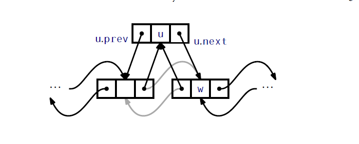

## Linked Lists
本章，我们继续学习`List`接口的实现，这一次使用基于指针而不再是数组的数据结构。本章的数据结构是由包含了链表元素的节点组成的。使用引用(指针)，节点被链接到一个序列中。我们首先研究单链表，可以以常量时间实现栈和(FIFO)队列操作，接着我们转向双链链表，可以以常量时间实现双端队列(`Deque`)操作。

基于指针链接的链表相比于基于数组的List接口实现有优点也有缺点。主要的缺点是我们无法使用`get(i)`或者`set(i,x)`在常量时间内访问任意元素。相反，我们必须要遍历整个`list`，一次一个元素，知道我们到达第i个元素。主要的优点是它们具有更高的动态性：有任意一个链表节点`u`的引用，我们可以在常量时间内删除`u`或者在`u`的旁边插入一个元素。无论`u`在`list`中哪个位置。

### 3.1 SLList:单链链表
一个`SLList`(一个单链表`singly-linked list`)由`Nodes`组成的序列。每个节点`u`存储了数据值`u.x`和指向序列下一个节点的引用`u.next`。对于序列中最后一个节点`w`，`w.next = null`。
```Java
class Node{
    T x;
    Node next;
}
```
为了效率，`SLList`使用变量`head`和`tail`跟踪序列中开始和最后的节点，以及整数`n`记录序列的长度。
```Java
Node head;
Node tail;
int n;
```
对一个`SSList`的栈和队列操作序列解释如图3.1。

`和`remove()`)和`Stack`(`push(x)`和`pop()`)操作序列")

`SSlist`通过在序列头部添加和删除元素可以高效的实现`Stack`的`push()`和`pop()`操作。`push`操作就是简单的创建一个节点`u`包含数据`x`，设置`u.next`指向链表旧的头节点然后设置`u`为链表新的头节点。最后，对`n`加一，因为`SSList`的长度多了一个元素：
```Java
T push(T x){
    Node u = new Node();
    u.x = x;
    u.next = head;
    head = u;
    if(n == 0)
      tail = u;
    n++;
    return x;
}
```
`pop()`操作在检查完`SSList`非空后，通过设置`head = head.next`删除头节点并对`n`减一。需要考虑的特殊情况是，最后一个元素被删除了，此时需要设置`tail`为`null`:
```Java
T pop(){
    if(n==0)return null;
    T x = head.x;
    head = head.next;
    if(--n = 0)tail = null;
    return x;
}
```
显然，`push(x)`和`pop()`操作运行时间为$O(1)$。
#### 3.1.1 队列操作
`SSList`还可以在常量时间里实现FIFO队列的`add(x)`和`remove()`操作。`remove()`是从链表的头开始的，它和`pop()`操作一样：
```Java
T remove(){
    if(n==0) return null;
    T x = head.x;
    head = head.next;
    if(--n = 0) tail = null
    return x;
}
```
另一方面，`add(x)`，是在链表尾端完成的。在大多数情况下，是通过设置`tail.next = u`完成，这里`u`是新创建的节点包含值`x`。然而，当`n==0`时，此时`tail==head==null`，在这种情况下，`tail`和`head`都被设置为`u`。
```Java
boolean add(T x){
    Node u = new Node();
    u.x = x;
    if(n == 0){
        head = u;
    }else{
        tail.next = u;
    }
    tail = u;
    n++;
    return true;
}
```
显然，`add(x)`和`remove()`时间开销是常量。

#### 3.1.2 总结
下面的定理总结了`SSList`的性能：
__定理3.1__ `SSList`实现了`Stack`和(FIFO)`Queue`接口。`push(x)`，`pop()`，`add(x)`和`remove()`操作的运行时间都是$O(1)$。

`SSList`基本上实现了全部的`Deque`操作。唯一缺少的操作是从`SSList`尾部移除元素。从`SSList`尾部移除元素很麻烦，因为它需要更新`tail`的值，使得它指向`tail`在`SSList`中的前驱节点`w`；这个节点满足`w.next == tail`。不幸的是，得到`w`的唯一方法是从`head`开始遍历整个`SSList`，这需要`n-2`步。

### 3.2 DLList:双向链表
一个DLList(双向链表)和SLList类似，除了在DLList的节点`u`有指向在它之后`u.next`的引用和在它之前的节点`u.prev`的引用。
```Java
class Node{
    Tx;
    Node prev,next;
}
```
在实现SLList时，我们看到总会有几种特殊情况需要考虑。例如，从SLList删除最后一个元素，或者对空SLList加入一个元素都需要仔细确保`head`和`tail`被正确的更新。在DLList中，这些特殊情况的数量增加了相当多。在DLList中考虑这些特殊情况最干净的可能方式是引入`dummy`节点。这个节点不包含任何数据，只是扮演一个占位符，这样就没有特殊节点了；每个节点都会有`next`和`prev`，这里`dummy`扮演了链表最后一个节点的后继以及第一个节点的前驱。使用这种方式，列表的节点以双向的方式链接成一个圆，如图3.2。


```Java
int n;
Node dummy;
DLList(){
    dummy = new Node();
    dummy.next = dummy;
    dummy.prev = dummy;
    n = 0;
}
```
在DLList中找到特定下标的节点很容易；我们要么从链表的头开始(`dummy.next`)向前查找，或者从列表尾部开始(`dummy.prev`)向后查找。这使得我们可以在$O(1+\min\{i,n-i\})$的时间内找到第i个元素。
```Java
Node getNode(int i){
    Node p  = null;
    if(i < n/2){
        p = dummy.next;
        for(int j = 0;j < i; j++){
            p = p.next;
        }
    }else{
        p = dummy;
        for(int j = n; j > i; j--){
            p  = p.prev;
        }
    }
    return p;
}
```
`get(i)`和`set(i,x)`操作现在也很容易了。我们先找到第i个节点，然后获取或者设置它的`x`值：
```Java
T get(int i){
    return getNode(i).x;
}

T set(int i,T x){
    Node u = getNode(i);
    T y = u.x;
    u.x = x;
    return y;
}
```
这些操作的运行时间由它用来找第i个元素的时间所决定，因此是$O(1+\min\{i,n-i\})$。

#### 3.2.1 新增和删除
如果我们有在DLList内一个节点`w`的引用并且我们想要在`w`前插入节点`u`，那么就只需要设置`u.next=w,u.prev=w.prev`，然后调整`u.prev.next`和`u.next.prev`。(参见图3.3)由于有`dummy`节点，我们就不需要担心`w.prev`或`w.next`不存在。
```Java
Node addBefore(Node w,T x){
    Node u = new Node();
    u.x = x;
    u.prev = w.prev;
    u.next = w;
    u.next.prev = u;
    u.prev.next = u;
    n++;
    return u;
}
```


现在，链表操作`add(i,x)`就很容易实现了。我们找到DLList内的第$i$个节点，然后就在他前面插入包含`x`的新节点`u`。
```Java
void add(int i,T x){
    addBefore(getNode(i),x);
}
```
`add(i,x)`运行时间中唯一不是常量的部分就是用在找第$i$个节点(`getNode(i)`)所花费的时间。因此，`add(i,x)`运行时间$O(1+\min\{i,n-i\})$。

从DLList中删除一个节点`w`是很容易的。我们只需要调整`w.next`和`w.prev`这两个指针，使得可以跳过`w`。再一次，使用`dummy`节点消除了对特殊场景的考虑：
```Java
void remove(Node w){
    w.prev.next =w.next;
    w.next.prev = w.prev;
    n--;
}
```
现在，`remove(i)`操作就很简单了。我们可以找到索引为`i`的节点，然后删除它：
```Java
T remove(int i){
    Node w = getNode(i);
    remove(w);
    return w.x;
}
```
再一次，这个操作唯一耗时的部分是使用`getNode(i)`找到第$i$个节点。，所以`remove(i)`的运行时间是$O(1+\min\{i,n-i\})$。

#### 3.2.2 总结
下面的定理总结了DLList的性能：
__定理3.2__ `DLList`实现了`List`接口。其中，`get(i)`，`set(i,x)`，`add(i,x)`和`remove(i)`操作的运行时间是$O(1+\min\{i,n-i\})$。

值得注意的是，如果我们忽略`getNode(i)`操作的开销，对DLList的所有操作都只花费常量时间。因此，对DDList的所有操作有开销的就是找到相关节点。

一旦我们有了相关节点，增加，删除和访问这个节点的数据都只用花费常量时间。

这和第二章中基于数组的链表实现形成了鲜明的对比；在那些实现中，相关的数组元素可以在常量时间找到。但是，增加和删除要求在数组中移动元素，并且，通常情况下，这会花费非常量时间。

由于这个原因，链式`list`结构非常适合那些可以通过外部方式获取链表节点引用的应用。一个例子就是Java集合框架中的`LinkedHashSet`数据结构，一系列元素存放在一个双端链表中，双端链表的节点存放在一个哈希表中(将在第5章介绍)。当从`LinkedHashSet`删除元素时，哈希表用来在常量时间查找相关链表节点，然后删除链表节点(所以也在常量时间内)。

### 3.3 SEList:空间高效的链表
链表的一个缺点(除了访问链表深处元素花费的时间)是它的空间使用。DLList的每个节点需要额外两个引用分别指向链表中下一个和前一个结点。节点中有两个域是用来维护链表，只有一个域是用来存储数据！

SEList(空间高效链表)通过一个简单的方式减少了空间浪费：我们不在DLList中独立的存放元素，而是存放一个包含多个元素的block(数组)。更精确地说，一个SEList是由 _块大小_ `b` 参数化的。SEList中每个独立的节点存放的是一个可以装载`b+1`个元素的块。

如果我们可以对每个块执行`Deque`接口的操作会很有帮助，原因稍后会变得清楚。我们选择的数据结构是`BDeque`(`bounded Deque`)，继承自2.4节的`ArrayDeque`。`BDeque`和`ArrayDeque`在一个很小的方式上不同：当一个新的`BDeque`创建时，它后端数组的大小是固定为`b+1`，不会增长也不会收索。`BDeque`的重要属性是允许在常量时间在两端增加或删除元素。这对于元素从一个块移动到另一块很有帮助。
```Java
class BDeque extend ArrayDeque<T>{
    BDeque(){
        super(SEList.this.type());
        a = new Array(b+1);
    }
    void resize(){}
}
```
`SEList`是一个块的双向链表：
```Java
class Node{
    BDeque d;
    Node prev,next;
}
```
```Java
int n;
Node dummy;
```
#### 3.3.1 空间需求
`SEList`对一个块中元素的数量设置了非常严格的限制：除非块是最后一个块，否则每个块至少包含`b-1`个元素，至多包含`b+1`个元素。这意味着，如果一个SEList包含`n`个元素，那么他最多有:
$$n/(b-1)+1=O(n/b)$$
个块。`BDeque`每个块包含的数据长度是`b+1`但是，对于除了最后一个块的每个块，在这个数组里最多只有常数的空间浪费。一个块剩余的内存使用也是常量，这意味着对于`SEList`浪费的空间仅仅是$O(b+n/b)$。通过选择`b`的值是$\sqrt{n}$的一个倍数，我们可以确保`SEList`的空间负荷是接近于第2.6.2节给出的$\sqrt{n}$下界。
#### 3.3.2 查找元素
使用`SEList`，我们面临的第一个挑战是给定一个下标`i`查找链表元素。注意一个元素的位置包含两个部分：
1. 节点`u`中包含了索引为`i`的元素所在块，以及
2. 它的块内的元素索引`j`
```Java
class Location{
    Node u;
    int j;
    Location(Node u,int j){
        this.u = u;
        this.j = j;
    }
}
```
为了找到包含特定元素的块，我们按照在`DLList`中同样的做法来处理。我们要么从列表头开始向后遍历，或者从列表尾部向前遍历直到我们到达我们想要的节点(注意：这里原文的方向和我翻译的方向朝向不一样，原文是 We either start at the front of the list and traverse in the forward direction,or at the back of the list and traverse backwards until we reach the node we want.可以看到原文是说，从头开始是向前查，从尾开始是向后查。这里需要注意，我是按照中文从头到尾是向后，从尾到头是向前。下文中文的时候，都是按照中文的方向)。唯一的区别就是，每次我们移动到下一个节点，我们就跳过了一整块的元素。
```Java
Location getLocation(int i){
    if(i < n/2){
        Node u = dummy.next;
        while(i >= u.d.size()){
            i -= u.d.size();
            u = u.next;
        }
        return new Location(u,i);
    }else{
        Node u = dummy;
        int idx = n;
        while (i < idx){
            u = u.prev;
            idx -= u.d.size();
        }
        return new location(u,i-idx);
    }
}
```
记住，除了最多一个块外，每个块都包含至少$b-1$个元素，这样在我们的搜索过程中的每一步，我们距离查找的元素就近$b-1$个元素。如果我们搜索从列表头部开始向后搜索，这意味着我们在$O(1+i/b)$步后找到想要的节点，如果我们从尾到头搜索，我们在$O(1+(n-i)/b)$步后到达我们的节点。这个算法会根据给定的`i`选择二者之间的较小的一个，这样定位索引为`i`的元素时间是$O(1+\min \{1,n-i\}/b)$。

一旦我们知道了如何定位索引为`i`的元素，`get(i)`和`set(i,x)`操作就可以翻译为在正确的块中获取或者设置索引：
```Java
T get(int i){
    Location l = getLocation(i);
    return l.u.d.get(l.j);
}

T set(int i){
    Location l = getLocation(i);
    T y = l.u.d.get(l.j);
    l.u.d.set(l.j,x);
    return y;
}
```
这些操作的运行时间由定位元素花费的时间决定，所以他们的运行时间是$O(1+\min \{1,n-i\}/b)$。
#### 3.3.3 添加元素
向`SEList`添加元素稍微有点复杂。在考虑通用情况前，我们考虑一个简单点的操作，`add(x)`，这个操作将`x`添加到列表末端。如果最后一个块是满的(或者还没有任何块存在)，我们首先分配一个新的块并把它加入到块列表(list of blocks)后。现在我们确保了最后一个块存在并且不是满的，我们将`x`加入到最后一个块中。
```Java
boolean add(T x){
    Node last = dummy.prev;
    if(last == dummy || last.d.size() == b+1){
        last = addBefore(dummy);
    }
    last.d.add(x);
    n++;
    return true;
}
```
当我们使用`add(i,x)`在列表中间添加元素时事情就变得更复杂了些。我们首先定位`i`获取节点`u`，它的块包含第$i$个列表元素。问题是我们想要在`u`的块中插入`x`，但是由于`u`的块已经包含了`b+1`个元素，已经没有位置可以插入`x`。

设$u_0,u_1,u_2,...$分别表示`u,u.next,u.next.next,...`等等。我们检查$u_0,u_1,u_2,...$查找一个节点可以为`x`提供空间。在我们的空间探索过程中会发生三种情况(参见图3.4)：


1. 我们迅速的(在$r+1 \le b$步中)找到一个节点$u_r$的块未满。在这种情况下，我们执行$r$次从一个块移动一个元素到下一个块。这样，在$u_r$的空闲空间就变成了在`u_0`的空闲空间。我们接下来就可以把`x`插入到$u_0$的块中。
2. 我们迅速的(在$r+1 \le b$步中)走到了块列表的尾部。在这种情况下，我们在快列表尾部添加一个新块然后按照第一种情况执行。
3. 在$b$步后我们没有找到任何一个未满的块。在这种情况下，$u_0,...,u_{b-1}$是`b`个块中包含了`b+1`个元素的序列。我们在这个序列的末端插入一个新的块$u_b$，然后扩散最初的$b(b+1)$个元素使得$u_0,...,u_b$每个块都包含$b$个元素，现在$u_0$块仅包含$b$个元素，就为我们插入`x`腾出了空间。
```Java
void add(int i ,T x){
    if(i == n){
        add(x);
        return;
    }
    Location l = getlocation(i);
    Node u = l.u;
    int r = 0;
    while (r < b && u != dummy && u.d.size() == b+1){
        u = u.next;
        r++;
    }
    if (r == b){//b个block每个都包含b+1个元素
        spread(l.u);
        u = l.u;
    }
    if(u == dummy) {//到达尾端添加新节点
        u = addBefore(u);
    }
    while (u != l.u) {//向前工作，移动元素
        u.d.add(0,u.prev.d.remove(u.prev.d.size()-1));
        u = u.prev;
    }
    u.d.add(l.j,x);
    n++;
}
```
`add(i,x)`操作的运行时间依赖于上述三种情况发生哪种。情况1和2包含最多在`b`个块中检查和移动元素，因此花费$O(b)$的时间。情况3包含调用`spread(u)`方法，会移动$b(b+1)$个元素因此花费时间是$O(b^2)$。如果我们忽略情况3的开销(稍后我们会使用摊销再计算它)，这意味着定位`i`和执行插入`x`的总时间是$O(b+\min \{i,n-i\}/b)$。

#### 3.3.4 删除元素
从`SEList`中删除一个元素类似于添加一个元素。我们首先定位包含的元素中有索引是`i`的节点`u`。现在，我们就需要处理，如果我们从`u`中删除一个元素，怎么保证`u`始终满足`SEList`的定义，即`u`的大小不能小于`b-1`个元素。

再一次，设$u_0,u_1,u_2,...$分别表示`u,u.next,u.next.next,...`等等。我们按顺序检查$u_0,u_1,u_2,...$，我们找到一个节点，从中可以借出一个元素从而让$u_0$块的大小至少是`b-1`。这里有三种情况：
1. 我们快速的(在$r+1 \le b$步中)找到一个节点，它的块包含超过`b-1`个元素。在这种情况下，我们一共执行r次从一个块中移动一个元素到前一个块中操作，这样在$u_r$中额外的元素就变成了在$u_0$的额外元素(so that the extra element in $u_r$ becomes an extra element in $u_0$.原文是这样，不知道是不是我理解错了，但是$u_r$的元素没有移动到$u_0$，而是到了$u_{r-1}$中)。我们可以从$u_0$块中删除相应的元素。
2. 我们迅速的(在$r+1 \le b$步中)跑到了块链表尾端，在这种情况下，$u_r$是最后一个块，不需要确保包含至少`b-1`个元素。因此，我们按照上面处理，从$u_r$中借用一个元素，从而在$u_0$多制造出一个元素。如果这导致了$u_r$的块变为空，我们就删除它。
3. 在$b$步后，我们没有找到任何块包含超过$b-1$个元素。在这种情况下，$u_0,u_1,u_2,...,u_{b-1}$为`b`个包含`b-1`个元素的块序列。我们 _收集_ 这些$b(b-1)$个元素并放到$u_0,u_1,u_2,...,u_{b-2}$中，这样，`b-1`个块中每个就包含`b`个元素了，我们删除$u_{b-1}$，因为他现在已经为空了。现在$u_0$的块就包含`b`个元素，这样我们就可以从中删除相应的元素了。

")

```Java
T remove(int i){
    Location l =getLocation(i);
    T y = l.u.d.get(l.j);
    Node u = l.u;
    int r = 0;
    while(r < b && u!=dummy && u.d.size() == b-1){
        u = u.next;
        r++;
    }
    if(r == b){//b个块每个都包含b-1个元素
        gather(1.u);
    }
    u = l.u;
    u.d.remove(l.j);
    while(u.d.size() < b-1 && u.next != dummy){
        u.d.add(u.next.d.remove(0));
        u = u.next;
    }
    if(u.d.isEmpty())remove(u);
    n--;
    return y;
}
```
就像`add(i,x)`操作，如果我们忽略在情况3中`gather(u)`方法的开销，`remove(i)`的运行时间就是$O(b+\min \{i,n-i\}/b)$。

#### 3.3.5 扩散操作(spreading)和聚集操作(gathering)的摊还分析
接下来，我们要考虑`gather(u)`和`spread(u)`方法的开销，它们可能会在`add(i,x)`和`remove(i)`方法中执行。为了完整性，它们的代码是：
```Java
void spread(Node u){
    Node w = u;
    for(int j = 0 ; j < b;j++){
        w = w.next;
    }
    w = addBefore(w);
    while(w!=u){
        while(w.d.size() < b){
            w.d.add(0,w.prev.d.remove(w.prev.d.size()-1));
        }
        w = w.prev;
    }
}

void gather(Node u){
    Node w = u;
    for(int j = 0;j < b-1;j++){
        while(w.d.size() < b){
            w.d.add(w.next.d.remove(0));
        }
        w = w.next;
    }
    remove(w);
}
```
这些方法的运行时间由两层嵌套循环决定。内循环和外循环都最多执行$b+1$次，因此每个方法的全部运行时间是$O((b+1)^2)=O(b^2)$。然而，如下引理显示了对于每$b$次调用`add(i,x)`或者`remove(i)`方法，这些方法最多执行一次。

__引理3.1.__ 如果创建了一个空的`SEList`并且执行了任意大于$m \ge 1$次对`add(i,x)`和`remove(i)`的调用序列，那么全部对`spread()`和`gather()`调用的时间开销是$O(bm)$

__证明__ 我们使用摊还分析的势能方法。我们说一个节点`u`是 _易碎的(fragile)_ 如果`u`的元素个数不是`b`(因此，`u`也要么是最后一个节点，要么元素个数是`b-1`或者`b+1`)。其它包含`b`个元素的节点是 _坚固的(rugged)_。一个`SEList`的势能定义为他拥有的易碎节点个数。我们只考虑`add(i,x)`操作以及与之相关的`spread(u)`调用次数。`remove(i)`和`gather(u)`的分析是一样的。

注意，如果在执行`add(i,x)`方法期间发生了情况1，只有一个节点$u_r$的块大小改变了。因此，至多一个节点，也即$u_r$，会从坚固变成易碎。如果发生了情况2，那么就创建了一个新节点，并且这个节点是易碎的，但是其它节点都没有改变大小，因此易碎的节点只增加了一个。因此，在情况1或者2中，`SEList`的势能最多只增加一个。

最后，如果发生了情况3，那么是因为$u_0,u_1,u_2,...,u_{b-1}$都是易碎节点。那么就会调用$spread(u_0)$，而这`b`个易碎节点就都替换为了`b+1`个坚固节点。最后，`x`被加入到$u_0$块，是的$u_0$变成易碎节点。整体的势能减少了`b-1`个。

总体上，势能从0(此时list中没有节点)开始。每次情况1或者情况2发生，势能最多增加1。每次情况3发生，势能减少`b-1`。势能永远不会小于0(因为他统计的是易碎节点的个数)。我们可以总结，对于每次发生了情况3，那么至少发生了`b-1`次情况1或者情况3。因此，对于每次调用`spread(u)`至少会调用`b`次`add(i,x)`。证明完成。$\square$
#### 3.3.6 总结
如下定理总结了`SEList`数据结果的性能：
__定理3.3.__ `SEList`实现了list接口。忽略对`spread(u)`和`gather(u)`的调用，一个块大小是$b$的`SEList`支持的操作有：
* `get(i)`和`set(i,x)`操作执行时间是$O(b+\min \{i,n-i\}/b)$；并且
* `add(i,x)`和`remove(i)`的操作时间是$O(b+\min \{i,n-i\}/b)$。

进一步的，从一个空的`SEList`开始，任意m次对`add(i,x)`和`remove(i)`操作的调用序列会导致对所有调用`spread(u)`和`gather(u)`的总时间是$O(bm)$。

`SEList`存储`n`个元素使用的空间(使用字测量)[<sup id="content1">1</sup>](#1)是$n+O(b+n/b)$。

`SEList`是对`ArrayList`和`DLList`的权衡，依据块大小`b`相对的融合了两个结构。在一个极端，`b=2`时，每个`SEList`节点存放最多三个值，这和`DLList`没有多大区别。在另一个极端`b>n`时，所有元素都存放在单个数组中，就像`ArrayList`。在这两个之间就存在权衡：增删一个list元素的时间与定位特定list元素的时间。

### 3.4讨论和练习
单链表和双端链表都是成熟的技术了，它们已经在程序中使用超过了40年。他们被广泛的讨论。甚至`SEList`数据结构看起来都是一个众所周知的数据结构练习。`SEList`有时候也叫做 _未展开链表(unrolled linked list)_。

在双端链表中节省空间的另一种方法是使用一个叫做XOR链表的方式。在XOR链表中，每个节点`u`只包含一个指针，叫做`u.nextprev`，存放的是`u.prev`和`u.next`按位异或的结果。链表自己需要存储两个指针，一个指向`dummy`元素，一个指向`dummy.next`(第一个节点，如果链表为空就是`dummy`)。这个技术依赖于这个事实：如果我们有指向`u`和`u.prev`的指针，那么我们使用公式`u.next = u.prev^u.nextprev`提取`u.next`(这里`^`计算两个参数的按位异或值)。这项技术使得代码复杂了些并且在某些语言中不可能实现，例如Java和Python，那些有垃圾回收但是只需要每个节点一个指针双端链表实现(注：大多数有GC的语言需要使用引用来维护GC信息，而它们没有字面意义上的指针，所以没法使用引用进行按位异或操作的)。


[<sup id ="1">1</sup>](#content1) 回忆下第1.4节讨论的内存是如何测量的。

