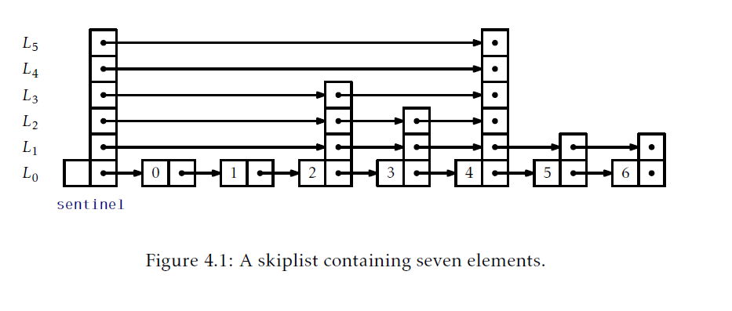

## 第四章 跳表
本章，我们会讨论一个漂亮的数据结构：跳表，有着非常广泛的应用场景。使用跳表我们可以实现一个List：它的`get(i)`,`set(i,x)`,`add(i,x)`和`remove(i)`实现运行时间是$O(\log n)$。我们还可以实现SSet，所有操作都有$O(\log n)$的期望时间。

跳表的效率依赖于它们对随机的使用。当在跳表中添加一个新的元素，跳表使用随机抛掷硬币决定新元素的高度。跳表的性能是根据期望运行时间和路径长度决定的。这个期望是由跳表使用的随机抛掷硬币的期望决定的。在本章的实现中，跳表使用的随机抛掷硬币是通过使用伪随机数(或者位)生成器模拟的。

### 4.1 基本结构
概念上，跳表一系列单链表$L_0,...,L_h$。每个list $L_r$包含的元素是$L_{r-1}$元素子集。我们从输入包含了$n$个元素的list $L_0$开始，然后从$L_0$构建$L_1$，从$L_1$构建$L_2$等等。对于$L_{r-1}$的每个元素`x`，我们都抛一次硬币，如果硬币头朝上，我们就把`x`放到$L_1$中。当我们创建的$L_r$为空时，这个进程就结束了。图4.1展示了一个跳表例子。



对于跳表中一个元素`x`，我们称`x`的高为x出现过的全部$L_r$中最大$r$的值。举个例子，只在$L_0$出现的元素高度是0。如果我们花一点时间想想，我们注意到元素`x`的高度符合如下实验：重复抛掷一枚硬币知道出现背面。会出现多少次头？无疑，答案是一个节点的期望高度是1(我们期望在得到背面前抛掷两次硬币，但是我们不会计算最后一次抛掷。)。跳表的高度就是它最高节点的高度。

每个列表的头都有一个特殊节点，叫做 _哨兵(sentinel)_，它扮演了列表的哑元节点(dummy node)。跳表的关键属性是存在一个断路径，叫做 _搜索路径(search path)_，从在$L_h$的哨兵到在$L_0$的每个节点。记住如何对一个节点`u`构造搜索路径，这很简单(见图4.2)：从跳表左侧顶部开始(在$L_h$中的哨兵)，一直向右除非超过`u`(注：这说明跳表是有序的，否则无法定义是否超过)，这种情况下你应该向下走到list的下面。

更精细的说，为了构造位于在$L_0$中节点`u`的搜索路径，我们从在`L_h`的哨兵`w`开始。下一步，我们检查`w.next`。如果`w.next`包含的元素在$L_0$中出现在`u`前，我们就设置`w = w.next`。否则，我们向下移动，继续搜索位于$L_{h-1}$中出现的`w`。我们一直按照这种方式处理知道达到在$L_0$中`u`的前驱。


我们将在4.4节证明如下结果，它展示搜索路径相当短：

__引理4.1.__ 对于任意$L_0$中的节点`u`搜索路径的期望长度最多是$2\log n +O(1) = O(\log n)$。

实现跳表一个空间高效的方式是顶一个一个节点`u`，由数据值`x`和一个存放指针的数组`next`(`u.next[i]`指向`u`在列表$L_i$的后继)，组成。使用这种方式，数据`x`在一个节点中只会被引用一次，即使`x`可能出现在几个列表中。
```Java
class Node<T>{
    T x;
    Node<T>[] next;
    Node(T ix,int h){
        x = ix;
        next = Array.newInstance(Node.class,h+1);//这里高度加1的原因是因为，跳表最底层的list的是从0开始的
    }
    int height(){
        return next.length-1;
    }
}
```
本章接下来两节讨论跳表的两个不同应用。在这些应用中，$L_0$存放了主要结构(元素的list或者元素的有序set)。二者主要不同在于这些结构的搜索路径是如何导航的；具体地说，区别在于它们是如何决定一个搜索路径是应该向下走到$L_{r-1}$还是在$L_r$中向右走。