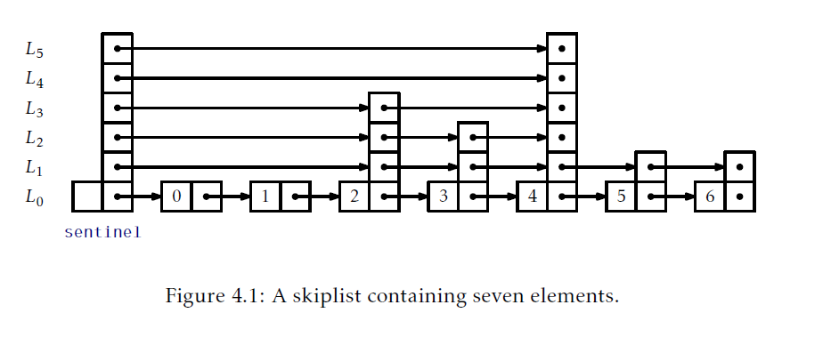
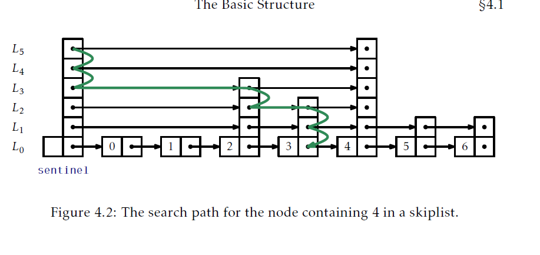
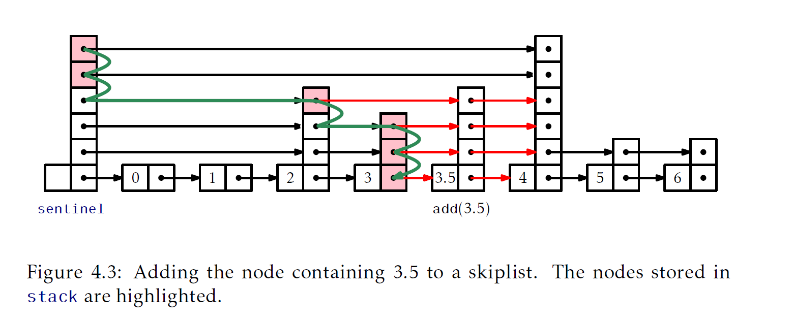
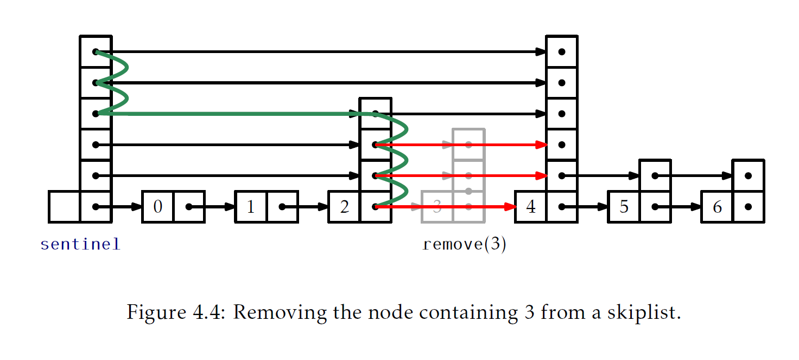
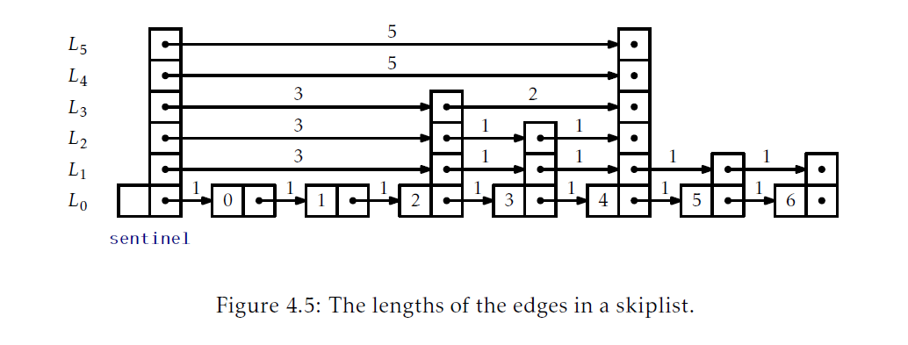
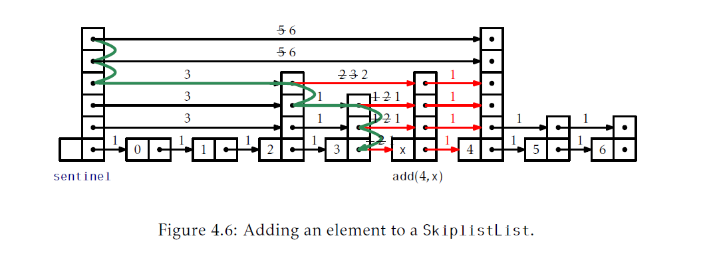
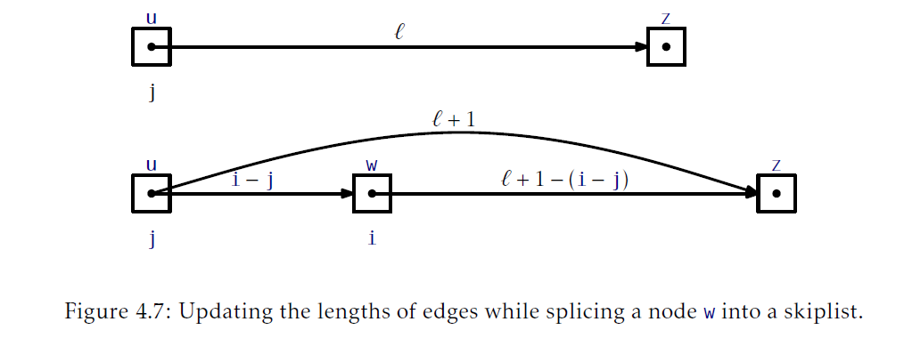

## 第四章 跳表
本章，我们会讨论一个漂亮的数据结构：跳表，有着非常广泛的应用场景。使用跳表我们可以实现一个List：它的`get(i)`,`set(i,x)`,`add(i,x)`和`remove(i)`实现运行时间是$O(\log n)$。我们还可以实现SSet，所有操作都有$O(\log n)$的期望时间。

跳表的效率依赖于它们对随机的使用。当在跳表中添加一个新的元素，跳表使用随机抛掷硬币决定新元素的高度。跳表的性能是根据期望运行时间和路径长度决定的。这个期望是由跳表使用的随机抛掷硬币的期望决定的。在本章的实现中，跳表使用的随机抛掷硬币是通过使用伪随机数(或者位)生成器模拟的。

### 4.1 基本结构
概念上，跳表一系列单链表$L_0,...,L_h$。每个list $L_r$包含的元素是$L_{r-1}$元素子集。我们从输入包含了$n$个元素的list $L_0$开始，然后从$L_0$构建$L_1$，从$L_1$构建$L_2$等等。对于$L_{r-1}$的每个元素`x`，我们都抛一次硬币，如果硬币头朝上，我们就把`x`放到$L_1$中。当我们创建的$L_r$为空时，这个进程就结束了。图4.1展示了一个跳表例子。



对于跳表中一个元素`x`，我们称`x`的高为x出现过的全部$L_r$中最大$r$的值。举个例子，只在$L_0$出现的元素高度是0。如果我们花一点时间想想，我们注意到元素`x`的高度符合如下实验：重复抛掷一枚硬币知道出现背面。会出现多少次头？无疑，答案是一个节点的期望高度是1(我们期望在得到背面前抛掷两次硬币，但是我们不会计算最后一次抛掷。)。跳表的高度就是它最高节点的高度。

每个列表的头都有一个特殊节点，叫做 _哨兵(sentinel)_，它扮演了列表的哑元节点(dummy node)。跳表的关键属性是存在一个断路径，叫做 _搜索路径(search path)_，从在$L_h$的哨兵到在$L_0$的每个节点。记住如何对一个节点`u`构造搜索路径，这很简单(见图4.2)：从跳表左侧顶部开始(在$L_h$中的哨兵)，一直向右除非超过`u`(注：这说明跳表是有序的，否则无法定义是否超过)，这种情况下你应该向下走到list的下面。

更精细的说，为了构造位于在$L_0$中节点`u`的搜索路径，我们从在`L_h`的哨兵`w`开始。下一步，我们检查`w.next`。如果`w.next`包含的元素在$L_0$中出现在`u`前，我们就设置`w = w.next`。否则，我们向下移动，继续搜索位于$L_{h-1}$中出现的`w`。我们一直按照这种方式处理知道达到在$L_0$中`u`的前驱。



我们将在4.4节证明如下结果，它展示搜索路径相当短：

__引理4.1.__ 对于任意$L_0$中的节点`u`搜索路径的期望长度最多是$2\log n +O(1) = O(\log n)$。

实现跳表一个空间高效的方式是顶一个一个节点`u`，由数据值`x`和一个存放指针的数组`next`(`u.next[i]`指向`u`在列表$L_i$的后继)，组成。使用这种方式，数据`x`在一个节点中只会被引用一次，即使`x`可能出现在几个列表中。
```Java
class Node<T>{
    T x;
    Node<T>[] next;
    Node(T ix,int h){
        x = ix;
        next = Array.newInstance(Node.class,h+1);//这里高度加1的原因是因为，跳表最底层的list的是从0开始的
    }
    int height(){
        return next.length-1;
    }
}
```
本章接下来两节讨论跳表的两个不同应用。在这些应用中，$L_0$存放了主要结构(元素的list或者元素的有序set)。二者主要不同在于这些结构的搜索路径是如何导航的；具体地说，区别在于它们是如何决定一个搜索路径是应该向下走到$L_{r-1}$还是在$L_r$中向右走。

### 4.2 `SkiplistSSet`:高效的`SSet`
`SkiplistSSet`使用跳表结构实现`SSet`接口。当按照这种方式使用跳表时，列表$L_0$按顺序存放了`SSet`的元素。`find(x)`方法使用沿着满足$y \ge x$最小值`y`的搜索路径工作(`find(x)` method works by following the search path for the smallest value `y` such that $y \ge x$)：
```Java
Node<T> findPredNode(T x){
    Node<T> u = sentinel;
    int r = h;
    while ( r >= 0 ) {
        while (u.next[r] != null && compare(u.next[r].x,x) < 0){
            u = u.next[r];//朝着list r右侧走
        }
        r--;//向下进入到list r-1
    }
    return u;
}
T find(T x) {
    Node<T> u = findPredNode(x);
    return u.next[0]==null?null:u.next[0].x;
}
```
沿着`y`的搜索路径很容易：当位于$L_r$的某个节点`u`时，我们看向右看看`u.next[r].x`，如果`x>u.next[r].x`，那么我们就在$L_r$中朝右走；否则，我们就朝下走到$L_{r-1}$中。在本次搜索的每一步(向右或者向下)都只花费常量时间；因此，根据引理4.1，`find(x)`的期望运行时间是$O(\log n)$。

在我们可以向`SkipListSSet`中添加一个元素前，我们需要一个模拟投掷硬币的方法决定这个新节点的高度`k`。我们通过随机挑选一个整数`z`，然后统计`z`的二进制表示中尾部1的个数[<sup id="content1">1</sup>](#1)(注：根据下面的代码可知，计算的是选择的随机数二进制表示中末尾1的个数，所谓末尾1的个数就是从最后一位开始往前数，如果遇到了0，就停止，然后统计1的个数。应该也可以统计0的个数，这样就可以使用Integer类的一个方法直接统计)：
```Java
int pickHeight(){
    int z = rand.nextInt();
    int k = 0;
    int m = 1;
    while((z&m) != 0){
        k++;
        m<<=1;
    }
    return k;
}
```
为了实现`SkiplistSSet`的`add(x)`方法，我们针对`x`搜索，然后将`x`移入到$L_0,...,L_k$这几个list中，其中，`k`是通过`pickHeight`方法选择的。最简单的方法是使用一个数组，`stack`，在搜索路径从某个list $L_r$向下进入到$L_{r-1}$时，保存这些节点的轨迹。具体地说，`stack[r]`是$L_r$中的一个节点，搜索路径从这个节点开始向下进入到$L_{r-1}$。为了插入`x`，我们需要修改的节点就是节点`stack[0],...,stack[k]`。



如下代码实现了`add(x)`算法：
```Java
boolean add(T x){
    Node<T> u = sentinel;
    int r = h;
    int comp = 0;
    while (r >= 0) {
        while (u.next[r] != null && (comp = compare(u.next[r].x,x)) < 0){
            u = u.next[r];
        }
        if(u.next[r] != null && comp == 0) return false;
        stack[r--] = u;//向下走，存储u
    }
    Node<T> w = new Node<T>(x,pickHeight());
    while(h < w.height()){
        stack[++h] = sentinel;//高度增加
    }
    for(int i = 0; i < w.next.length;i++){
        w.next[i] = stack[i].next[i];
        stack[i].next[i] = w;
    }
    n++;
    return true; 
}
```

删除元素的方式是类似的，除了不需要`stack`保持搜索路径踪迹。我们沿着搜索路径可以完成删除操作。我们搜索`x`并且只要每次搜索从节点`u`向下移动了，我们就检查是否满足`u.next.x=x`，如果满足，我们就把节点`u`从list中移出去：



```Java
boolean remove(T x) {
    boolean removed = false;
    Node<T> u = sentinel;
    int r = h;
    int comp = 0;
    while(r >= 0) {
        while (u.next[r] != null&&(comp = compare(u.next[r].x,x)) < 0){
            u = u.next[r];
        }
        if(u.next[r] != null && comp == 0){
            removed = true;
            u.next[r] = u.next[r].next[r];
            if(u == sentinel && u.next[r] == null){
                h--;//高度下降了，因为哨兵直接指向的节点，且没有后续节点，需要降低高度
            }
        }
    }
    if(removed) n--;
    return removed;
}
```
#### 4.2.1总结
下面的定理总结了使用跳表实现的有序set的性能：
__定理4.1.__ `SkiplistSSet`实现了`SSet`接口。一个`SkiplistSSet`支持$O(\log n)$期望时间的`add(x)`，`remove(x)`和`find(x)`操作。

### `SkiplistList`：高效随机访问list
`SkiplistList`使用`skiplist`实现了`List`接口。在`SkiplistList`中，$L_0$包含list的全部元素，顺序跟它们出现在list中的顺序一致。就像`SkiplistSSet`那样，元素可以在$O(\log n)$的时间里完成增删查。

为了让这成为可能，我们需要一个方式可以跟随位于$L_0$中第$i$个元素的搜索路径。最简单的方式是：定义在某个list $L_r$中一个边  _长度_ 这个概念。我们定义在$L_0$中每个边的长度是1。在$L_r$($r\gt 0$)中，一个边$e$的长度定义为在$L_{r-1}$中，位于$e$之下所有边长度之和。等价地，$e$的长度是$L_0$中所有位于$e$下方的边个数。图4.5展示了一个跳表各个边的长度。由于跳表的边被存在数组中，那么边的长度可以按照同样的方式存储：



```Java
class Node{
    T x;
    Node[] next;
    int[] length;
    Node(T x,int h){
        x = ix;
        next = Array.newInstance(Node.class,h+1);
        length = new int[h+1];
    }
    int height(){
        return next.length - 1;
    }
}
```
`length`这一属性的定义有用之处在于，如果我们当前所在几点位于$L_0$中位置为`j`，那么我们沿着一个长度为$\ell$的边走，那么我们移动到的节点在$L_0$的位置就是$j+\ell$。按照这种方式，在沿着搜索路径走时，我们可以跟踪当前节点在$L_0$中的位置。当在$L_r$中的一个节点`u`时，如果`j`加`u.next[r]`的边长小于`i`，我们就朝右走。否则，我们就向下进入到$L_{r-1}$。

```Java
Node findPred(int i){
    Node u = sentinel;
    int r = h;
    int j = -1;//当前节点在list 0中的索引
    while(r >= 0){
        while(u.next[r] != null && j+u.next[r] < i){
            j += u.length[r];
            u = u.next[r];
        }
        r--;
    }
    return u;
}
```
```Java
T get(int i){
    return findPred(i).next[0].x;
}
T set(int i,T x){
    Node u = findPred(i).next[0];
    T y = u.x;
    u.x = x;
    return y;
}
```
由于`get(i)`和`set(i,x)`操作最难的部分是找到$L_0$中第`i`个节点，这些操作的运行时间是$O(n)$。

在位置`i`给`SkiplistList`中添加一个元素相当简单。不想`SkiplistSSet`，我们确定一个新节点会真的被添加，所以我们可以在搜索新节点位置的同时完整添加。首先，我们挑选一个高度`k`给将要新插入的节点`w`，然沿着`i`的搜索路径。任何时候，搜索路径从$L_r$向下移动并且$r\le k$，我们就将`w`移入到$L_r$中。唯一需要额外关心的是确保边的长度被正确的更新了，参见图4.6。



注意，每一次搜索路径在$L_r$中的节点`u`需要向下走的时候，`u.next[r]`的边长度就需要加一，因为我们要在位置`i`添加一个新节点，而这个节点在这些边之下。将一个节点`w`加入到`u`和`z`两个节点之间的操作如图4.7。由于沿着跟踪路径走我们已经保存了节点`u`在$L_0$中位置`j`。因此，我们知道从`u`到`w`的边长是`i-j`。我们还可以从`u`到`z`的边长度$\ell$中推断出从`w`到`z`的边长度。因此，我们可以加入`w`并在常量时间更新这些边的长度。



这听起来比实际要复杂，实际的代码很简单：
```Java
void add(int i, T x){
    Node w = new Node(x,pickHeight());
    if(w.height() > h){
        h = w.height();
    }
    add(i,w);
}
```
```java
Node add(int i,Node w){
    Node u = sentinel;
    int k = w.height();
    int r = h;
    int j = -1;
    while(r >= 0){
        while(u.next[r] != null && j+u.length[r] < i){
            j += u.length[r];
            u = u.next[r];
        }
        u.length[r]++;
        if(r <= k){
            w.next[r] = u.next[r];
            u.next[r] = w;
            w.length[r] = u.length[r] -(i - j);
            u.length[r] = i - j;
        }
        r--;
    }
    n++;
    return u;
}
```
现在，`remove(i)`操作的实现就很显然了。我们跟踪位于`i`位置节点的搜索路径。每一次我们从位于等级`r`的节点`u`向下走，我们就减少在那个等级离开时的节点`u`的边长。我们还要检查`u.next[r]`是否是排名为`i`的元素，如果是，我们还要从那个等级把它移出去，例子参见图4.8。
```Java
T remove(int i){
    T x = null;
    Node  u = sentinel;
    int r = h;
    int j = -1;
    while( r >= 0 ){
        while(u.next[r] != null && j+u.length[r] < i){
            j += u.length[r];
            u = u.next[r];
        }
        u.length[r]--;//那些我们正在删除的节点
        if( j + u.length[r]+1 == i && u.next[r] != null){
            x = u.next[r].x;
            u.length[r] += u.next[r].length[r];
            if(u == sentinel && u.next[r] == null){
                h--;
            }
        }
        r--;
    }
    n--;
    return x;
}
```
#### 4.3.1 总结
如下定理总结了`SkiplistList`的定理：
`SkiplistList`实现了`List`接口。`SkiplistList`支持以期望运行时间为$O(\log n)$的`get(i)`，`set(i,x)`，`add(i,x)`和`remove(i)`。

### 4.4 `Skiplist`分析
本节，我们分析`skiplist`的长度，大小和期望的高度。本节要求基本的概率背景。有几个定理的证明基于如下对硬币抛掷的基本观察。

__引理4.2.__ 设$T$为抛掷一个公平硬币的次数，包含第一次出现头的情况。那么$\mathrm{E}[T]=2$。
$\text{Proof}$ 假设我们在第一次出现头时停止抛掷硬币。定义指示变量
$$I_i = \begin{cases}
    0 如果硬币抛掷次数小于i次\\
    1 如果硬币抛掷次数大于等于i次
\end{cases}$$
注意到$I_i = 1$当且仅当前$i-1$次硬币抛掷结果都是尾，所以$\mathrm{E}[I_i]=Pr\{I_i=1\}=1/2^{i-1}$。观察到硬币抛掷总次数是$T$可以写为$T=\sum_{i=1}^{\infin}I_i$。因此，有：
$$\begin{aligned}
    \mathrm{E}[T]&=\mathrm{E}\left[\sum_{i=1}^{\infin}I_i\right]\\
    &=\sum_{i=1}^{\infin}\mathrm{E}[I_i]\\
    &=\sum_{i=1}^{\infin}1/2^{i-1}\\
    &=1+1/2+1/4+1/8+\cdots\\
    &=2.\qquad\qquad\qquad\square
\end{aligned}$$
接下来的两个引理告诉我们，跳表有着线性大小：
__引理4.3.__ 包含$n$个元素的跳表中节点的期望数量，不包括出现的哨兵(occurrences of sentinel)节点，是$2n$。

$\text{Proof}.$ 任意特定元素`x`包含在 `list` $L_r$中的概率是$1/2^r$[<sup id="content2">2</sup>](#2)，所以在全部`list`中节点全部期望数量是：
$$\sum_{r=0}^{\infin}n/2^r = n(1+1/2+1/4+1/8+\cdots)=2n.$$
__引理4.4.__ 包含$n$个元素的跳表的期望高度最多是$\log n +2.$
$\text{proof}.$对于任意$r\in\{1,2,3,\ldots,\infin\}$，定义指示器随机变量
$$I_r=\begin{cases}
    0 \text{如果$L_r$为空}\\
    1 \text{如果$L_r$不为空}
\end{cases}$$
跳表的高度$h$由如下等式给定：
$$h = \sum_{r=1}^{\infin}I_r.$$
注意$I_r$超过$L_r$的长度$|L_r|$，所以：
$$\mathrm{E}[I_r]\le\mathrm{E}[|L_r|]=n/2^r$$
因此，我们有：
$$\begin{aligned}
    \mathrm{E}[h]&=\mathrm{E}\left [ \sum_{r=1}^{\infin} I_r \right ]\\
&=\sum_{r=1}^{\infin}\mathrm{E}[I_r]\\
&=\sum_{r=1}^{\lfloor \log n \rfloor}\mathrm{E}[I_r]+\sum_{r=\lfloor \log n\rfloor +1 }^{\infin} \mathrm{E}[I_r]\\
&\le \sum_{r=1}^{\lfloor \log n \rfloor} 1+\sum_{r = \lfloor \log n \rfloor+1}^{\infin}n/2^r\\
&\le \log n +\sum_{r=0}^{\infin}1/2^r\\
&= \log n +2.\qquad\qquad\qquad\square
\end{aligned}
$$
__引理4.5.__ 包含$n$个元素的跳表期望节点数，包括所有的哨兵，是$2n+O(\log n)$。

$\text{Proof}.$根据引理4.3，不包含哨兵节点时，节点的期望个数是$2n$。出现的哨兵个数等于跳表的高度$h$，所以，根据引理4.4，出现的哨兵期望数最多是$\log n +2 = O(\log n)\qquad\qquad\qquad\square$。

__引理4.6.__ 跳表中一个搜索路径的期望长度最多是$2\log n +O(1)$。

$\text{Proof}.$证明这个问题最简单的方式是考虑一个节点`x`的逆向搜索路径。这个路径从位于$L_0$中`x`的前驱节点开始。在任何合适的时候，如果路径可以向上一个等级，他就会向上走。如果不能向上一个等级，他就向左走。仔细思考一会就会发现，`x`的逆向搜索路径和`x`的搜索路径是一致的，除了它是反向的。

反向搜索路径访问一个特定等级`r`时的节点个数和如下实现相关：抛硬币。如果硬币投向上，那么久向上移动并停止。否则，就向左移动然后重复这个实验。硬币出现头向上前的抛掷次数代表了反向搜索路径在某个特定等级[<sup id="content3">3</sup>](#3)向左移动的步数。引理4.2告诉我们在首次出现头前硬币抛掷次数的期望是1。

设$S_r$表示正向搜索路径在某个特定等级$r$向右走的步数。我们只需要证明$\mathrm{E}[S_r]\le 1$。进一步的，$S_r\le |L_r|$，因为我们我们不可能在
$L_r$中走过的步数超过$L_r$的长度，所以：

$$\mathrm{E}[S_r] \le \mathrm{E}[|L_r|] = n/2^r$$

我们现在可以像引理4.4那样完成证明。设$S$为跳表中某个节点`u`搜索路径的长度，然后设$h$为跳表的高度。那么：
$$\begin{aligned}
    \mathrm{E}[S]&=\mathrm{E}\left[ h +\sum_{r=0}^{\infin}S_r \right]\\
    &=\mathrm{E}[h] + \sum_{r=0}^{\infin}\mathrm{E}[S_r]\\
    &=\mathrm{E}[h] + \sum_{r=0}^{\lfloor \log n\rfloor}\mathrm{E}[S_r] + \sum_{r=\lfloor \log n\rfloor+1}^{\infin}\mathrm{E}[S_r]\\
    &\le \mathrm{E}[h] + \sum_{r=0}^{\lfloor \log n\rfloor}1 + \sum_{r=\lfloor \log n\rfloor+1}^{\infin}n/2^r\\
    &\le \mathrm{E}[h] + \sum_{r=0}^{\lfloor \log n\rfloor}1 + \sum_{r=0}^{\infin}1/2^r\\
    &\le \mathrm{E}[h] + \log n + 3\\
    &\le 2 \log n +5.\qquad\qquad\qquad\square
\end{aligned}$$
如下定理总结了本节的结论：
__定理4.3.__ 包含$n$个元素的跳表期望大小是$O(n)$并且任意特定元素搜索路径的期望长度最多是$2\log n +O(1)$。

### 4.5节 讨论和练习
跳表是由Pugh引入，他还展示了数个跳表的应用和扩展。从那时起，它们被广泛的研究。很多研究人员对跳表中第$i$个元素搜索路径期望路径长度以及长度的变化做了非常精确的分析。跳表的确定性版本，带偏向的版本以及自适应版本都被开发出来。跳表在多个语言和框架中被实现，并被用于开源数据库中。一个跳表的变体被用在了HP-UX操作系统内核进程管理结构中。跳表甚至是Java 1.6 API中。


[<sup id="1">1</sup>](#content1)这个方法并没有精确地复制硬币抛掷实验，因为`k`的值总是一个`int`的二进制位数。然而，这只有很微小的影响除非结构中元素的数量远远大于$2^{32}=4294967296$。
[<sup id="2">2</sup>](#content2)查看1.3.4节看看是如何使用指示器变量得到这些的以及期望的线性。
[<sup id="3">3</sup>](#content3)