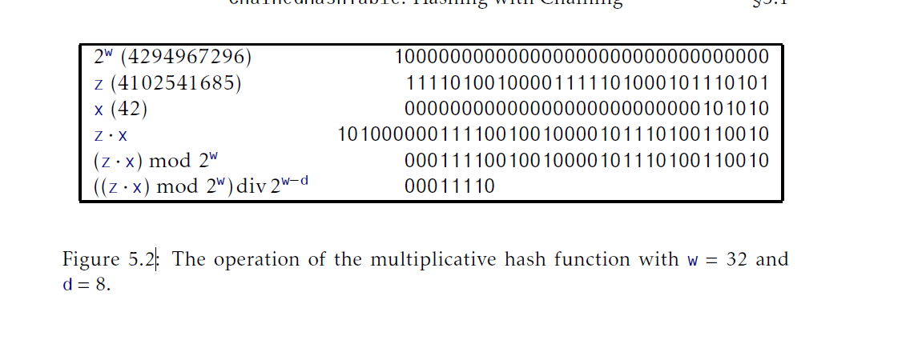

## 哈希表
存放$n$个少量整数(整数本身属于一个$U=\{0,\ldots,2^w-1\}$很大范围中)的一个高效方式是使用哈希表。词汇 _哈希表_ 一批很广泛的数据结构。本章第一部分关注于哈希表中最常见的两个实现：链式哈希和线性探测哈希。

很多哈希表存储的数据类型不是整数。在这种情况下，每个数据元素都有与之关联的整形 _哈希码(hash code)_，这个码，被用于哈希表中。本章第二部分讨论如何生成这样的哈希码。

本章使用的某些方法要求在某个指定的整数范围随机选择。在代码示例中，这些"随机"整数有些是硬编码常量。这些常量是使用大气噪声产生的随机位获取的。

### 5.1 `ChainedHashTable`：链式哈希
`ChainedHashTable`数据结构使用 _链式哈希(hashing with chaining)_ 把数据存放到list数组`t`中。整数`n`记录所有list中全部元素总数(参见图5.1)：
```Java
List<T>[] t;
int n;
```
=6")

一个数据元素`x`的 _哈希值(hash value)_，记为`hash(x)`是一个位于范围$\{0,\ldots,t.length-1\}$的值。所有哈希值为`i`的元素都存放在`t[i]`的list中。为了保证这个list不会太长，我们维护了不变量：
$$n \ge t.length$$
这样，这些list中单个包含的元素平均数是$n/t.length \lg 1$。

为了把一个元素`x`加入到哈希表中，我们首先检查`t`的长度是否需要增加，如果需要，我们就增长`t`。完成这个之后，我们通过对`x`执行哈希操作得到一个整数`i`，位于范围$\{0,\ldots,t.length-1\}$中，然后我们将`x`加入到list `t[i]`中：
```Java
boolean add(T x){
    if(find(x) != null) return false;
    if(n+1 > t.length) resize();
    t[hash(x)].add(x);
    n++;
    return true;
}
```
增长表操作(如果有必要)涉及到要倍增`t`的长度并把所有元素重新插入到新的表中。这个策略和曾在`ArrayStack`实现中使用的完全一样，因此也有同样的结果：当增长操作摊还到一系列插入操作时，增长的开销就只是常量时间(参见引理2.1)。

除了增长操作外，当给`ChainedHashTable`增加一个元素`x`时，其它工作就只是将`x`添加到list `t[hash(x)]`中。对于在第2和第3章中描述的其他任何list实现，都是花费常量时间。

为了从哈希表中删除一个元素`x`，我们在list `t[hash(x)]`上迭代查找`x`，然后删除它：
```Java
T remove(T x){
    Iterator<T> it = t[hash(x)].iterator();
    while(it.hasNext()){
        T y = it.next();
        if(y.equals(x)){
            it.remove();
            n--;
            return y;
        }
    }
    return null;
}
```
这会花费$O(n_{hash(x)})$的时间，其中$n_i$表示位于`t[i]`的list长度。

在哈希表中搜索元素`x`类似。我们在`t[hash(x)]`上执行线性搜索：
```Java
T find(Object x){
    for(T y : t[hash(x)]){
        if(y.equals(x)){
            return y;
        }
    }
    return null;
}
```
再一次，这个花费的时间正比于相应list `t[hash(x)]`的长度。

哈希函数是哈希表的性能的关键依赖。一个好的哈希函数会将元素平均地分布到`t.length`个list上，所以单个list t[hash(x)]的期望长度是$O(n/t.length)=O(1)$。另一方面，一个坏的哈希函数可能会把所有的值(包括`x`)哈希到同一个表位置，此时，单个list `t[hash(x)]`的长度就是`n`。下一节我们描述一个好的哈希函数。

#### 5.1.1 乘法哈希(multiplicative hashing)
乘法哈希(multiplicative hashing)是基于模运算(modular arithmetic)(在2.3节讨论过)和整数除法的高效哈希值成方法。他使用$\text{div}$操作符，只计算商的整数部分不考虑余数。形式化的说，对于任意整数$a \ge 0 \text{和} b \ge 1, a \text{div} b = \lfloor a/b \rfloor$。

在乘法哈希中，对于某个整数`d`(叫做 _维度(dimension)_)。哈希一个整数$x\in \{0,\ldots,2^w-1\}$公式是：
$$hash(x)=((z\cdot x)\bmod 2^w)\text{div}2^{w-d}$$
这里，$z$是从$\{1,\ldots,2^w-1\}$中选择的 _奇数_。默认情况，对于整数的操作已经完成了模$2^w$，这里$w$是一个整数的位数[<sup id="content1">1</sup>](#1)(参见图5.2)，所以这个操作可以被实现的非常高效。进一步的， 整数除以$2^{w-d}$等于丢掉这个整数二进制表示的最右边$w-d$位(通过使用$>>>$操作向右移动$w-d$位)。使用这种方式，代码可以以更简单的方式实现上述公式：



```Java
int hash(Object x){
    return (z*x.hashcode())>>>(w-d);
}
```
如下引理，本节稍后证明，显示了乘法哈希对于避免冲突非常有效：
__引理5.1.__ 设`x`和`y`为范围$\{0,\ldots,2^w-1\}$中任意两个值，且$x\not ={y}$。那么$\text{Pr}\{hash(x)=hash(y)\}\le 2/2^d$。

使用引理5.1，`remove(x)`和`find(x)`的性能就很容易分析了：
__引理5.2.__ 对于任意数据值`x`，list `t[hash(x)]`的期望长度最多$n_x+2$，这里$n_x$是`x`在哈希表中出现的次数。
$\text{Proof}$ 设$S$为哈希表中不等于`x`的元素的集合。对于一个元素$y\in S$，定义指示器变量：
$$I_y=\begin{cases}
    1\quad\text{如果$hash(x) = hash(y)$}\\
    0\quad\text{其他情况}
\end{cases}$$
并且，注意到，根据引理5.1，$\mathrm{E}[I_y]\le 2/2^d = 2/t.length$。list `t[hash(x)]`的期望长度由如下等式给出：
$$\begin{aligned}
    \mathrm{E}[t[hash(x)].size()] &= \mathrm{E}\left[n_x+\sum_{y\in S}I_y\right]\\
    &= n_x+\sum_{y \in S}\mathrm{E}[I_y]\\
    &\le n_x+\sum_{y \in S}2/t.length\\
    &\le n_x+\sum_{y \in S}2/n\\
    &\le n_x+(n-n_x)2/n\\
    &\le n_x+2\\
\end{aligned}$$
这就证明了引理。

现在，我们要证明引理5.1，但首先我们需要一个数论的结论。在后面的证明中，我们使用符号$(b_r,\ldots,b_0)_2$表示$\sum_{i=0}^rb_i2^i$，这里每个$b_i$是一个bit，要么0，要么1。换句话说，$(b_r,\ldots,b_0)_2$是一个整数的二进制表示。我们使用$\star$标记一个bit的值未知。

__引理5.3.__ 设$S$为$\{1,\ldots,2^w-1\}$中奇数集合；设`q`和`i`为$S$中任意两个值。那么就唯一存在一个值$z\in S$满足$zq \bmod 2^w=i$。

$\text{Proof}$ 对于$z$和$i$的选择是相同的，就足够证明最多有一个值$z\in S$满足$zq \bmod 2^w=i$。

假设，不失矛盾的，有两个值$z$和$z'$，有$z \gt z'$。那么：
$$zq \bmod 2^w = z'q\bmod 2^w = i$$
所以，
$$(z-z')q \bmod 2^w = 0$$
单这意味着
$$\tag{5.1} (z-z')q = k2^w$$
其中，$k$是某个整数。按照二进制数考虑，我们有：
$$(z-z')q = k\cdot(1,\underbrace{0,\ldots,0}_{m})_2$$
所以$(z-z')q$的$w$个末尾bit位二级制表示都是0。

进一步的，$k\neq 0$，因为$q \neq 0$且$z-z' \neq 0$。由于$q$是奇数，它的二进制表示是没有拖尾的0：
$$q=(\star,\cdots,\star,1)_2$$
由于$\vert z-z'\vert \lt 2^w$，$z-z'$的二进制表示拖尾0要小于$w$：
$$z-z' = (\star,\cdots,\star,1,\underbrace{0,\cdots,0}_{\lt w})_2$$
因此，$(z-z')q$积的二进制表示拖尾0就少于$w$个：
$$(z-z')q=(\star,\cdots,\star,1,\underbrace{0,\cdots,0}_{\lt w})_2$$
因此，$(z-z')q$无法满足等式(5.1)，从而产生了矛盾完成了证明。

对引理5.3的利用来自于如下的观察：如果$z$按照随机的方式均匀地从$S$选择，那么$zt$就会均匀地分布在$S$上。在接下来的证明中，使用$z$的二进制表示(由$w-1$个随机bit后跟着一个1组成)来思考问题会很有帮助。

_引理5.1的证明_ 首先我们注意到条件$hash(x) = hash(y)$和语句"$zx \bmod 2^w$最高顺序的$d$个位(bit)和$zy \bmod 2^w$最高顺序的$d$个位(bit)是一样的"是等价的。这个语句的一个必要条件是$z(x-y)\bmod 2^w$的二进制表示最高顺序的$d$个位(bit)。也就是说：
$$\tag{5.2} z(x-y)\bmod 2^w = (\underbrace{0,\ldots,0}_{d},\underbrace{\star,\ldots,\star}_{w-d})_2$$

当$zx\bmod 2^w \gt zy \bmod 2^w$或者
$$\tag{5.3}  z(x-y)\bmod 2^w = (\underbrace{1,\ldots,1}_{d},\underbrace{\star,\ldots,\star}_{w-d})_2$$
当$zx \bmod 2^w \lt zy \bmod 2^w$。因此，我们只需要界定$z(x-y)\bmod 2^w$形如$(5.2)$或者$(5.3)$的概率。

对于某个整数$r \ge 0$，设$q$是满足$(x-y)\bmod 2^w = q2^r$的唯一奇数。根据引理5.3，$zq\bmod 2^w$的二进制表示是$w-1$个随机bit后跟着一个1：
$$zq\bmod 2^w = (\underbrace{b_{w-1},\ldots,b_1}_{w-1},1)_2$$
因此，$z(x-y)\bmod 2^w = zq2^r\bmod 2^w$的二进制表示有$w-r-1$各个随机bit后跟一个1，然后后跟$r$个0：
$$z(x-y)\bmod 2^w = zq2^r\bmod 2^w = (\underbrace{b_{w-r-1},\ldots,b_1}_{w-r-1},1,\underbrace{0,0,\ldots,0}_{r})_2$$
现在我们可以完成证明：如果$r\gt w-d$，那么$z(x=y)\bmod 2^2$的$d$个较高bit位包含的都是0和1，所以$z(x-y)\bmod 2^w$形如$(5.2)$或者$(5.3)$的概率是0。如果$r=w-d$，$z(x-y)\bmod 2^w$形如$(5.2)$的概率是0，但是形如$(5.3)$的概率是$1/2^{d-1}=2/2^d$(因为我们必须有$b_1,\ldots,b_{d-1} = 1,\ldots,1$)。如果$r\lt w-d$，那么我们必须有$b_{w-r-1},\ldots,b_{w-r-d} = 0,\ldots,0$或者$b_{w-r-1},\ldots,b_{w-r-d} = 0,\ldots,0$。这两种情况的概率都是$1/2^d$，而且它们之间都是互斥的(mutually exclusive)，所以每种情况的概率都是$2/2^d$。这就完成了证明。

#### 5.1.2 总结
如下定理总结了`ChainedHashTable`数据结构的性能：
__定理5.1__ `ChainedHashTable`实现了`USet`接口。忽略调用`grow()`的开销，`ChainedHashTable`支持每个操作期望运行时间是$O(1)$的`add(x)`，`remove(x)`和`find(x)`。

进一步的，从一个空的`ChainedHashTable`开始，以任意顺序对`add(x)`和`remove(x)`$m$次调用操作会花费一共$O(m)$的时间用来调用全部的`grow()`。

### `LinearHashTable`：线性探测(linear probing)
`ChainedHashTable`数据结构使用list数组，第`i`个list存储所有满足$hash(x)=i$的元素$x$。一个替换品，叫做 _开放寻址(open addressing)_ 的方法是直接在一个数组`t`中存放元素，`t`中每个数组位置最多存放一个元素。本节描述的`LinearHashTable`就采用了这个方法。在有些地方，这个数据结构叫做 _使用线性探测的开放寻址(open addressing with linear probing)_。

`LinearHashTable`背后的主要想法是我们想要，理想情况下，当元素`x`(哈希值为$i=hash(x)$)存放在`t[i]`的位置。如果我们无法做到(因为已经有元素存放于那个位置)那么我们就存放在$t[(i+1)\bmod t.length]$的位置；如果还是不可以，那么我们就尝试$t[(i+2)\bmod t.length]$一直这样下去知道为`x`找到一个位置。

`t`中存放的有三种类型条目：
1. 数据值：我们要呈现的位于`USet`中的实际值；
2. `null`值：没有存放任何值的数组位置；以及
3. `del`值：数据曾经在这个位置存放过但是已经被删除了。

另外，计数器`n`用来跟踪`LinearHashTable`中元素的个数，计数器`q`跟踪类型为1和3的元素个数。也即，`q`等于`n`加上`t`中`del`值的个数。为了让这一切更高效的工作，我们需要`t`要显著的大于`q`，这样`t`中就会有很多`null`。在`LinearHashTable`中有操作维护了`t.length \ge 2q`这个不变量。

为了总结，`LinearHashTable`包含一个数组`t`，用来存放数据元素，以及整数`n`和`q`分别跟踪数组`t`数据元素和非`null`元素的个数。因为很多哈希函数只能在表大小为2的幂的情况下正常工作，我们也保存了一个整数`d`并维护了不变量$t.length=2^d$。
```Java
T[] t;//后端支撑表
int n;//大小
int d;//t.length = 2^d
int q;//t中non-null元素个数
```
`LinearHashTable`的`find(x)`操作很简单。我们先从数组条目`t[i]`(`i`满足$i=hash(x)$)开始，搜索$t[i]$，$t[(i+1)\bmod t.length]$，$t[(i+2)\bmod t.length]$以此类推，直到我们找到索引`i'`满足$t[i']=x$或者$t[i'] = null$。前者我们就返回`t[i']`，后者，我们就得知`x`不在哈希表中从而返回`null`。
```Java
T find(T x){
    int i = hash(x);
    while(t[i] != null){
        if(t[i] != del && x.equals(t[i])){
            return t[i];
        }
        i = (i == t.length-1)?0:i+1;//增加i值
    }
    return null;
}
```
`add(x)`操作也相当容易实现。在检查哈希表中还没有存放`x`后(使用`find(x)`)，我们搜索数组条目`t[i]`，$t[(i+1)\bmod t.length]$，$t[(i+2)\bmod t.length]$以此类推，直到我们找到`null`或者`del`可以在这个位置存放`x`，然后增加`n`和`q`(如果合适的话)。
```Java
boolean add(T x){
    if(find(x) != null) return false;
    if(2*(q+1)>t.length) resize();//最大50%容量
    int i = hash(x);
    while(t[i] != null && t[i] != del){
        i = (i==t.length-1)?0:i+1;//增加i
    }
    if(t[i] == null) q++;
    n++;
    t[i] = x;
    return true;
}
```
现在，`remove(x)`操作的实现应该就很显然了。我们搜索`t[i]`，$t[(i+1)\bmod t.length]$，$t[(i+2)\bmod t.length]$以此类推，直到我们找到索引`i'`满足$t[i']=x$或者$t[i'] = null$。前者我们就设置`t[i']=del`并返回`x`，后者，我们就得知`x`不在哈希表中从而返回`null`。
```Java
T remove(T x){
    int i = hash(x);
    while(t[i] != null){
        T y = t[i];
        if(y != del && x.equals(y)){
            t[i] = del;
            n--;
            if(8*n<t.length)resize();//最小12.5%的容量
            return y;
        }
        i = (i==t.length-1)?0:i+1;//增加i
    }
    return null;
}
```
`find(x)`，`add(x)`和`remove(x)`方法的正确性很容易验证，不过它依赖于对`del`值的使用。注意到这些操作都没有把不是`null`的条目设置为`null`。因此，当我们访问到所以`i'`时$t[i']=null$，这证明了我们正在搜索的元素`x`没有存在表中；$t[i']$一直都是`null`，所以这就没有可能之前一个`add(x)`操作会处理到索引会超过$i'$。

`resize()`方法会在执行`add(x)`操作时非`null`条目个数超过了$t.length/2$或者在执行`remove(x)`操作时数据条目个数少于$t.length/8$时被调用。这个`resize()`方法和其它基于数据的数据结构是类似的。我们找到最小的非负整数$d$满足$2^d \ge 3n$。我们重新分配一个数组`t`大小为$2^d$，我们把所有旧版本`t`的全部元素都插入到重新调整大小的`t`的副本中。这样做后，我们重置`q`等于`n`，因为新分配的`t`不包含`del`值。
```Java
void resize(){
    d = 1;
    while ((1<<d)<3*n) d++;
    T[] told = t;
    t = newArray(1<<d);
    q = n;
    for(int k = 0;k < told.length;k++){
        if(told[k] != null && told[k] != del){
            int i = hash(told[k]);
            while(t[i] != null){
                i = (i == t.length-1)?0:i+1;
            }
            t[i] = told[k];
        }
    }
}
```
#### 5.2.1 线性探测分析
注意到`find(x)`，`add(x)`和`remove(x)`这些操作都是一旦它在`t`中发现第一个`null`条目时(或者在这之前)就结束了。线性探测分析背后的直觉是：因为至少`t`中一半的元素都等于`null`，一个操作不会花费太多时间才会完成，因为操作很快就会遇到`null`条目。然而，我们不应该太过于依赖这个直觉，因为它会导致我们得到(不正确的)结论，就是每个操作在`t`中检测的位置数期望个数是2。

本届剩下的内容，我们将要假设所有的哈希值都是独立且均匀分布在$\{0,\ldots,t.length-1\}$。这不是一个实际的假设，但是这让我们分析线性探测有了可能。本节稍后我们会描述一个方法，叫做表格哈希(tabulation hashing)，它会为线性探测产生一个足够好的哈希函数。我们还会假设所有指向`t`的位置的下标都是模`t.length`的，这样`t[i]`就是$t[i\bmod t.length]$的简写。

我们说 _长度为`k`的路程(run of length `k`)_ 意味着从`i`开始表中条目$t[i],t[i+1],\ldots,t[i+k-1]$都是non-`null`并且$t[i-1] = t[i+k] = null$。`t`中non-`null`元素个数就是`q`并且`add(x)`方法保证了，在所有时候都有，`q\le t.length/2`。从上一次执行了`rebuild`操作后有`q`个元素$x_1,\ldots,x_q$插入了`t`中。由于我们的假设，这些元素都有一个哈希值`hash(x_j)`，均匀并独立于其它值。有了这一步，我们可以证明用来分析线性探测的主要引理。

__引理5.4.__ 固定一个值$i \in \{0,\ldots,t.length-1\}$。那么从$i$开始长度为`k`的路程的概率是$O(c^k)$，其中$0\lt c\lt 1$。

$\text{Proof}$ 如果长度为`k`的路程从$i$开始，那么就有确定的$k$个元素$x_j$满足$hash(x_j)\in \{i,\ldots,i+k-1\}$。那么这个发生的概率就完全是：
$$p_k= {q\choose k}\left(\frac{k}{t.length}\right)^k(\frac{t.length-k}{t.length})^{q-k},$$
因此，对于$k$个元素的每次选择，那些$k$个元素哈希到$k$给位置的一个，并且剩下的$q-k$个元素必须哈希到其它$t.length-k$个表位置。[<sup id="content2">2</sup>](#2)

在后面的推导(derivation)中我们会讨一个巧，使用$(r/e)^r$替换$r!$。Stirling渐进(Stirling's approximation)(第1.3.2节)显示了二者只有$O(\sqrt{r})$因子的差距(this is only a factor of $O(\sqrt{r})$ from the truth)。这让推导变得简单了；联系5.4要求读者完整的使用Stirling渐进更严格的重做计算。

当$t.length$最小时，$p_k$的值最大，并且这个数据结构维护了$t.length\ge 2q$不变量，所以：
$$\begin{aligned}
    p_k &\le {q \choose k}\left(\frac{k}{2q}\right)^k\left(\frac{2q-k}{2q}\right)^{q-k}\\
    &= \left(\frac{q!}{(q-k)!k!}\right)(\frac{k}{2q})^k(\frac{2q-k}{2q})^{q-k}\\
    &\approx \left(\frac{q^q}{(q-k)^{q-k}k^k}\right)\left(\frac{k}{2q}\right)^k\left(\frac{2q-k}{2q}\right)^{q-k}\qquad \text{[Stirling's approximation]}\\
    &=\left(\frac{q^kq^{q-k}}{(q-k)^{q-k}k^k}\right)\left(\frac{k}{2q}\right)^k\left(\frac{2q-k}{2q}\right)^{q-k}\\
    &=\left(\frac{qk}{2qk}\right)^k\left(\frac{q(2q-k)}{2q(q-k)}\right)^{q-k}\\
    &=(\frac{1}{2})^k\left(\frac{2q-k}{2(q-k)}\right)^{q-k}\\
    &=(\frac{1}{2})^k\left(1+\frac{k}{2(q-k)}\right)^{q-k}\\
    &\le\left(\frac{\sqrt{e}}{2}\right)^k.
\end{aligned}$$
(在最后一步，我们使用了不等式$(1+1/x)^x\le e$，这对所有$x>0$都是成立的。)由于$\sqrt{e}/2\lt 0.824360636\lt 1$，证明完成。$\square$

使用引理5.4证明`find(x)`，`add(x)`和`remove(x)`操作的期望运行时间现在就相当直接了。考虑到最简单的例子：我们使用`find(x)`查找某个从没有存放在`LinearHashTable`的`x`值。在这种情况下，$i = hash(x)$是一个位于$\{0,\ldots,t.length-1\}$随机值，独立于`t`的内容。如果`i`是长度为$k$路程的一部分，那么它用来执行`find(x)`操作的时间最多是$O(1+k)$。因此，期望运行时间的上届可以由：
$$O\left(1+\left(\frac{1}{t.length}\right)\sum_{i=1}^{t.length}\sum_{k=0}^{\infin}k\mathrm{Pr}\{\text{$i$是长度为$k$路程的一部分}\}\right)$$
界定。

注意到每一个长度为$k$路程贡献了$k$次内部求和，所以一共贡献了$k^2$，所以上述求和可以被重写为：
$$\begin{aligned}
    &O\left(1+\left(\frac{1}{t.length}\right)\sum_{i=1}^{t.length}\sum_{k=0}^{\infin}k^2\mathrm{Pr}\{\text{$i$从长度为$k$路程开始}\}\right)\\
    &\le O\left(1+\left(\frac{1}{t.length}\right)\sum_{i=1}^{t.length}\sum_{k=0}^{\infin}k^2p_k\right)\\
    &= O\left(1+\sum_{k=0}^{\infin}k^2p_k\right)\\
    &= O\left(1+\sum_{k=0}^{\infin}k^2\cdot O(c^k)\right)\\
    &= O(1).
\end{aligned}$$

这个推导中最后一步来自于这个事实：$\sum_{k=0}^{\infin}k^2\cdot O(c^k)$是一个指数下降序列[<sup id="content3">3</sup>](#3)。因此，我们总结了查找一个没有包含在`LinearHashTable`中的值的`find(x)`操作期望运行时间是$O(1)$。

如果我们忽略`resize()`操作的开销，那么上述分析就是我们用来分析所有`LinearHashTable`操作的开销。

首先，上面给出的`find(x)`操作分析可以应用到`add(x)`操作上，当`x`不在表中。为了分析当`x`存在于表中时`find(x)`操作，我们只需要注意这和之前将`x`加入到表中时`add(x)`操作的开销是一样的。最后，`remove(x)`操作的开销和`find(x)`操作的开销是一样的。

总结一下，如果我们忽略`resize()`调用的开销，`LinearHashTable`的所有操作都是$O(1)$的期望运行时间。`resize`的开销可以使用2.1节对`ArrayStack`数据结构同样类型的摊还分析来总结。

#### 5.2.2 总结
如下定理总结了`LinearHashTable`数据结构的性能：
__定理5.2.__ `LinearHashTable`实现了`USet`接口。忽略`resize()`调用的开销，`LinearHashTable`支持期望运行时间是$O(1)$的`add(x)`,`remove(x)`和`find(x)`操作。

进一步的，从一个空`LinearHashTable`开始，任意顺序调用`add(x)`和`remove(x)`操作$m$次产生的所有`resize()`调用一共花费$O(m)$的时间。

#### 5.2.3 表格哈希函数(tabulation hashing)
在分析`LinearHashTable`结构时，我们做出了一个很强的假设：对于任意元素$\{x_1,\ldots,x_n\}$的集合，哈希值$hash(x_1),\ldots,hash(x_n)$是独立且均匀分布在整个集合$\{0,\ldots,t.length-1}$。达成这个的一个方式是把数据存放到一个巨大的数组`tab`中，大小是$2^w$，它里面每个条目是随机的`w`个bit位的整数，和其他所有条目都不同。以这种方式，我们可以通过从`tab[x.hashCode()]`提取bit位个数是`d`整数：
```Java
int idealHash(T x){
    return tab[x.hashCode()>>>w-d];
}
```
不幸的是，存储一个大小为$2^w$的数组对于内存使用来说是难以承受的。相反，使用表格哈希函数(tabulation hashing)的方法把`w`个bit的整数看成由$w/r$个整数组成的，每个整数只有$r$个bit。使用这种方式，表格哈希只需要$w/r$个数组，每个数组长度是$2^r$。这些数组中的所有元素都是独立随机的`w`个bit的整数。为了获得`hash(x)`的值，我们把`x.hashCode()`分割为$w/r$个$r$个bit的整数，然后使用这些作为那些数组的索引。然后我们使用按位异或操作结合所有这些值来获取`hash(x)`。如下代码显示了当`w=32`和`r=8`时是如何工作的：
```Java
int hash(T x){
    int h = x.hashCode();
    return (tab[0][h&0xff]
            ^tab[1][(h>>>8)&0xff]
            ^tab[2][(h>>>16)&0xff]
            ^tab[3][(h>>>24)&0xff])
           >>>(w-d);
}
```
我们可以很容易的验证这个，对于任意`x`，`hash(x)`是均匀分布在$\{0,\ldots,2^d-1\}$上。只需要少量的工作，我们就可以确认任意一对值都有独立的哈希值(With a little work,one can even verify that any pair of values have independent hash values)。这意味着表格哈希可以用来代替`ChainedHashTable`实现中使用的乘法哈希。

然而，对于`n`个不同值的集合都会有`n`个独立哈希值。不过，当使用制表哈希时，定理5.2的界限依旧是保持的。本章最后提供了相关的引用。

### 5.3 哈希码(Hash Codes)
上面段落讨论的哈希表是用于key由`w`个bit组成的整数的数据。在很多情况下，key都不是整数。他们可能是字符串，对象，数组或者其它复合数据结构。为了让这些类型的数据也可以使用哈希表，我们必须把这些值映射为`w`个bit的整数哈希码。哈希码映射应该遵循如下属性：
1. 如果`x`和`y`相等，那么`x.hashCode()`和`y.hashCode()`相等。
2. 如果`x`和`y`不相等，那么`x.hashCod() == y.hashCode()`的概率应很小(接近$1/2^w$)。

第一个属性确保了如果我们在哈希表中存了一个元素`x`然后稍后查找一个值`y`等于`x`，那么我们就可以找到`x`，就像我们希望的那样。第二个属性最小化了转化我们对象为整数丢弃的东西。它保证了不相等的对象通常有不同的哈希值并且很可能存在我们哈希表中不同的位置。

#### 5.3.1 原始数据类型哈希码
像`char`，`byte`，`int`和`float`这样小的原始数据类型通常很容易为它们找到哈希码。这些数据类型总是有一个二进制表示并且这个二进制表示通常是由`w`或者更少个bit位组成。(例如，在Java中，`byte`是一个8-bit类型而`float`是一个32-bit类型。)在这些情况下，我们就把这些bit看作是一个范围是$\{0,\ldots,2^w-1\}$的整数二进制表示。如果两个值不同，它们就有不同的哈希码。如果他们相同，就有相同的哈希码。

少量的基本数据类型是由超过`w`个bit位组成的，通常是$cw$个bit位，其中，$c$是一个常量整数(Java的`long`和`double`类型就是一个例子，它们的$c=2$。)这些数据类型可以看作是由`c`个部分的符合对象，我们将在下节讲解。

#### 5.3.2 符合元素哈希码
对于复合对象，我们想要通过结合对象格个组成部分自身的哈希码创建这个对象的哈希码。这不像说起来那么简单。尽管我们可以为这个找到很多啊hack方法(例如，使用按位异或操作结合这些哈希码)，这些hack方法很多都被证明很容易破坏(foil)(参见练习5.7-5.9)。然而，我们愿意以$2w$个bit位的精度计算，那么就存在简单健壮的方法。假设我们有一个对象是由几个部分组成$p_0,\ldots,p_{r-1}$，每个部分对应的哈希码是$x_0,\ldots,x_{r-1}$。那么我们可以互斥的选择独立随机$w$个bit位的整数$z_0,\ldots,z_{r-1}$和一个随机$2w$个bit位的奇数$z$并使用如下公式计算我们对象的哈希码(Suppose we have an object made up of severals parts $p_0,\ldots,p_{r-1}$ whose hash codes are $x_0,\ldots,x_{r-1}$.Then we can choose mutually independent random w-bit integers $z_0,\ldots,z_{r-1}$ and a random 2w-bit odd integer z and compute a hash code for our object with)：
$$h(x_0,\ldots,x_{r-1})=\left(\left(z\sum_{i=0}^{r-1}z_ix_i\right)\bmod 2^{2w}\right)\mathrm{div}\;2^w$$
注意这个哈希码的最后一步()使用了来自5.1.1节的乘法哈希函数来获取`2w`个bit位中间结果，然后把它规约到一个`w`个bit位的最终结果。这里有一个例子，显示了这个方法是怎么计算一个包含了$x_0$，$x_1$和$x_2$三部分的简单复合对象：
```Java
int hashCode(){
    //从rand.org获取的随机数
    long[] z = {0x2058cc50L, 0xcb19137eL, 0x2cb6b6fdL};
    long zz = 0xbea0107e5067d19dL;
    //转换(无符号)hashcodes为long
    long h0 = x0.hashCode()&((1L<<32)-1);
    long h1 = x1.hashCode()&((1L<<32)-1);
    long h2 = x2.hashCode()&((1L<<32)-1);
    return (int)(((z[0]*h0+z[1]*h1+z[2]*h2)*zz)>>>32);
}
```
下面的定理显示了，除了很容易实现之外，这个方法还证明很有效：

__定理5.3.__ 设$x_0,\ldots,x_{r-1}$和$y_0,\ldots,y_{r-1}$是$w$个bit位整数的序列，整数范围是$\{0,\ldots,2^w-1\}$，并假设对于至少一个索引$i\in\{0,\ldots,r-1\}$有$x_i\neq y_i$。那么：
$$\mathrm{Pr}\{h(x_0,\ldots,x_{r-1}) = h(y_0,\ldots,y_{r-1})\}\le 3/2^w$$

$\text{Proof}$ 我们先忽略最后的乘法哈希步骤，稍后再看看这一步是如何贡献的。定义：
$$h'(x_0,\ldots,x_{r-1}) = \left(\sum_{j=0}^{r-1}z_jx_j\right)\bmod 2^{2w}$$
假设$h'(x_0,\ldots,x_{r-1}) = h'(y_0,\ldots,y_{r-1})$。我们可以重写这个公式为：
$$\tag{5.4} z_i(x_i-y_i)\bmod 2^(2w) = t$$
如果我们假设，不失一般性的，$x_i\gt y_i$，那么公式$(5.4)$就变成了：
$$\tag{5.5} z_i(x_i - y_i) = t,$$
因为对于每个$z_i$和$(x_i-y_i)$最大是$2^w-1$，所以他们的积最大就是$2^(2w)-2^(w+11)+1\lt 2^{2w}-1$。根据假设，$x_i-y_i\neq 0$，所以，公式$(5.5)$在$z_i$集合中最多有一个解(at most one solution in $z_i$)。因此，因为$z_i$和$t$是独立的($z_0,\ldots,z_{r-1}$是互斥独立的)，所以我们选择满足$h'(x_0,\ldots,x_{r-1}) = h'(y_0,\ldots,y_{r-1})$等式$z_i$的概率最多是$1/2^w$。

这个哈希函数最后一步是应用乘法哈希把我们的`2w`个bit位中间结果$h'(x_0,\ldots,x_{r-1})$规约到`w`个bit位最终结果$h(x_0,\ldots,x_{r-1})$。根据引理5.1(注意，这里应该原文是错误的，引用的应该是引理5.1，原文说的根据定理5.3，而这个证明正面的就是5.3)，如果$h'(x_0,\ldots,x_{r-1}) \neq h'(y_0,\ldots,y_{r-1})$，那么$\mathrm{Pr}\{h(x_0,\ldots,x_{r-1}) = h(y_0,\ldots,y_{r-1})\}\le 2/2^w$
总结一下：
$$\begin{aligned}
    &\mathrm{Pr}\left\{\begin{array}{c}
        h(x_0,\ldots,x_{r-1})\\
        \quad\quad =h(y_0,\ldots,y_{r-1})
    \end{array}\right\}\\
    &=\mathrm{Pr}\left\{\begin{array}{c}
        &h'(x_0,\ldots,x_{r-1})=h'(y_0,\ldots,y_{r-1})\; \text{or} \; \\
        &h'(x_0,\ldots,x_{r-1})\neq h'(y_0,\ldots,y_{r-1}) \\
        &\text{and}\; zh'(x_0,\ldots,x_{r-1})\mathrm{div} 2^w = zh'(y_0,\ldots,y_{r-1})\mathrm{div}2^w 
    \end{array}\right\}\\
    &\le 1/2^w +2/2^w = 3/2^w.\qquad\qquad\square
\end{aligned}$$

### 5.3.3 数组和字符串的哈希码
上面介绍的方法对于有固定常量个数的组件的对象工作的很好。然而，当我们的对象有可变数量的组件的话，这个方法就不可行了，因为它要求对每个组件都由一个随机`w`个bit位的整数$z_i$。我们可以使用一个伪随机序列来生成我们需要的$z_i$个数，但是这个$z_i$就不是互斥独立的，这样就证明这些伪随机数不会对我们使用的哈希函数很糟糕的影响就变得很困难。特别的，在定理5.3的证明中，$t$和$z_i$的值就不再是独立的了。

一个更严格的方式是让我们的哈希码基于素数域的多项式；他就是一个平常的多项式，只是模某个素数$p$得到的(注：应该指的多项式系数)(base our hash codes on polynomials over prime fields;these are just regular polynomials that are evaluated modulo some prime number,$p$.)。这个方法基于如下定理，这个定理说明了素数域上的多项式行为非常想普通的多项式(This method is based on the following theorem,which says that polynomials over prime fields behave pretty-much like usual polynomials)。

注：polynomials over prime fields，我没有搜到这个内容，但是有一个 factorization of polynomials over infinite fields。这里设计到了域，有限域的概念，有限域又叫伽罗华域它的阶(也就是有限域的个数)是一个素数或者是素数的k次幂，其中k是正整数。记模素数$p$的有限域为$\mathrm{GF(p)}$，是整数集合$\{0,1,\ldots,p-1\}$的集合，在之上的加法和乘法都是模加法和模乘法。另一个有限域就是$\mathrm{GF(p^m)}$，他的运算需要利用$\mathrm{GF(p)}$的多项式运算了。同时还有一个多项式的概念叫做不可约多项式(也叫做素多项式)，比如$x^2-2$就是一个在整数域上的不可约的多项式。更多相关的内容要参照数论了。其实这个注也没有很好的解释上文的概念。

__定理5.4.__ 设$p$是一个素数，并设$f(z) = x_0 z^0+x_1z^1+\cdots+x_{r-1}z^{r-1}$是一个非平凡多项式，其中系数$x_i\in\{0,\ldots,p-1\}$。那么等式 $f(z)\bmod p = 0$，对于$z\in\{0,\ldots,p-1\}$最多只有$r-1$个解。

(注：非平凡多项式，上例中中最大的$i$值满足$x_i\neq 0$，则这个$i$就是多项式的度，如果对任意$i$来说，$x_i$都等于0，那么这个多项式的度是$-\infin$，如果多项式的度是0或者$-\infin$，就说这个多项式是平凡的，否则，就是平凡的)

通过使用定理5.4，我们哈希一个整数序列$x_0,\ldots,x_{r-1}$，对其中每个$x_i\in\{0,\ldots,p-2\}$，我们使用一个随机整数$z\in\{0,\ldots,p-1\}$，通过公式：
$$h(x_0,\ldots,x_{r-1})=(x_0z^0+\cdots+x_{r-1}z^{r-1}+(p-1)z^r)\bmod p$$

注意公式最后这个额外的$(p-1)z^r$。把$(p-1)$看作是序列$x_0,\ldots,x_r$最后的一个元素$x_r$会有帮助。注意这个元素不同于序列中其它的元素(这些元素位于集合$\{0,\ldots,p-2}$)。w我们可以把$p-1$看作序列结束的标记。

下面的定理显示了如果两个序列长度一样，那么这个哈希函数在只需要从少量的随机数中选择$z$就可以有很好的结果：
__定理5.5__ 设$p\gt 2^w+1$是一个素数，设$x_0,\ldots,x_{r-1}$和$y_0,\ldots,y_{r-1}$都是由范围在$\{0,\ldots,2^w-1\}$的$w$个bit位整数构成的序列，并假设至少存在一个索引$i\in\{0,\ldots,r-1\}$满足$x_i \neq y_i$。那么
$$\mathrm{Pr}\{h(x_0,\ldots,x_{r-1})=h(y_0,\ldots,y_{r-1})\}\le (r-1)/p$$

__证明__ 等式$h(x_0,\ldots,x_{r-1})=h(y_0,\ldots,y_{r-1})$可以被重写为：
$$\tag{5.6} \left((x_0-y_0)z^0+\cdots+(x_{r-1}-y_{r-1})z^{r-1}\right)\bmod p = 0$$
因此$x_i \neq y_i$，这个多项式是非平凡的。因此，根据定理5.4，$z$中最多有$r-1$个解。因此，我们选择$z$作为这些解的概率最多是$(r-1)/p\qquad\square$

注意到这个哈希函数也处理了两个序列长度不等的情况，甚至是一个序列是另一个的前缀。这是因为这个函数高效的哈希了这个无穷序列
$$x_0,\ldots,x_{r-1},p-1,0,0,\ldots .$$
这就保证了如果我们有两个序列的长度分别是$r$和$r'$并且$r\gt r'$，那么这些序列就在索引$i=r$处不同。在这种情况下，等式$(5.6)$变成：
$$\left(\sum_{i=0}^{i=r'-1}(x_i-y_i)z^i+(x_{r'}-p+1)z^{r'}+\sum_{i=r'+1}^{i=r-1}x_iz^i+(p-1)z^r\right)\bmod p = 0,$$
根据定理5.4，在$z$中至多只有$r$个解。结合这个和定理5.5足够证明如下更一般的定理：
__定理5.6__ 设$p\gt 2^w+1$是一个素数，设$x_0,\ldots,x_{r-1}$和$y_0,\ldots,y_{r-1}$都是由范围在$\{0,\ldots,2^w-1\}$的$w$个bit位整数构成的序列。那么
$$\mathrm{Pr}\{h(x_0,\ldots,x_{r-1})=h(y_0,\ldots,y_{r-1})\}\le \max\{r,r'\}/p$$
如下示例代码显示了这个哈希函数是如何应用到一个包含了数组$x$:
```Java
int hashCode(){
    long p = (1<<<32)-5;//素数2^32-5
    long z = 0x64b6055aL; // 32 bits from random.org
    int z2 = 0x5067d19d; // random odd 32 bit number
    long s = 0;
    long zi = 1;
    for(int i =0;i<x.length;i++){
        //规划为31bits
        long xi = (x[i].hashCode()*z2)>>>1;
        s = (s+zi*xi)%p;
        zi=(zi*z)%p;
    }
    s = (s+zi*(p-1))%p;
    return (int)s;
}
```
上面的代码为了实现的方便牺牲了冲突概率(也即冲突的概率变高了)。特别的，它应用了第5.1.1节的乘法哈希函数，使用$d=31$来规约`x[i].hashCode()`为一个31个bit的值。使用63bit无符号算数可以通过模一个素数$p=2^{32}-5$开完成加法和乘法，长度是`r`长的那个序列，有同样哈希码最多
$$2/2^{31}+r/(2^{32}-5)$$
而不是定理5.6说的$r/2^{32}-5$
### 5.4 讨论和练习
哈希表和哈希码代表了一个巨大活跃的研究领域，本章只稍微触及了一些。关于哈希的在线文献包含将近2000个条目。

存在各种不同的哈希表变种实现。第5.1节描述就是著名的 _链式哈希(hashing with chaining)_(每个数组条目包含一个元素连(list))。链式哈希要追溯到1953年2月H.P.Luhn在IBM写的内部备忘录。这个备忘录看起来也是链式list的最早引用。

链式哈希的一个替代是 _开放地址哈希(open addressing)_ 模式，所有数据都直接存在数组中。这些模式包含了5.2节介绍的`LinearHashTable`结构。这个想法同样也是有IBM的一个小组在20世纪50年代独立提出的。开放地址哈希模式必须处理 _冲突决议(collision resolution)_ 问题：两个值哈希到同一个数组位置。存在不同的冲突决议策略；它们提供了不同的性能保障，通常会要求比这里描述更复杂的哈希函数。

另一个哈希表实现的类别也叫做 _完美哈希(perfect hashing)_ 方法。这些方法会使得`find(x)`操作在最差情况下是$O(1)$的时间开销。对于静态数据集，可以通过为数据找到一个 _完美哈希函数(perfect hashing functions)_ 实现；这些函数把每一份数据都映射为唯一的数组位置。对于会变化的数据，完美哈希函数包括了 _FKS两层哈希表(FKS two-level hash tables)_ 和 _cuckoo hashing_。

本章介绍的哈希函数很可能是当前已知对于任意数据集合都已证明可以工作的很好的最具实践的方法。其它可验证的好的方法要追溯到Carter和wegman的开拓性工作，他俩引入了 _通用哈希(universal hashing)_ 的概念并针对不同场景描述了几个不同的哈希函数。5.2.3节描述的表格哈希要归功于Carter和wegman，但是它的分析，当应用于闲心探测(以及其它几种哈希表模式)时，就要归功于Pătrașcu和Thorup。

_乘法哈希(multiplicative hashing)_ 的概念很古老，似乎是属于哈希风俗(hashing folklore)的一部分。然而，对乘数$z$的选择必须是一个随机 _奇数_ 这一想法以及第5.1.1节的分析要归功于 Dietzfelbinger及其合作者。这一版本的乘法哈希是最简单的版本之一，但是他$2/2^d$的冲突概率只是比一个从$2^w\rightarrow 2^d$的随机函数大两倍。_乘加哈希(multiply-add hashing)_ 方法使用函数
$$h(x)=((zx+b)\bmod 2^{2w})\mathrm{div} 2^{2w-d}$$
其中，$z$和$d$都是从$\{0,\ldots,2^{2w}-1\}$中随机选择的。乘加哈希的冲突概率只有$1/2^d$，但是要求`2w`个bit位精度的算数。

从由`w`个bit位整数组成的固定长度序列中获取哈希码的方法有很多。一个特别快的方法是函数：
$h(x_0,\ldots,x_{r-1})=\left(\sum_{i=0}^{r/2-1}((x_{2i}+a_{2i})\bmod 2^w)((x_{2i+1}+a_{2i+1})\bmod 2^w)\right)\bmod 2^{2w}$

这里$r$是偶数，并且$a_0,\ldots,a_{r-1}$是从$\{0,\ldots,2^w\}$中随机选择的。这会产生一个`2w`个bit的哈希码，冲突概率是$1/2^w$。可以通过使用乘法(或者乘加)哈希归约到一个`w`个bit的哈希码。因为它只要求$r/2$个 `2w`个bit数据的相乘，这个方法就很快，而5.3.2节描述的要求$r$个数据相乘。(这个$\mathrm{mod}$操作加法和乘法通过使用`w`和`2w`的bit位算数会相应的隐式发生。)

5.2.3节的方法使用素数域多项式哈希变长数组和字符串要归功于Dietzfelbinger及其合作者。由于他对$\mathrm{mod}$操作的使用依赖于高开销的机器指令，也就是说，不幸的是，并不是很快。这个方法的几个变体选择一个形如$2^w-1$素数$p$，此时，$\mathrm{mod}$操作符可以替换为加(+)或者按位与(&)操作。另一个选项是应用针对固定长度字符串的快速方法到长度为$c$的块，其中常量$c\gt 1$然后应用素数域方法生成$\lceil r/c \rceil$个哈希码序列。

[<sup id="1">1</sup>](#content1)对于大多数编程语言来说，包括`C`，`C#`，`C++`和`Java`。明显的例外是`Python`和`Ruby`，在这两门语言中，如果一个固定长度是`w`位的整数操作溢出了，会升级到可变长度的表示。
[<sup id="2">2</sup>](#content2)注意，$p_k$比从$i$开始长度为`k`的路程的概率大，因为$p_k$的定义不要求$t[i-1] = t[i+k] = null$。
[<sup id="3">3</sup>](#content3)在很多微积分书籍中的术语中，这个求和通过了比率测试(ratio test)：存在一个正整数$k_0$满足，对所有$k\ge k_0,\frac{(k+1)^2c{k+1}}{k^2c^k}\lt 1$