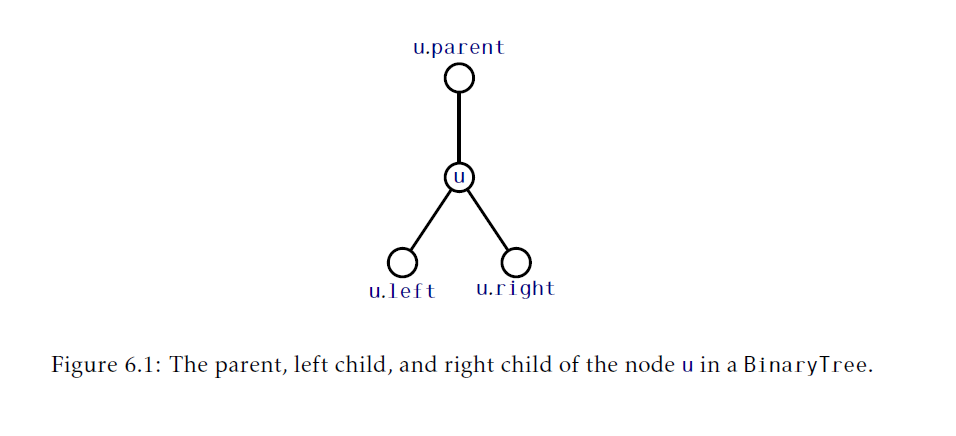
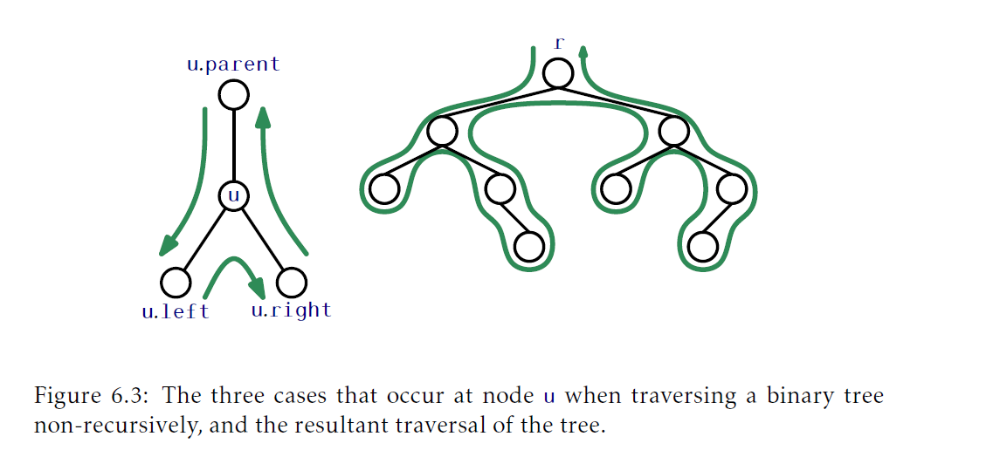
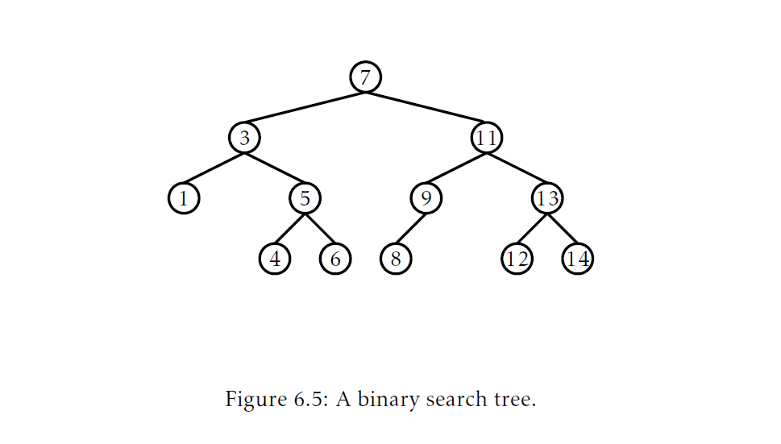
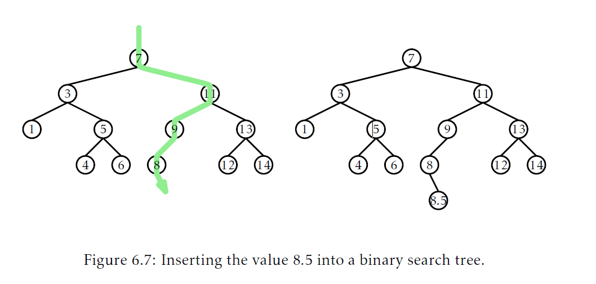

## 二叉树(Binary Trees)
本章介绍计算机科学中最基础的结构之一：二叉树。使用 _树_ 来自这个事实：当我们把这个结构画出来，结果绘画结果通常是类似于森林中的一棵树。二叉树有很多定义。偏数学的说，一个 _二叉树(binary tree)_ 是一个连通的，无向的，无环有限图，其中，没有一个顶点的度大于3(a binary tree is a connected,undirected,finite graph with no cycles,and no vertex of degree greater than three)。

对于大多数的计算机科学应用，二叉树是 _有根的(rooted)_：一个特殊节点$r$，它的度最多是2，被称作树的 _根_。对于任何节点$u\neq r$，从$u$到$r$的路径上，第二个节点叫做$u$的 _父节点(parent)_。其他所有和$u$连接的节点叫做$u$的 _子节点(child)_。大多数我们感兴趣的二叉树是 _有序的_，这样我们可以区分$u$的 _左孩子_ 和 _右孩子_。

在图示中，二叉树通常是从根向下画，这样，根就在最顶端，相应的，左孩子和右孩子就在画面的左右两侧(图6.1)。举个例子，图6.2展示了一个有9个节点的二叉树。



和10个外部节点(b)的二叉树")

由于二叉树非常重要，有几个专门描述它的术语：在二叉树中节点`u`的 _深度(depth)_ 是从`u`到树的根的长度。如果一个节点`w`位于从`u`到`r`的路径上，那么`w`就是`u`的一个祖先，而`u`是`w`的后代。节点`u`的 _子树(subtree)_ 就是以`u`为根包含所有`u`的后代的二叉树。节点`u`的 _高度(height)_，就是从`u`到它所有后代中路径最长的值。一个树的 _高度(height)_ 就是根的高度。如果节点`u`没有孩子，那么就叫做 _叶子(leaf)_。

有时候我们会给一个树增加 _外部节点(external nodes)_ 。如果一个节点没有左孩子，就会有一个外部节点作为左孩子，相应的，如果一个节点没有丫头孩子，就有一个外部节点作为右孩子(参见图6.2.b)。通过归纳法很容易验证，一个拥有$n\ge 1$个真实节点的二叉树有$n+1$个外部节点。
### 6.1 二叉树：一个基础的二叉树
表达二叉树的一个节点`u`最简单的方法是显式的存储`u`的邻居(最多三个)：
```Java
class BTNode<Node extends BTNode<Node>>{
    Node left;
    Node right;
    Node parent;
}
```
如果这三个邻居 有一个不存在我们就设置为`nil`。使用者这种方式，这个树的所有外部节点和根的父节点对应的值就是`nil`。

二叉树本身可以通过它根节点的引用`r`表示：
```Java
Node r;
```
我们可以通过统计从二叉树一个节点`u`到它的根节点的步数计算这个节点的深度：
```Java
int depth(Node u){
    int d = 0;
    while(u!=r){
        u = u.parent;
        d++;
    }
    return d;
}
```
#### 6.1.1 递归算法
使用递归算法让计算二叉树相关数据很容易。例如，为了计算以节点`u`为根的二叉树大小(树中节点个数)，我们可以递归的计算以节点`u`两个儿子作为根的子树的大小，然后把这两个大小加起来，再加一：
```Java
int size(Node u){
    if(u == nil) return 0;
    return 1+size(u.left)+size(u.right);
}
```
为了计算节点`u`的高度，我们可以计算`u`两个子树的高度，然后选出大的那个， 并加一：
```Java
int height(Node u){
    if(u == nil) return -1;
    return 1+max(height(u.left),height(u.right));
}
```
#### 6.1.2 遍历二叉树
前面章节介绍了两个算法都是使用递归访问二叉树中所有的节点。都是按照下面代码访问方式访问二叉树中的节点：
```Java
void traverse(Node u){
    if(u == nil) return;
    traverse(u.left);
    traverse(u.right);
}
```
使用递归的方式编写的代码很简洁，但是也可能会有问题。递归最大的深度是根据二叉树中节点的最大深度决定的，例如，树的高度。如果这个树很高，那么这个递归操作可能会使用比可用栈空间还要多，从而导致崩溃。

为了不使用递归遍历二叉树，我们使用一个根据他从哪来决定它下一步怎么走的算法(use an algorithm that relies on where it came from to determine where it will go next)。参见图6.3。如果我们从节点`u.parent`访问到节点`u`，那么下一步就是访问`u.left`。如果我们从`u.left`访问节点`u`，那么下一步就是访问`u.right`。如果我们从`u.right`访问节点`u`，那么我们就完成了对节点`u`的访问，然后我们就回到了`u.parent`。如下代码实现了这个想法，并且处理了当`u.left`，`u.right`或者`u.parent`为`nil`的情况：



```Java
void traverse2(){
    Node u = r,prev = nil,next;
    while(u!=nil){
        if(prev == u.parent){
            if(u.left != nil) next = u.left;
            else if(u.right != null) next = u.right;
            else next = u.parent;
        }else if(prev == u.left){
            if(u.right != nil) next = u.right;
            else next = u.parent;
        }else{
            next = u.parent;
        }
        prev = u;
        u = next;
    }
}
```
其它通过递归算法计算的数据都可以使用这种非递归方法计算。例如，为了计算树的尺寸我们保存一个计数器`n`，然后无论什么时候第一次访问节点我们就递增`n`:
```Java
int size2(){
    Node u = r,prev=null,next;
    int n = 0;
    while(u != nil){
        if(prev == parent){
            n++;
            if(u.left != nil) next = u.left;
            else if(u.right != nil) next = u.right;
            else next = u.parent;
        }else if(prev == u.left){
            if(u.right != nil) next = u.right;
            else next = u.parent;
        }else{
            next = u.parent;
        }
            prev = u;
            u = next;
    }
    return n;
}
```
在某些二叉树的实现中，没有使用`parent`域。在这种情况下，非递归实现依旧是有可能的，但是就需要一个`List`(或者一个`Stack`)来跟踪从当前节点到根的路径了。

一个不适合上面函数模式的特殊遍历类型是 _广度优先遍历(breadth-first traversal)_。在广度优先遍历中，节点使用根节点开始一层一层向下遍历的，在每一层中，从左向右访问节点(参考图6.4)。这和我们阅读一篇文章的方式一样。广度优先遍历需要使用队列`q`实现，初始情况只包含一个根节点`r`。在每一步，我们从`q`中提取下一个节点`u`，然后处理`u`并把`u.left`和`u.right`(如果它们是非空的)入队`q`：


```Java
void bfTraverse(){
    Queue<Node> q = new LinkedList<Node>();
    if(r != nil) q.add(r);
    while (!q.isEmpty()){
        Node u = q.remove();
        if(u.left != nil) q.add(u.left);
        if(u.right != nil) q.add(u.right);
    }
}
```
### 6.2 二叉搜索树(BinarySearchTree)：一个不平衡的二叉搜索树
`BinarySearchTree`是一个特殊类型的二叉树，每个节点`u`按照某种全序关系(total order)存储的数据值`u.x`。在二叉搜索树中的数据值遵循 _二叉搜索树的性质_：对于一个节点`u`，存储在以`u.left`为根的子树数据值都小于`u.x`，存储在以`u.right`为根的子树数据值都大于`u.x`。图6.5展示了一个`BinarySearchTree`的例子。



#### 6.2.1 搜索
二叉搜索树属性及其有用，因为它允许我们可以在二叉搜索树快速的定位值为`x`的数据。这样我们从根`r`开始搜索`x`。当检验一个节点`u`，我们有三种情况：
1. 如果$x<u.x$，那么搜索就处理`u.left`；
2. 如果$x>u.x$，那么搜索就处理`u.right`；
3. 如果$x = u.x$，那么我们就找到了包含`x`的节点`u`。

搜索终止发生在情况3或者当$u = nil$时。如果是前一种情况，我们就找到了`x`。在后一种情况，我们就总结到`x`不在二叉搜索树中。
```Java
T findEQ(T x){
    Node u = r;
    while (u != nil) {
        int comp = compare(x,u.x);
        if(comp < 0) u = u.left;
        else if(comp > 0) u = u.right;
        else return u.x;
    }
    return null;
}
```
图6.6展示了二叉搜索树的搜索例子。就像第二个例子中展示的那样，尽管我们没有在树中找到`x`，但是我们还是获取了有价值的信息。当情况1发生时，如果我们看看最后一个节点`u`，我们就会发现`u.x`是树中比`x`大的最小节点值。类似的，当发生情况2时，最后一个节点是树中比`x`小的最大值。因此，在发生情况1时，通过跟踪最后一个节点`z`，`BinarySearchTree`可以实现返回大于或或者等于`x`的最小值的`find(x)`操作：

的例子(a)和一次不成功查找(查找10)的例子(b)")

```Java
T find(T x){
    Node w = r, z = nil;
    while (w != nil) {
        int comp = compare(x,w.x);
        if(comp < 0){
            z = w;
            w = w.left;
        }else if(comp > 0){
            w = w.right;
        }else {
            return w.x;
        }
    }
    return z == nil?null:z.x;
}
```
#### 6.2.2 添加
在二叉树中添加一个元素`x`时，我们先搜索`x`。如果找到了，那么就不需要插入了。否则，我们在搜索`x`过程中遇到的最后一个节点`p`的叶子孩子存放`x`。新节点是`p`的左孩子还是右孩子依赖`x`和`p.x`的比较。
```Java
boolean add(T x){
    Node p = findList(x);
    return addChild(p,newNode(x));
}
Node findLast(T x){
    Node w = r,prev = null;
    while(w != nil){
        prev = w;
        int comp = compare(x,w.x);
        if(comp < 0){
            w = w.left;
        }else if(comp > 0){
            w = w.right;
        }else{
            return w;
        }
    }
    return prev;
}
boolean addChild(Node p,Node u){
    if(p == nil){
        r = u;//inserting into empty tree
    }else{
        int comp = compare(u.x,p.x);
        if(comp < 0){
            p.left = u;
        }else if(comp > 0){
            p.right = u;
        }else{
            return false;//u.x is alreaday in the tree
        }
        u.parent = p;
    }
    n++;
    return true;
}
```
图6.7展示了一个例子。这个处理过程中最消耗时间的部分是对`x`的初始化查找，这个花费的时间正比于新添加节点`u`的高度。在最差情况，这等于`BinarySearchTree`的高度。



#### 6.2.3 删除
删除`BinarySearchTree`中存储的一个节点`u`有点麻烦。如果`u`是一个叶子，我们可以直接取消`u`和它父节点的连接。更好的是，如果`u`只有一个孩子节点，我们可以通过让`u.parent`继承`u`的孩子节点把`u`从树中拆出来(参看图6.8)：
```Java
void splice(Node u){
    Node s,p;
    if(u.left != nil){
        s = u.left;
    }else{
        s = u.right;
    }
    if(u == r) {
        r = s;
        p = nil;
    }else{
        p = u.parent;
        if(p.left == u){
            p.left = s;
        }else{
            p.right = s;
        }
    }
    if(s != nil){
        s.parent = p;
    }
    n--;
}
```
或者只有一个孩子的节点(9)很容易")

当`u`有两个孩子的时候，就有些棘手了。在这种情况下，要做的事情中最简单的是找到一个节点`w`，它的孩子节点最多是一个，这样`w.x`就可以替换`u.x`了。为了维护二叉搜索树的属性，`w.x`要很接近`u.x`。例如，选择的`w`满足`w.x`是大于`u.x`的最小值就可以。找到节点`w`很简单，他就是以`u.right`为根的子树中的最小值。这个节点可以很容易删除，因为它没有左孩子(参考图6.9)(也可以查找满足`w.x`是小于`u.x`的最大值，他就是以`u.left`为根的子树中的最大值，这个节点没有右孩子。上文已经编写了大于`u.x`的最小值的查找方法，所以这里使用这个值作为替换节点)：
```Java
void remove(Node u){
    if(u.left == nil || u.right == nil){
        splice(u);
    }else{
        Node w = u.right;
        while(w.left != nil){
            w = w.left;
        }
        u.x = w.x;
        splice(w);
    }
}
```
，通过使用`u`右子树中最小值来替换`u`的值")

#### 6.2.4 总结
`BinarySearchTree`中的`find(x)`，`add(x)`和`remove(x)`操作涉及到沿着树中根到某个节点的路径。在对树的形状没有了解更多的情况下很对路径长度下过多节论，除了它小于`n`，树中节点的个数。如下定理(简单的)总结了`BinarySearchTree`的性能：

__定理6.1__ `BinarySearchTree`实现了`SSet`接口并支持在$O(n)$时间内的`add(x)`，`remove(x)`和`find(x)`。

简单的比较一下定理6.1和定理4.1，定理4.1显示了`SkiplistSSet`的`SSet`实现每个操作的是$O(\log n)$的期望时间。`BinarySearchTree`的问题是，他可能变得 _不平衡(unbalanced)_。不想图6.5展示的那样，他可能变成一个`n`个节点链(chain)，除了最后一个节点意外其他节点就只有一个孩子。

有很多方法避免一个不平衡的二叉搜索树，所有这些操作都会导致数据结构每个操作的时间时$O(\log n)$。第七章会展示，如何通过使用随机，使每个操作有$O(\log n)$的 _期望_ 运行时间。第八章我们如何使用部分重建操作达成每个操作的 _摊还_ 时间$O(\log n)$。第九章我们会展示如何通过模拟一个不是二叉的树(节点最多可以有四个孩子)完成每个操作最差情况是$O(\log n)$的时间。

### 6.3 讨论和练习
二叉树被用来建模关系已经有几千年了(Binary trees have been used to model relationships for thousands of years)。其中一个原因是本质上建模了(学园 pedigree)家族树。这个家族树根是一个人，而他的左右孩子是这个人的父母以此类推。在最近的几个世纪中，二叉树用来建模生物中的种类树，树中的叶子代表了现存的物种，树的中间节点表示 _进化事件(speciation events)_：单个物种的两个种群(populations)进化为两个分离的物种。

二叉搜索树由几个小组在20世纪50年代独立发现。特定种类的二叉搜索树更进一步的引用在后续章节中提供。

当从一开始实现二叉树时，需要做几个设计决策。其中一个问题是每个节点要不要存一个指向它们父节点的指针。如果大部分操作就是简单的沿着从根到叶的路径，那么父节点指针就不是必须的了，浪费空间并且是一个潜在的编码错误。另一方面，没有父指针，树的遍历操作就需要使用递归或者显式栈。其他某些方法(像对某种平衡二叉搜索树进行插入或者删除操作)由于没有父指针也会变得复杂。

另一个设计决策是考虑如何在节点中存储父节点，左孩子，右孩子指针。这里给出的实现是用不同的变量分别存储这些指针。把他们存放在一个长度为3的数组`p`中，这样`u.p[0]`是`u`的左孩子，`u.p[1]`是`u`的右孩子，`u.p[2]`是`u`的父节点。按照这样的方式使用数组，意味着某些`if`语句序列可以简化为代数表达式。

这样简化的一个例子发生在树遍历过程中。如果从`u.p[i]`遍历到一个节点`u`，那么遍历过程中下一个节点是$u.p[(i+1)\bmod 3]$。类似的例子发生在当有左右对称时。例如，例如，`u.p[i]`的兄弟节点就是$u.p[(i+1)\bmod 2]$。这个技巧只有当`u.p[i]`是`u`左孩子(i=0)或者是右孩子(i=1)时才起作用。在某些情况下这意味着某些需要左右版本写一次的复杂代码可以只用写一次。其中一个例子就是后面介绍随机二叉搜索树中的`rotateLeft(u)`和`rotateRight(u)`。