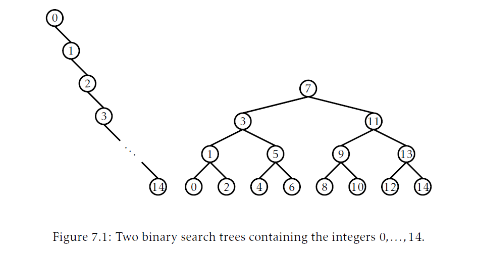
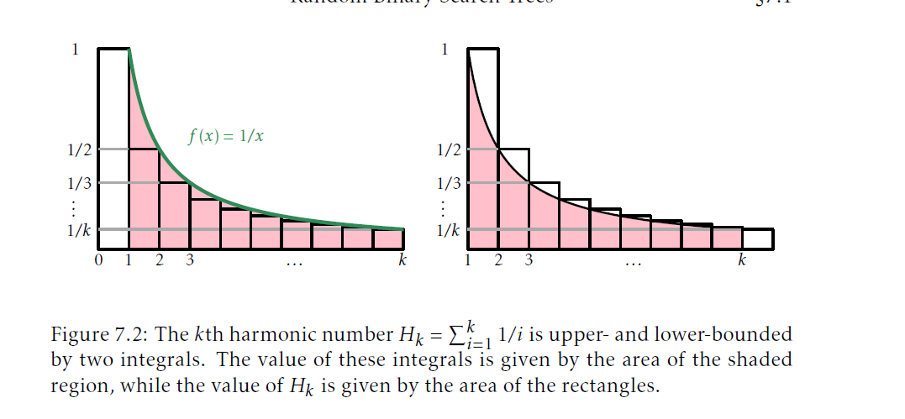
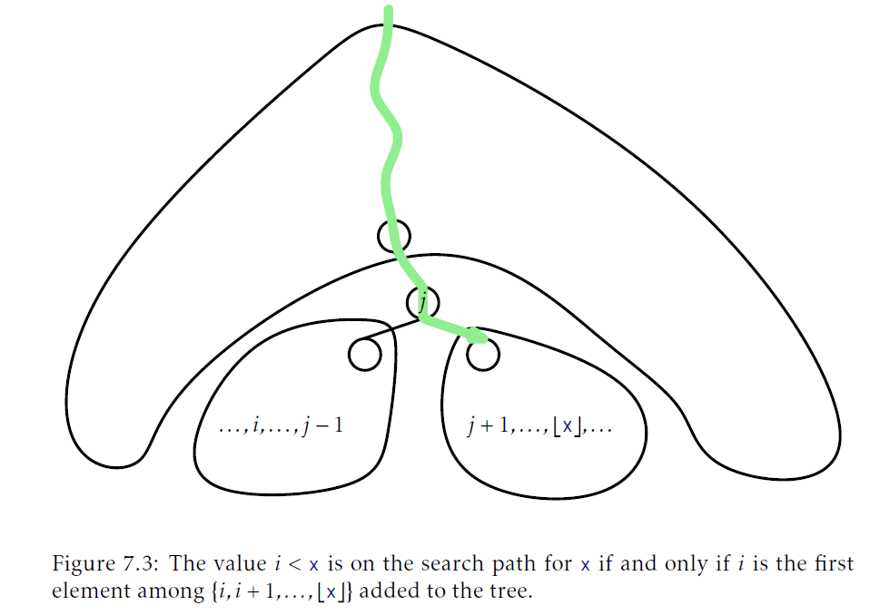
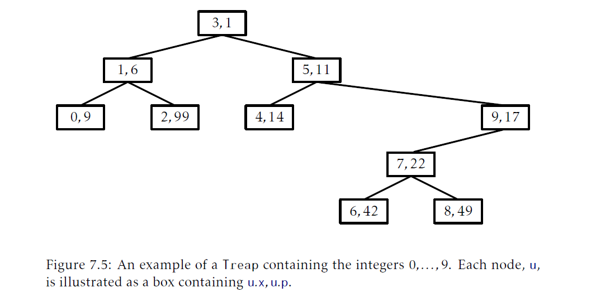
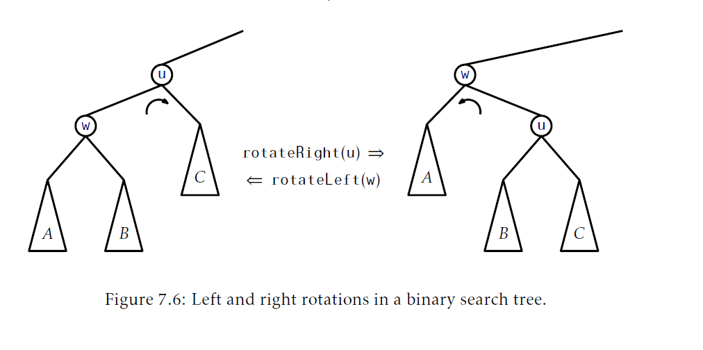

## 随机二叉搜索树
本章，我们会展示一个二叉搜索树，它使用随机性来达到所有操作都有$O(\log n)$的期望运行时间

### 7.1 随即二叉搜索树
考虑如图7.1的两个二叉搜索树，每个树的节点都有$n=15$个节点。左边是一个list而右边是一个完美平衡的二叉搜索树。左边的高度是$n-1=14$，右边的高度是3。



想象一下可能的构造方式。如果我们从一个空的`BinarySearchTree`开始，按照下面的方式添加元素，会出现左边的情况：
$$\langle0,1,2,3,4,5,6,7,8,9,10,11,12,13,14\rangle$$
其他别的添加顺序都不会构造出这个树(你可以通过对`n`进行归纳证明)。另一方面，右边的树可以按照下面的添加序列构建：
$$\langle7,3,11,1,5,9,13,0,2,4,6,8,10,12,14\rangle$$
其它序列可以工作的很好，包括：
$$\langle7,3,1,5,0,2,4,6,11,9,13,8,10,12,14\rangle$$
和
$$\langle7,3,1,11,5,0,2,4,6,9,13,8,10,12,14\rangle$$
事实上，一共有21,964,800种不同的添加序列可以生成右边的树，但是只有一个方式可以生成左边的树。

上面的例子给出了某些轶事证据表明，如果我们选择$0,\ldots,14$的一个随机排列，然后添加到二叉搜索树中，那么我们很可能会得到一个很平衡的树(图7.1右边)。

可以通过研究随机二叉搜索树我们可以形式化这个概念。一个 _随机二叉搜索树(random binary search tree)_ 的大小$n$通过如下方式获取：取整数集$0,\ldots,n-1$一个随机排列：$x_0,\ldots,x_{n-1}$，然后一个一个的把它的元素加入到`BinarySearchTree`中。对于 _随机排列(random permutation)_ 我们的意思是：$0,\ldots,n-1$的$n!$个排列(顺序)每个的可能性是相等的，因此取任意一个特定排列的可能性是$1/n!$。 

注意到值$0,\ldots,n-1$可以替换为任意包含$n$个元素的有序集合而不会改变随机二叉搜索树的性质。元素$x\in \{0,\ldots,n-1\}$就简单的代表了在大小为$n$的有序集合中排$x$名次的元素。

在我们展示随机二叉搜索树的主要结论前，我们必须花点时间稍微离题一下，去研究一下当研究随机化的结构时，经常会出现的数字类型。对于一个非负整数$k$，第$k$个 _调和数(harmonic number)_，记为$H_k$，的定义是：
$$H_k = 1+1/2+1/3+\cdots+1/k$$
调和数$H_k$没有一个简单的接近的形式(closed form)，但是但是它和$k$的自然对数很相关。特别的：
$$\ln k \lt H_k \le \ln k +1$$
学习过微积分的读者可能注意到这是因为积分$\int _1^k(1/x)\mathrm{d}x = \ln k$。记住，这个积分可以解释为一个曲线和X轴之间的区域，值$H_k$的上下界分别可以由积分$\int_1^k(1/x)\mathrm{d}x$和$1+\int_1^k(1/x)\mathrm{d}x$界定。(图7.2是一个图形化解释。)


(注：第`k`个调和数$H_k=\sum_{i=1}^k1/i$是两个积分的上下界。这些积分的值可以通过计算阴影面积得到，而$H_k$的值这是矩形面积)

__引理7.1.__ 大小为$n$的随机二叉搜索树中，保持如下语句所说特性：
1. 对于任意$x\in\{0,\ldots,n-1\}$，`x`的搜索路径的期望长度是$H_{x+1}+H_{n-x}-O(1)$[<sup id="content1">1</sup>](#1)
2. 对于任意$x\in (-1,n)\setminus\{0,\ldots,n-1\}$，对于元素`x`的搜索路径的期望长度是$H_{\lceil x\rceil}+H_{n-\lceil x\rceil}$($\setminus$表示补集)

下一节我们将证明这个引理。现在，考虑一下引理7.1的两个部分告诉了我们什么。第一条告诉我们如果我们在大小为`n`的树中搜索一个元素，那么搜索路径的期望长度最多是$2\ln n+O(1)$。第二条告诉了我们同样的事情在搜索树中不存在的元素时(这句话的意思是，第二条也是告诉我们在一个树中查找一个元素时的时间，只不过第二条是针对元素不在树中的)。当我们比较引理中的两个部分时，我们看到元素在树中比元素不在树中时，搜索速度只是稍微快了些。

#### 7.1.1 引理7.1的证明
证明引理7.1的关键观察是：在一个二叉搜索树$T$中，值$x$(位于开区间$(-1,n)$内)的搜索路径包含一个节点，它的key是`i`，且$i\lt x$，当且仅当用来构建树$T$的随机排列中，`i`出现在${i+1,i+2,\ldots,\lfloor x\rfloor}$中任意一个元素前。(注：这里的i位于任意${i+1,i+2,\ldots,\lfloor x\rfloor}$之前指的是，在随机排列中，任何比$i$大比$x$小的数字都要位于$i$之后，而不用关心这些数字之间的顺序，同时，在$i$之后的数字也有比$i$小的，但是比$i$大的必须要在$i$之后。参见上面列出的排列例子给出的最后一个排列情况。11位于14的搜索路径上，因为所有比11大的数据(12,13)都在11后面(但是12，13不是顺序的)，12就不在14的搜索路径上，因为13在12前面)


(注：当且仅当$i$是在$\{i,i+1,\ldots,\lfloor x\rfloor\}$中第一个添加到树中的元素时，值$i\lt x$存在于$x$的搜索路径上)

为了观察到这个，我们查看一下图7.3，注意到直到某个位于$\{i,i+1,\ldots,\lfloor x\rfloor\}$的元素被添加前，在开区间$(i-1,\lfloor x\rfloor +1)$中的每个元素的搜索路径都是相同的(记住，对于两个元素有两个不同的搜索路径，在树中必存在某个元素和他们相比完全不同)。设$j$是$\{i,i+1,\ldots,\lfloor x\rfloor\}$中第一个出现在随机排列中的元素。注意到$j$现在以及将来总会位于$x$的搜素路径上。如果$j\neq i$，那么包含$j$的节点$u_j$比包含$i$的节点$u_i$先创建。稍后，当$i$被添加，它就会加入到以$u_j.left$为根的子树中，因为$i<j$。另一方面，$x$的搜索路径中永远不会访问这个子树，因为在访问$u_j$节点后，就处理了$u_j.right$子树。

类似的，对于$i\gt x$，$i$出现在$x$的搜索路径上，当且仅当，$i$在用于构建树$T$的随机排列中出现在任意$\{\lceil x\rceil,\lceil x\rceil+1,\ldots,i-1\}$前。(和上一段类似，例如$i=5$，对于$x=2$的搜索路径上，{2,3,4}这个集合中3位于5前(2，3，4这个三值本身的排列顺序不影响)，所以，5就不再搜索路径上。而对于$i=3$，{2}这个集合中3位于他之前，尽管3和2之间还有很多比2小比3大的值但是不影响，3在搜索路径上)

(注：这里稍微整理理解下，整个这个观察强调的是现在有一个元素值`x`，它是根据某个排列(设为$P$)构造的树中的一个节点的key。一个值$i$(这个值$i$本身满足$i\lt x$)注意，这个$i$也是在这个排列中的，如果$i$在$x$的搜索路径之中，它就需要满足对于所有属于范围${i+1,i+2,\ldots,\lfloor x\rfloor}$的值，如果它们也出现在构造树的随机排列中，这些值在随机排列中的位置就需要位于$i$之后，只有这样，$i$才会位于$x$的搜索路径中，否则$i$就不会在$x$的搜索路径中。为什么$i$需要满足这个条件才能出现在$x$的搜索路径上，当$\{i,i+1,\ldots,\lfloor x\rfloor\}$的元素中出现在排列$P$的元素都还没有加入到树中，那么，在开区间中$(i-1,\lfloor x\rfloor +1)$中的元素的搜素路径是一样的，原因是，开区间的元素还没有加入到树中，当开区间中元素的一个元素加入到树中，搜索路径的前缀是一一致的。那么当在$\{i,i+1,\ldots,\lfloor x\rfloor\}$的元素加入到树中后，如果此时$j\neq i$，那么必然$j \gt i$，后面，再加入$i$时，$i$在$j$的左子树中，$x$在$j$的右子树中。)

注意，如果我们从$\{0,\ldots,n\}$的一个随机排列开始，那么只包含$\{i,i+1,\ldots,\lfloor x \rfloor\}$和$\{\lceil x\rceil,\lceil x\rceil +1,\ldots,i-1\}$子序列也是相应的元素的随机排列。那么，每个在子集合$\{i,i+1,\ldots,\lfloor x \rfloor\}$和$\{\lceil x\rceil,\lceil x\rceil +1,\ldots,i-1\}$中的元素都同样可能比其他任何在子集合元素要先在用于创建$T$的随机排列中出现。所以我们有：
$$\mathrm{Pr}\{i \text{位于$x$的搜索路径上}\}=\begin{cases}
    1/(\lfloor x\rfloor -i+1)\text{ 如果$i\lt x$}\\
    1/(\lceil x\rceil -i+1)\text{ 如果$i\gt x$}
\end{cases}$$

使用这个观察，引理7.1的证明涉及到某些使用了调和数的计算。

$\text{引理7.1的证明}$ 设$I_i$是指示器随机变量，当$i$出现在$x$的搜索路径上是1，否则是0。那么搜索路径的长度由如下给出：
$$\sum_{i\in\{0,\ldots,n-1\}\setminus \{x\}}I_i$$
所以，如果$x\in\{0,\ldots,n-1\}$，搜索路径的期望长度有如下给出：

x是一个整数并且(b)当x不是整数")

(参考图片7.4.a)
$$\begin{aligned}
    \mathrm{E}\left[\sum_{i=0}^{x-1}I_i+\sum_{i=x+1}^{n-1}I_i\right]&=\sum_{i=0}^{x-1}\mathrm{E}[I_i]+
    \sum_{i=x+1}^{n-1}\mathrm{E}[I_i]\\
    &=\sum_{i=0}^{x-1}1/(\lfloor x\rfloor-i+1)+\sum_{i=x+1}^{n-1}1/(i-\lceil x\rceil+1)\\
    &=\sum_{i=0}^{x-1}1/(x-i+1)+\sum_{i=x+1}^{n-1}1/(i-x+1)\\
    &=\frac{1}{2}+\frac{1}{3}+\cdots+\frac{1}{x+1}\\
    &\quad+\frac{1}{2}+\frac{1}{3}+\cdots+\frac{1}{n-x}\\
    &=H_{x+1}+H_{n-x}-2.
\end{aligned}$$

对于搜索一个值$x\in(-1,n)\setminus\{0,\ldots,n-1\}$的对应的计算几乎是一样的(参见图7.4.b)。

#### 7.1.2 总结
如下定理总结随即二叉搜索树的性能：

__定理7.1__ 随机二叉搜索树可以在$O(n\long n)$的时间内构造。在随即二叉搜索树中，`find(x)`的执行会花费$O(\log n)$的期望时间。

我们再次强调定理7.1的期望是因为用于构造随机二叉搜索树的随机排列。特别的，它不依赖于对`x`的随机选择，对`x`的所有值他都是真的。

### 7.2 `Treap`：随机化的二叉搜索树
当然，随即二叉搜索树的问题是它们不是动态的。它们不支持实现`SSet`接口要实现的`add(x)`和`remove(x)`操作。本节，我们描述一个叫做`Treap`的数据结构，它使用了引理7.1实现了`SSet`接口。[<sup id="content2">2</sup>](#2)

`Treap`中的一个节点很想`BiarySearchTree`中的一个节点，有一个数据值`x`，但它还包含一个唯一的数字类型的 _优先级(priority)_，`p`，是随机赋值的：
```Java
class Node<T> extends BSTNode<Node<T>,T>{
    int p;
}
```
除了是一个二叉搜索树，`Treap`中的节点还满足 _堆属性(heap property)_ ：
* (堆属性)对于每个节点`u`，除了根节点，`u.parent.p<u.p`。
换句话说，每个结点的优先级都小于它的两个孩子。图7.5展示了一个例子。



堆和二叉搜索树的条件一起保证了，一旦每个结点的key(x)和优先级(p)确定了，`Treap`的形状就完全确定了。堆属性告诉我们属性值最小的节点就是`Treap`的根。二叉搜索树的属性告诉我们所有key值小于`r.x`的节点存放在以`r.left`为根的子树，所有key值大于`r.x`的节点存放在以`r.right`为根的子树中。

关于`Treap`中的优先级重要的一点是它们都是唯一且是随机赋值的。由于这个原因，我们有两个等价的方式看待`Treap`。正如上面的定义，`Treap`遵循堆和二叉搜索树属性。另一个说法，我们可以把`Treap`看作是一个`BinarySearchTree`，他的节点是按照优先级递增的顺序添加的。举个例子，图7.5中的`Treap`可以按照下面的`(x,p)`值序列加入到`BinarySearchTree`中产生：
$$\langle(3,1),(1,6),(0,9),(5,11),(4,14),(9,17),(7,22),(6,42),(8,49),(2,99)\rangle$$
由于优先级是随机选择的，这等同于是采用了key的随机排列，在这个例子中，排列是：
$$\langle 3,1,0,5,9,4,7,6,8,2 \rangle$$
然后将他们添加到`BinarySearchTree`中。但这意味着这个`treap`的形状和这个随机二叉搜索树是一样的。具体的说，如果我们通过节点的排序位置[<sup id="content3">3</sup>](#3)替换它们的key，那么引理7.1可以引用在这里。用`Treap`重申引理7.1，我们有：
__引理7.2__ 在`Treap`中我们存储一个由$n$个key组成的集合，它有如下属性：
1. 对于任意$x\in S$，$x$搜索路径的期望长度是$H_{r(x)+1}+H_{n-r(x)}-O(1)$
2. 对于任意$x\notin S$，$x$搜索路径的期望长度是$H_{r(x)}+H_{n-r(x)}$
这里，$r(x)$记为$x$在集合$S\cup \{x\}$中排序位置。

引理7.2告诉我们`Treap`可以高效的实现`find(x)`操作。然而，`Treap`真正的好处是它可以支持`add(x)`和`delete(x)`操作。为了做到这个，他需要执行旋转从而维护堆属性。参考图7.6。二叉搜索树中旋转是一个局部修改，它会调整节点间的父子关系，原来`u`是`w`的父节点，变成`w`的父节点`u`，同时还维护了二叉搜索树的属性。旋转有两个方式：根据`w`是`u`的右孩子还是左孩子相应的执行 _左旋转_ 和 _右旋转_ 。




[<sup id="1">1</sup>](#content1) 表达式$x+1$和$n-x$可以分别解释为树中小于等于`x`的元素个数和树中大于等于`x`的元素个数。
[<sup id="2">2</sup>](#content2) `Treap`这个名字来自于这个事实：这个数据结构是模拟的二叉搜索树(__T__ ree)(6.2节)和堆(h __eap__)(第十章)。
[<sup id="3">3e</sup>](#content3) 元素`x`在集合$S$中排名就是集合$S$中小于`x`的个数。