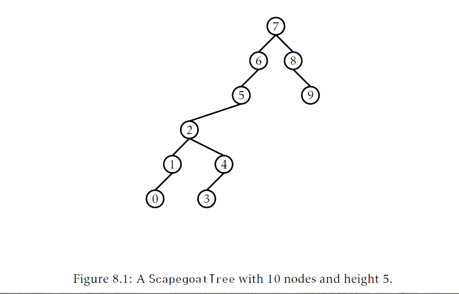
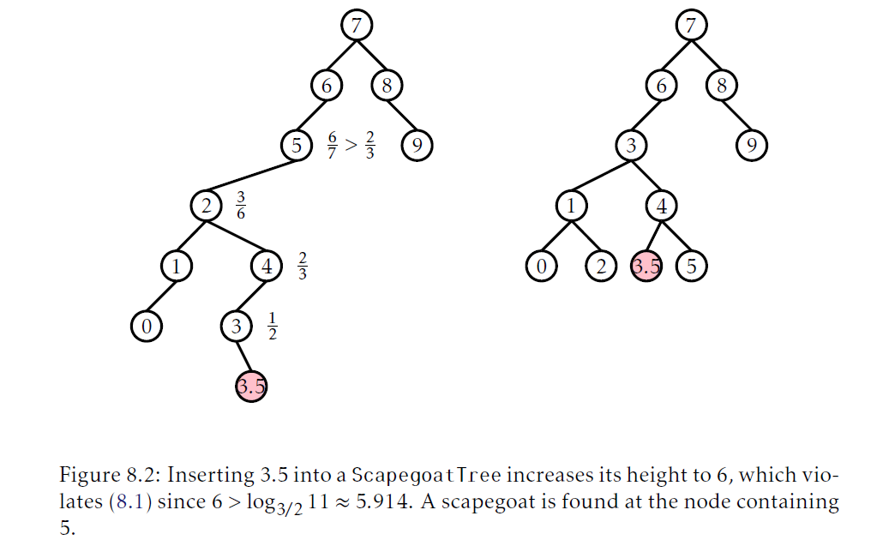

## 替罪羊树(scapegoat trees)
本章我们研究一个二叉搜索树数据结构，替罪羊树。这个结构基于一个常见的名言：当事情出错，人们首先会找到某个人(替罪羊)背锅。一旦过失确认了，我就让替罪羊解决问题。

`ScapegoatTree`使用 _局部重建操作(partial rebuilding operations)_ 保持自身平衡。在局部重建过程中，整个子树被解构并重建为一个完美平衡子树。将一个以节点`u`为根的子树重建为一个完美平衡树有很多方法。最简单的一种是遍历`u`的子树，把他所有节点都收集到一个数组`a`中，通过`a`递归地构建一个平衡子树。如果我们设`m=a.length/2`，那么元素`a[m]`就是新子树的根，`a[0]`到`a[m-1]`就是递归的存放在左子树中，而`a[m+1]`到`a[a.length-1]`就递归地存在右子树中。
```Java
void rebuild(Node<T> u){
    int ns = size(u);
    Node<T> p = u.parent;
    Node<T>[] a = Array.newInstance(Node.class,ns);
    packIntoArray(u,a,0);
    if(p == nil){
        r = buildBalanced(a,0,ns);
        r.parent = nil;
    }else if(p.right == u){
        p.right = buildBalanced(a,0,ns);
        p.right.parent = p;
    }else{
        p.left = buildBalanced(a,0,ns);
        p.left.parent = p;
    }
}
int packIntoArray(Node<T> u,Node<T>[]a,int i){
    if(u == nil){
        return i;
    }
    i = pakcIntoArray(u.left,a,i);
    a[i++] = u;
    return packIntoArray(u.right,a,i);
}
Node<T> buildBalanced(Node<T>[]a,int i,int ns){
    if(ns == 0){
        return nil;
    }
    int m = ns/2;
    a[i+m].left = buildBalanced(a,i,m);
    if(a[i+m].left != nil){
        a[i+m].left.parent = a[i+m];
    }
    a[i+m].right = buildBalanced(a,i+m+1,ns-m-1);
    if(a[i+m].right != nil){
        a[i+m].right.parent = a[i+m];
    }
    return a[i+m];
}
```
调用一次`rebuild()`操作会花费$O(size(u))$。产生的子树有最小的高度；不存在有$size(u)$个节点的子树高度会更小。

### 8.1 `ScapegoatTree`：使用部分重建的二叉搜索树
`ScapegoatTree`是一个二叉搜索树，并且有一个变量`n`跟踪树中节点的个数，同时还有一个计数器`q`，维护了节点个数的上界。
```Java
int q;
```
在全部时刻，`n`和`q`都满足如下不等式：
$$q/2\le n \le q$$
除此之外，`ScapegoatTree`还有对数的高度；替罪羊树的高度在所有时刻都不会超过：
$$\tag{8.1}\log_{3/2}q\le \log_{3/2} 2n \lt \log_{3/2}n+2$$



即使有这个约束，`ScapegoatTree`依旧可以相当不平衡。图8.1的$q = n = 10$并且高满足$\lt \log_{3/2}{10}\approx 5.679$。

通过使用标准的`BinarySearchTree`搜索算法(参考6.2节)就实现了`ScapegoatTree`的`find(x)`操作。这个时间开销正比于树的高度，根据公式$(8.1)$，就是$O(\log n)$。

为了实现`add(x)`操作，我们首先增加`n`和`q`然后使用把一个节点`x`加入到二叉搜索树中的普通算法；我们搜索`x`然后添加一个新的叶节点`u`满足`u.x = x`。此时，我们可能很幸运：`u`的深度不超过$\log_{3/2}q$。这样，我们就完成了操作。

不幸的是，有时候会出现$depth(u)\lt \log_{3/2}q$。在这种情况中，我们需要降低它的高度。这并不是一个大工程；只有一个节点`u`的高度超过了$\log_{3/2}q$。为了修复`u`，我们从`u`转向根节点走查找一个 _替罪羊(scapegoat)_ `w`。这个替罪羊`w`是很不平衡的节点。它有这个属性：
$$\tag{8.2} \frac{size(w.child)}{size(w)}\lt \frac{2}{3}$$
这里，`w.child`是`w`两个孩子中那个位于从根节点到节点`u`路径上的节点。我们将简单的证明存在这个替罪羊。现在，我们就先使用这个结论。一旦我们找到一个替罪羊`w`，我们完全摧毁这个以`w`为根的子树并重建为一个完美平衡的二叉搜索树。从公式$(8.2)$我们可以知道，甚至在添加节点`u`前，`w`的子树也不是一个完全二叉树。因此，当我们重建`w`时，高度至少下降1，因此，`ScapegoatTree`的高度再一次至多是$\log_{3/2}q$。
```Java
boolean add(T x){
    //先做基本的插入操作保存深度
    Node<T> u = newNode(x);
    int d = addWithDepth(u);
    if(d>log32(q)){
        //深度超出了，查找替罪羊
        Node<T> w = u.parent;
        while(3*size(w)<=2*size(w.parent)){
            w = w.parent;
        }
        rebuild(w.parent);
    }
    return d>=0;
}
```
如果我们忽略查找替罪羊`w`和重建以`w`为根的子树，那么`add(x)`的运行时间就有初始的搜索决定，它会花费$O(\log q)=O(\log n)$的时间。我们稍后会在下一节使用摊还分析统计找到替罪羊以及重建的开销。

`ScapegoatTree`中`remove(x)`的实现很简单。我们查找`x`然后使用从`BinarySearchTree`中删除一个节点的普通方法删除这个节点。(注意到这永远不会增加树的高度)下一步，我们降低`n`，但是不修改`q`。最后，我们检查`q\lt 2n`，如果满足，我们重建整个树为一个完美平衡的二叉搜索树，并设置`q=n`。
```Java
boolean remove(T x){
    if(super.remove(x)){
        if(2*n<q){
            rebuild(r);
            q = n;
        }
        return true;
    }
    return false;
}
```
再一次，如果我们忽略重建的开销，`remove(x)`操作运行时间正比于树的高度，因此是$O(\log n)$。


(在`ScapegoatTree`中插入3.5导致树的高度增加为6，违反了公式$(8.1)$，因为$6\lt \log_{3/2}11\approx 5.914$。替罪羊就是包含了值5的节点)

### 8.1 正确性和运行时间分析
本节，我们分析`ScapegoatTree`的正确性和摊还运行时间。我们首先通过证明当`add(x)`操作会导致一个节点违反了条件$(8.1)$，那么我们总是可以找到一个替罪羊来证明正确性：
__引理8.1__ 设`u`是`ScapegoatTree`中深度$h\lt \log_{3/2}q$的一个节点。那么那么存在一个节点`w`位于从`u`到根的路径上满足：
$$\frac{size(w)}{size(parent(w))}\gt \frac{2}{3}$$
_证明_ 假设，为了矛盾，没有情况这种情况，并且，对于所有位于从节点`u`到根节点路径上的节点`w`，都有：
$$\frac{size(w)}{size(parent(w))}\lt \frac{2}{3}$$
记从根到`u`的路径为$r=u_0,\ldots,u_h=u$。那么，我们有$size(u_0)=n,size(u_1)\le \frac{2}{3}n,size(u_2)\le \frac{4}{9}n$，以及，更一般的：
$$size(u_i)\le(\frac{2}{3})^in$$
但这就导致了矛盾，因为`size(u)\ge 1`，因此
$$1\le size(u)\le (\frac{2}{3})^hn\lt(\frac{2}{3})^{\log_{3/2}q}n\le(\frac{2}{3})^{\log_{3/2}n}n=(\frac{1}{n})n=1\square$$
接下来，我们分析还没有统计的运行时间部分。这里有两部分：当搜索替罪羊节点时调用`size(u)`的开销以及当我们找到替罪羊`w`时调用`rebuild(w)`时的开销。