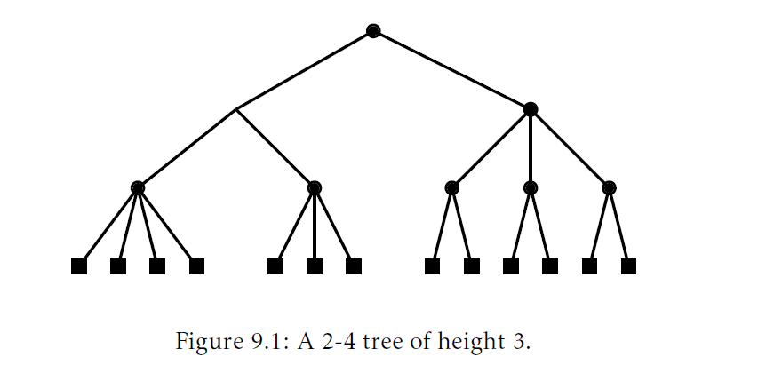
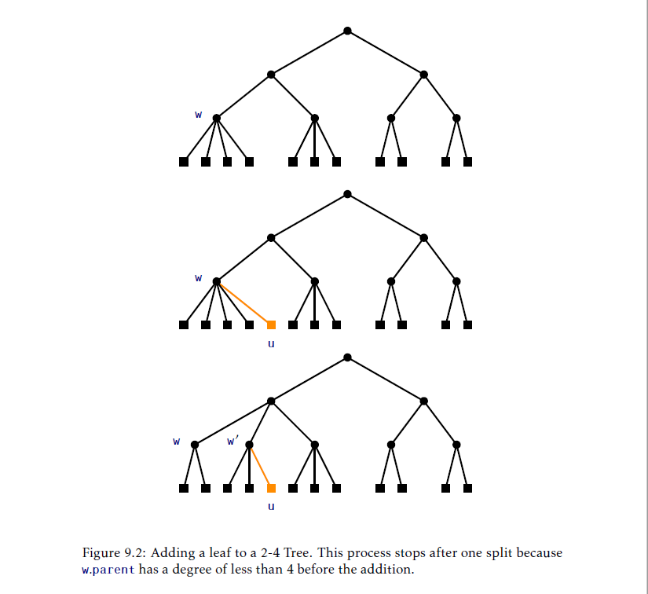
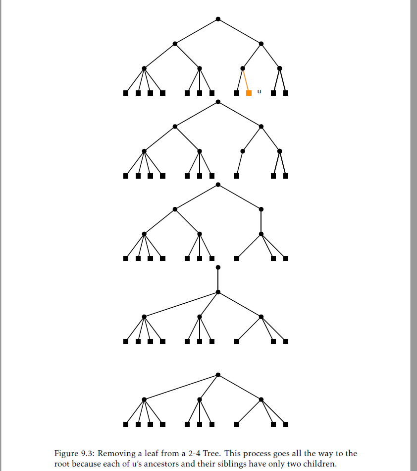

## 红黑树
本章，我们呈现红黑树，一个对数(logarithmic)高度的二叉搜索树版本。红黑树是使用最广泛的一个数据结构。它们在很多库实现中作为主要的搜索结构出现，包括了Java集合框架和C++STL(Standard Template Library)的几种实现。它们也用在了Linux操作系统内核中。红黑树的流行有几个原因：
1. 存储了`n`个值的红黑树高度最多是$2\log n$。
2. 红黑树的`add(x)`和`remove(x)`操作 _最差(worst-case)_ 运行时间是$O(\log n)$。
3. 在执行`add(x)`和`remove(x)`操作期间执行旋转的摊还数量是常量。
这些属性的前两个已经让红黑树排在了跳表，替罪羊树和treaps前了。跳表和treaps依赖于随机性并且它们的`O(\log n)`运行时间只是期望的。替罪羊树对它的高度有一个保证的界限，但是`add(x)`和`remove(x)`只是运行在$O(\log n)$的摊还时间。第三个属性是锦上添花。它告诉我们添加或者删除一个元素`x`所需的时间相比于找到`x`需要的时间要小很多。[<sup id="content1">1</sup>](#1)

然而，红黑树漂亮的属性是由代价的：实现复杂度。维护界限为$2\log n$的高度很不容易。他要求仔细的分析几种情况。我们必须保证这个实现在每种情况下都做正确的事情。一次错误放置的旋转或者颜色改变产生的bug难以理解并解决。

相比直接陷入到红黑树的实现中，我们先提供一个相关数据结构的一些背景：2-4树。对于红黑树是怎么被发现以及为什么高效维护它们是可能的，这个结构会给出一些提示。

### 9.1 2-4树
2-4树是一个有根树，有如下属性：
__属性9.1__(高度)。所有叶子都有一样的深度。
__属性9.2__(度)。每个节点包含2，3或者4个孩子。

图9.1中显示2-4树的例子。2-4树的属性意味着它的高度是叶子个数的对数(The properties of 2-4 trees imply that their height is logarithmic in the number of leaves)：



__引理9.1.__ `n`个叶子节点的2-4树高度最多是$\log n$。
__证明__ 一个内部节点孩子个数的下界为2意味着如果一个2-4树高度是$h$，那么他至少有$2^h$个叶子。换句话说，
$$n\ge 2^h$$
对不等式两边取对数得到$h\le \log n$。

#### 9.1.1 添加一个叶子
在2-4树中添加一个页子节点很容易(参见图9.2)。如果我们想要添加一个叶子节点`u`给某个节点`w`作为孩子节点，那么我们简单的把`u`变成`w`的孩子节点就可以了。这肯定维护了高度的属性，但是可能会违反度(degree)的属性；如果在添加`u`前`w`已经有了4个孩子，那么`w`现在就有了5个孩子了。此时，我们把`w`分成两个节点，`w`和`w'`，分别有两个和三个孩子。但是现在`w'`没有父节点，所以我们递归地让`w`的父节点做为`w'`的父节点。再一次，这可能会导致`w`的父节点有太多的孩子，此时我们就要分裂它。这个过程会一直持续下去直到我们到达某个节点的孩子少于4个，或者我们分裂了根节点`r`为两个节点`r`和`r'`。在后一种情况中，我们创建一个新的节点作为根，同时`r`和`r'`作为它的孩子。这同时增加了所有叶节点的深度因此维护了高度属性。

由于2-4树的高度从不会超过$\log n$，添加一个叶子的过程最多在$\log n$步后结束。



#### 9.1.2 删除一个叶子
从2-4树中删除一个叶子节点就稍微麻烦了些(参见图9.3)。为了从节点`u`的父节点`w`中删除节点`u`，我们直接删除。如果`w`在执行对`u`删除操作前只有两个孩子，那么`w`在删除操作后只留下一个孩子从而违反了度属性。

为了修正这个，我们看下`w`的兄弟节点`w'`。节点`w'`肯定存在，因为`w`的父节点至少有两个孩子。如果`w'`有三个或者四个孩子，我们从`w'`的这些孩子中拿出一个给`w`。现在`w`有两个孩子，而`w'`有两个或者三个节点，我们的工作做完了。

另一方面，如果`w'`只有两个孩子，那么我们 _合并_ `w`和`w'`为单个节点，`w`，这就有三个孩子。下一步我们递归地从`w'`的父节点中删除`w'`。当我们到达一个节点`u`，`u`或者它的兄弟节点超过2个孩子，又或者当我们到达了根节点时，这个过程才结束。在后一个例子中，如果根剩下一个孩子，那么我们删除根节点并让他的孩子为新的节点。再一次，这同时降低了所有叶子节点的高度从而维护了高度属性。

再一次，因为树的高度从没有超过$\log n$，删除一个叶子的过程最多在`\log n`步后结束。



### 9.2 RedBlackTree:一个模拟2-4树
红黑树是一个二叉搜索树其中每个节点`u`都有一个 _颜色(colour)_：要么是 _红(red)_ 或者是 _黑(black)_。值0表示红色而值1表示黑。
```Java
class Node<T> extends BSTNode<Node<T>,T>{
    byte colour;
}
```
在红黑树任何操作前后，下面的两个属性都会被满足。每个属性都是按照颜色红和黑以及数值0和1定义的。

__属性9.3__(黑色高度(black-height)) 从根到每个叶子的路径上黑色节点个数是一样的。(任意一个从根到叶子路径颜色的和是一样的。)
__属性9.4__(没有的红色边(no-red-edge)) 不存在两个相邻的红色节点。(对于任何一个节点`u`，除了根节点，$\text{u.colour+u.parent.colour}\ge 1$)

注意我们可以总是对红黑树的根节点`r`着黑色而不违反这两个属性，所以我们将假设根是黑色的，而更新红黑树的算法会维护整个假设。另一个简化红黑树的技巧是把外部节点(通过`nil`表示)看作是黑色的。使用这种方式，红黑树的每个真实节点`u`都精确的拥有两个孩子，每个孩子的颜色都是定义好的。图9.4显示了一个红黑树的例子。

用黑色方块表示")


[<sup id="1">1</sup>](#content1) 注意跳表和treaps在期望意义下也有这个属性。参见练习4.6和练习7.5。