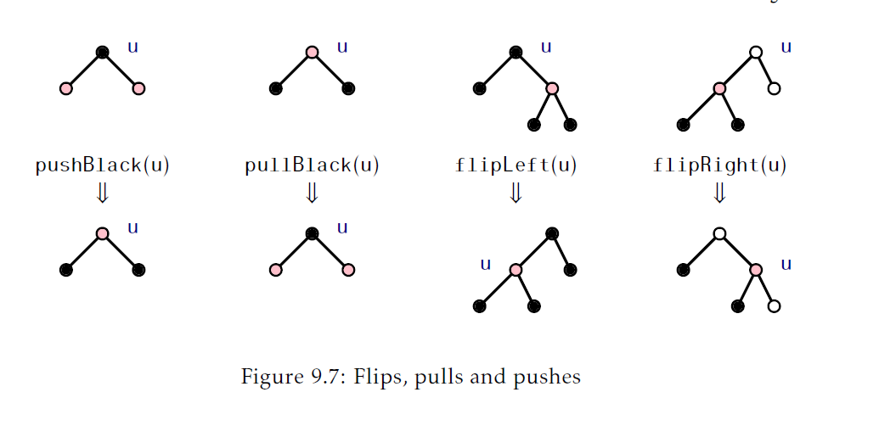
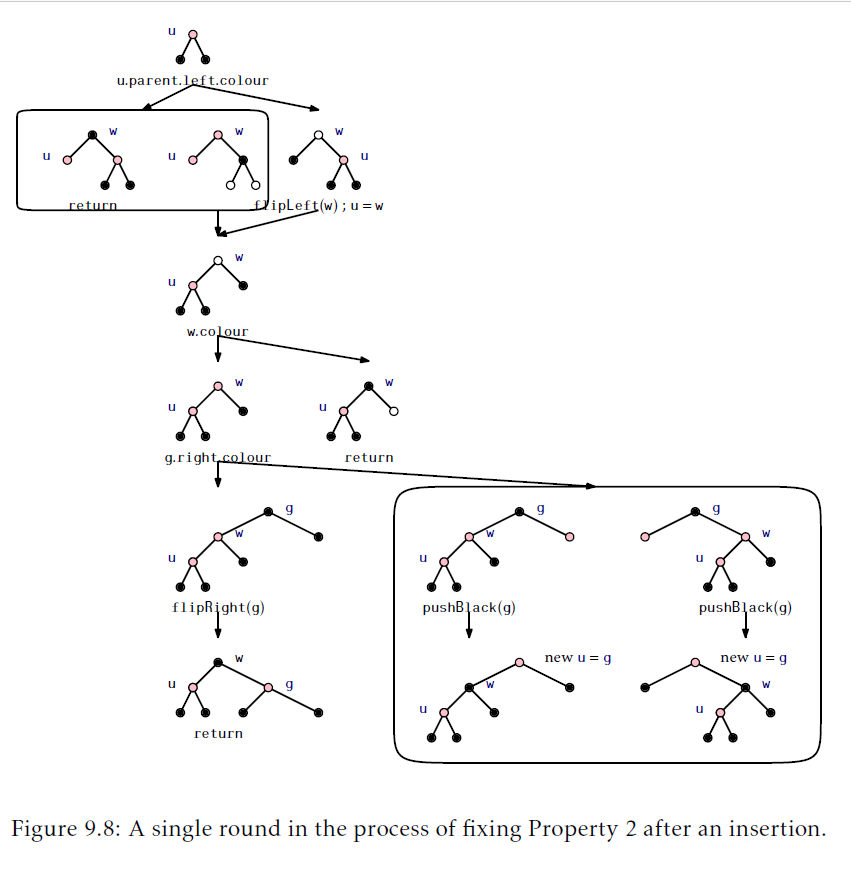

## 红黑树
本章，我们呈现红黑树，一个对数(logarithmic)高度的二叉搜索树版本。红黑树是使用最广泛的一个数据结构。它们在很多库实现中作为主要的搜索结构出现，包括了Java集合框架和C++STL(Standard Template Library)的几种实现。它们也用在了Linux操作系统内核中。红黑树的流行有几个原因：
1. 存储了`n`个值的红黑树高度最多是$2\log n$。
2. 红黑树的`add(x)`和`remove(x)`操作 _最差(worst-case)_ 运行时间是$O(\log n)$。
3. 在执行`add(x)`和`remove(x)`操作期间执行旋转的摊还数量是常量。
这些属性的前两个已经让红黑树排在了跳表，替罪羊树和treaps前了。跳表和treaps依赖于随机性并且它们的`O(\log n)`运行时间只是期望的。替罪羊树对它的高度有一个保证的界限，但是`add(x)`和`remove(x)`只是运行在$O(\log n)$的摊还时间。第三个属性是锦上添花。它告诉我们添加或者删除一个元素`x`所需的时间相比于找到`x`需要的时间要小很多。[<sup id="content1">1</sup>](#1)

然而，红黑树漂亮的属性是由代价的：实现复杂度。维护界限为$2\log n$的高度很不容易。他要求仔细的分析几种情况。我们必须保证这个实现在每种情况下都做正确的事情。一次错误放置的旋转或者颜色改变产生的bug难以理解并解决。

相比直接陷入到红黑树的实现中，我们先提供一个相关数据结构的一些背景：2-4树。对于红黑树是怎么被发现以及为什么高效维护它们是可能的，这个结构会给出一些提示。

### 9.1 2-4树
2-4树是一个有根树，有如下属性：
__属性9.1__(高度)。所有叶子都有一样的深度。
__属性9.2__(度)。每个节点包含2，3或者4个孩子。

图9.1中显示2-4树的例子。2-4树的属性意味着它的高度是叶子个数的对数(The properties of 2-4 trees imply that their height is logarithmic in the number of leaves)：


__引理9.1.__ `n`个叶子节点的2-4树高度最多是$\log n$。
__证明__ 一个内部节点孩子个数的下界为2意味着如果一个2-4树高度是$h$，那么他至少有$2^h$个叶子。换句话说，
$$n\ge 2^h$$
对不等式两边取对数得到$h\le \log n$。

#### 9.1.1 添加一个叶子
在2-4树中添加一个页子节点很容易(参见图9.2)。如果我们想要添加一个叶子节点`u`给某个节点`w`作为孩子节点，那么我们简单的把`u`变成`w`的孩子节点就可以了。这肯定维护了高度的属性，但是可能会违反度(degree)的属性；如果在添加`u`前`w`已经有了4个孩子，那么`w`现在就有了5个孩子了。此时，我们把`w`分成两个节点，`w`和`w'`，分别有两个和三个孩子。但是现在`w'`没有父节点，所以我们递归地让`w`的父节点做为`w'`的父节点。再一次，这可能会导致`w`的父节点有太多的孩子，此时我们就要分裂它。这个过程会一直持续下去直到我们到达某个节点的孩子少于4个，或者我们分裂了根节点`r`为两个节点`r`和`r'`。在后一种情况中，我们创建一个新的节点作为根，同时`r`和`r'`作为它的孩子。这同时增加了所有叶节点的深度因此维护了高度属性。

由于2-4树的高度从不会超过$\log n$，添加一个叶子的过程最多在$\log n$步后结束。


#### 9.1.2 删除一个叶子
从2-4树中删除一个叶子节点就稍微麻烦了些(参见图9.3)。为了从节点`u`的父节点`w`中删除节点`u`，我们直接删除。如果`w`在执行对`u`删除操作前只有两个孩子，那么`w`在删除操作后只留下一个孩子从而违反了度属性。

为了修正这个，我们看下`w`的兄弟节点`w'`。节点`w'`肯定存在，因为`w`的父节点至少有两个孩子。如果`w'`有三个或者四个孩子，我们从`w'`的这些孩子中拿出一个给`w`。现在`w`有两个孩子，而`w'`有两个或者三个节点，我们的工作做完了。

另一方面，如果`w'`只有两个孩子，那么我们 _合并_ `w`和`w'`为单个节点，`w`，这就有三个孩子。下一步我们递归地从`w'`的父节点中删除`w'`。当我们到达一个节点`u`，`u`或者它的兄弟节点超过2个孩子，又或者当我们到达了根节点时，这个过程才结束。在后一个例子中，如果根剩下一个孩子，那么我们删除根节点并让他的孩子为新的节点。再一次，这同时降低了所有叶子节点的高度从而维护了高度属性。

再一次，因为树的高度从没有超过$\log n$，删除一个叶子的过程最多在`\log n`步后结束。


### 9.2 RedBlackTree:一个模拟2-4树
红黑树是一个二叉搜索树其中每个节点`u`都有一个 _颜色(colour)_：要么是 _红(red)_ 或者是 _黑(black)_。值0表示红色而值1表示黑。
```Java
class Node<T> extends BSTNode<Node<T>,T>{
    byte colour;
}
```
在红黑树任何操作前后，下面的两个属性都会被满足。每个属性都是按照颜色红和黑以及数值0和1定义的。

__属性9.3__(黑色高度(black-height)) 从根到每个叶子的路径上黑色节点个数是一样的。(任意一个从根到叶子路径颜色的和是一样的。)
__属性9.4__(没有的红色边(no-red-edge)) 不存在两个相邻的红色节点。(对于任何一个节点`u`，除了根节点，$\text{u.colour+u.parent.colour}\ge 1$)

注意我们可以总是对红黑树的根节点`r`着黑色而不违反这两个属性，所以我们将假设根是黑色的，而更新红黑树的算法会维护整个假设。另一个简化红黑树的技巧是把外部节点(通过`nil`表示)看作是黑色的。使用这种方式，红黑树的每个真实节点`u`都精确的拥有两个孩子，每个孩子的颜色都是定义好的。图9.4显示了一个红黑树的例子。

用黑色方块表示")

#### 9.2.1 红黑树和2-4树
刚开始看到红黑树可以高效的更新并维护黑色高度以及没有红色边属性可能会让你惊讶，并且甚至也不容易看出来这些性质是有用的。然而，红黑树是按照以二叉树的方法高效模拟2-4树而设计的。

参考图9.5。考虑任意一个红黑树`T`，包含`n`个节点并执行如下转换：删除每一个红色几点`u`并把`u`的两个孩子节点直接连到`u`的(黑色)父节点。转换后剩下的树`T'`就只有黑色节点。

![figure9.5.png "每个红黑树都与之对应的2-4树"]

`T'`中每个内部节点都由2，3或者4个孩子：开始有两个黑色节点孩子的黑色节点在转换后依旧只有两个黑色孩子。开始有一个黑色节点孩子和红色节点孩子的黑色节点在转换后就有三个孩子了。有两个红色节点孩子的黑色节点在转换后就有4个孩子了。进一步的，黑色高度属性现在保证了`T'`中所有从根到叶的路径长度都一样。换句话说，`T'`是一个2-4树！

2-4树`T'`中$n+1$($n$是红黑树real nodes的个数)个叶子，对应到红黑树中$n+1$(红黑树是二叉树，二叉树的属性有一个就是，$n$个real nodes包含$n+1$个external nodes)个外部节点。因此，这个树的高度最多是$\log(n+1)$。现在，2-4树每条从根到叶子的路径都对应到红黑树中一条从根到外部节点的路径。在这个路径上第一个和最后一个节点是黑色的并且每两个内部节点中最多有一个是红色的，因此这个路径上最多有$\log(n+1)$个黑色节点以及最多有$\log(n+1)-1$个红色节点。因此，`T`中从根到任意 _内部节点(internal node)_ 最长路径满足对于任意$n\ge 1$最多是：
$$2\log(n+1)-2\le 2\log n$$
这证明了红黑树最重要的属性：
__引理9.2.__ `n`个节点的红黑树高度最多是$2\log n$

现在我们看到了2-4树和红黑树的关系，就不难相信我们可以在添加和删除元素过程中高效的维护红黑树。

我们已经看到了在`BinarySearchTree`中添加一个元素可以通过添加一个新的叶子节点完成。因此，为了实现红黑树中的`add(x)`我们需要一个方法模拟2-4树中分裂一个有5个孩子的节点。一个2-4树中有5个孩子的节点被表示为一个有者两个红色节点孩子的黑色节点，这两个红色节点孩子其中还有一个有红色孩子。我们可以通过把这个节点染成红色并把它的两个孩子染成黑色来"分裂"这个节点。图9.6展示了这个例子。

")

类似的，实现`remove(x)`需要一个方法合并两个节点并从兄弟节点借一个孩子。合并两个节点是分裂的相反操作(图9.6展示的)，并且设计到对两个)(黑色)兄弟节点染成红色并对他们的父节点(红色)染成黑色。从兄弟节点借用节点是车个过程最复杂的部分并且设计到旋转和重新着色节点。

当然，在所有这些操作期间我们必须要一直维护没有红色边属性和黑色节点高度属性。尽管我们不会惊讶这可以办到，但是如果我们尝试通过红黑树直接模拟2-4树依旧有大量的边界情况必须要考虑。在某些时刻，忽略底层的2-4树直接维护红黑树的特性会让这些变得简单些。

#### 9.2.2 左倾向的红黑树(Left-Leaning Red-Black Trees)
不存在单一的红黑树定义。相反，有一个家族的结构在`add(x)`和`remove(x)`操作过程中管理维护黑色高度和没有红色边的属性。不同的结构使用不同的方式。这里，我们实现了一个我们成为`RedBlackTree`的数据结构。这个结构实现了一个红黑树的特别变体，满足了额外的属性：
__属性9.5.__(左倾向) 对于任意节点`u`，如果`u.left`是黑色的，那么`u.right`也是黑色的

注意图9.4展示的红黑树是不满足左倾向属性的；在她最右边的路径上红色节点的父节点违反了这个属性。

维护左倾向属性的原因是它减少了在`add(x)`和`remove(x)`操作期间会遇到的情况。用2-4树来说，它意味着每个2-4树只有唯一的表示：度为2的节点变成一个有着两个黑色节点孩子的黑色节点。一个度为3的节点变为一个左孩子是红色右孩子是黑色的黑色节点。度为4的节点变成一个有两个红色孩子节点的黑色节点。

在我们详细描述`add(x)`和`remove(x)`实现前，我们现在图9.7中展示这些方法会使用到的几个简单例程。开始的两个例程是用来操作颜色从而保护黑色高度属性。`pushBlack(u)`方法用一个有着两个红色孩子节点的黑色节点`u`作为入参，然后将`u`着红色，将它的两个孩子着黑色。`pullBlack(u)`是这个操作的反操作：



```Java
void pushBlack(Node<T> u){
    u.colour--;
    u.left.colour++;
    u.right.colour++;
}
void pullBlack(Node<T> u){
    u.colour++;
    u.left.colour--;
    u.right.colour--;
}
```
`flipLeft(u)`方法会交换`u`和`u.right`的颜色，然后在`u`处执行一次左旋转。这个方法反转了这两个节点的颜色以及父子关系：
```Java
void flipLeft(u){
    swapColors(u,u.right);
    rotateLeft(u);
}
```
`flipLeft(u)`操作在恢复违反了左倾向属性的节点`u`时很有用(因为`u.left`是黑色而`u.right`是红色)。在这种特定情况下，我们可以确信这个操作保护了黑色高度和无红色边属性。`flipRight(u)`操作和`flipLeft(u)`是对称的，当左和有的角色调整时：
```Java
void flipRight(u){
    swapColors(u,u.left);
    rotateRight(u);
}
```
```Java
protected void swapColors(Node<T> u, Node<T> w) {
	byte tmp = u.colour;
	u.colour = w.colour;
	w.colour = tmp;
}
```
#### 9.2.3 添加
为了实现`RedBlackTree`的`add(x)`操作，我们执行标准的`BinarySearchTree`插入操作新增一个叶子节点`u`，有`u.x = x`并设置`u.colour=red`。注意到这不会修改任意节点的黑色高度，所以它不会违反黑色高度属性。然而， 他可能左倾向属性(如果`u`它父节点的右孩子)，并且它也可能违反无红色边属性(如果`u`的父节点是`red`)。为了恢复这些属性，我们可以调用方法`addFixup(u)`。
```Java
boolean add(T x){
    Node<T> u = newNode(x);
    u.colour = red;
    boolean  added = add(u);
    if(added)addFixup(u);
    return added;
}
```
正如图9.8展示的，`addFixup(u)`接受一个颜色是`red`节点`u`的作为参数，他可能违反了无红色边属性且/或左倾向属性。如果没有参考图9.8或者重新在一页纸上绘制，下面的讨论大概率无法被理解。事实上，我们希望读者在继续前先学习这个图片。



如果`u`是树的根，那么我们可以把`u`着成黑色从而恢复所有属性。如果`u`的兄弟也是红的，那么`u`的父节点就必定是黑色的，因此所有属性都已经保持了。

否则，我们先判断`u`的父节点`w`是否违反了左倾向属性，如果是，就执行一次`flipLeft(w)`操作然后设置`u = w`。这样执行后我们就得到一个良好定义的状态了：`u`是它父节点`w`的左孩子，并且`w`现在满足左倾向属性。剩下的就是保证`u`节点的没有红色边属性。我们唯一需要担心的就是`w`是红色这种情况，否则`u`已经满足了非红色边属性。

因为我们还没有完成`u`是红色且`w`是红色的情况。没有红色边属性(这意味着`u`违反了但是`w`没有违反)意味着`u`的祖父节点`g`存在并且是黑色的。如果`g`的右孩子是红色的，那么左倾向属性保证了`g`的两个孩子都是红色的，因此调用`pushBack(g)`让`g`边红而让`w`边黑。这在节点`u`处恢复了没有红色边属性，但是可能会导致在`g`处违反，因此，整个过程重新以`u=g`开始。()

如果`g`的右孩子是黑色，那么调用`flipRight(g)`让`w`成为`g`的(黑色)父节点并设置`u`和`g`为它的两个红色儿子。这保证了`u`满足非红色边属性并且`g`满足左倾向属性。在这种情况下我们可以停止了。
```Java
void addFixup(Node<T> u){
    while(u.colour == red){
        if(u == r){//u是根节点--结束
            u.colour = black;
            return;
        }
        Node<T> w = u.parent;
        if(w.left.colour == black){//保证左倾向
            flipLeft(w);
            u = w;
            w = u.parent;
        }
        if(w.colour == black)return//没有红色边 -- 完成
        Node<T> g = w.parent;//u的祖父节点
        if(g.right.colour == black){
            flipRight(g);
            return;
        }else{
            pushBlack(g);
            u=g;
        }
    }
}
```
`addFixup(u)`方法每次迭代会花费常量的时间而且每次迭代要么结束，要么将`u`进一步的移动到根。因此，`addFixup(u)`方法在$O(\log n)$次迭代后结束花费$O(\log n)$的时间。


[<sup id="1">1</sup>](#content1) 注意跳表和treaps在期望意义下也有这个属性。参见练习4.6和练习7.5。