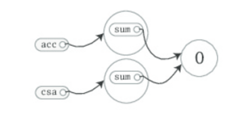
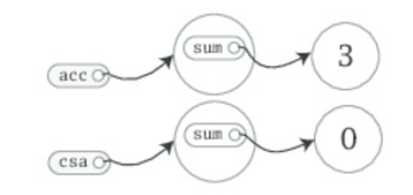
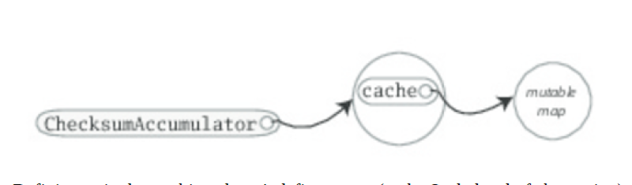

1. 类是对象的蓝图。一旦定义了一个类，就可以使用`new`来创建对象。通过`new ChecksumAccumulator`可以声明一个如下的类的对象
```scala
class ChecksumAccumulator {
// class definition goes here
}
```
2. 类定义内部你可以添加field和method，合称成员。filed是定义为val或var的变量。method是以def定义的可执行代码。filed存放的是一个对象的状态或者数据。方法使用这些数据做对象的计算工作。当初始化一个对象时，运行时就会分配内存存放对象状态的镜像(image)(例如，变量的内容)。例如，你执行了如下代码：
```scala
class ChecksumAccumulator {
var sum = 0
}
val acc = new ChecksumAccumulator
val csa = new ChecksumAccumulator
```
内存中的对象映像如图：



由于sum是var而不是val，所以你可以赋值为`acc.sum = 3`，现在的内存图如下：


、

3. 可以看到，这里有两个sum变量，一个由`acc`对象引用，一个由`csa`对象引用。filed也叫做实例变量。因为每个对象都有自己的实例对象集合。
4. 整体的说，一个对象的实例变量组成了这个对象在内存的映像。这里，不仅仅是两个`sum`变量，修改一个并不会影响另一个
5. 还可以看到，即使`acc`是`val`的，但是还可以修改由`acc`引用的对象，但是不能重新给`acc`赋一个新对象。
6. 你可以依靠的是，`acc`永远指向你初始化时给他的`ChecksumAccumulator`对象，但是，它里面包含的filed可能随时都会改变。
7. 如果不指定任何访问修饰符，在Scala中成员就是public的。
8. Scala的方法参数是val而不是var的，所以，如果在方法体内修改了这个参数，就会编译不过
9. 如果没有显式的return语句，Scala的方法会返回方法最后计算的值
10. Scala对方法的建议风格是避免有显式特别是多个返回语句，而是把每个方法看成一个产生一个值(方法返回的值)的表达式。这个哲学鼓励你让方法尽可能的小，由多个小的方法组成大的方法。
11. 如果方法足够小，你可以把方法体和方法声明def放在一起并省略返回值类型，scala可以推断出来。
12. 建议为了代码读者方便，还是写明白public方法的返回类型
13. 返回类型是Unit的方法会产生副作用。副作用通常定义为用方法在外部修改状态或者执行I/O动作。一个只为了执行副作用的方法也叫做 _procedure_。
14. 语句后面的分号是可选的。如果在一行内输入多行语句就需要用分号分隔
15. 如果要把一个语句分为多行，多数时间你就直接回车就可以了，scala可以正确的分割这些语句
16. 在某些情况下，scala可能会分错：
    ```scala
    x
    + y
    ```
    这里会解析为两个语句`x`和`+y`。如果你倾向于解析为一个语句`x+y`，你要加上括号
    ```scala
    (x
    + y)
    ```
17. 或者，你可以把`+`放在行尾。因为这个原因，如果你要链式中缀操作符例如`+`，常见的scala风格是把操作符放在行尾而不是行头
    ```scala
    x +
    y +
    z
    ```
18. 分号推断规则：精确的语句推断规则相对于他们工作的成果是很简单的。简单来说，如果存在如下情况中的一种，就不会在末尾加分号
    1. 所述行的结尾不是合法的语句结尾，例如是一个前缀或者中缀操作符
    2. 下一行的开头词不能作为语句的开始
    3. 行结尾还在括号内(圆括号或者方括号)，因为它们内部不能包含多行
19. scala相对于java更加面向对象在于scala没有静态方法。作为替代，Scala有 _单例对象(singleton object)_。
20. 单例对象的定义类似于类定义，除了关键字用`object`声明而不是`class`
    ```scala
    import scala.collection.mutable
    object ChecksumAccumulator {
        private val cache = mutable.Map.empty[String,Int]
        def calculate(s:String):Int = {
            if (cache.contains(s))
                cache(s)
            else{
                val acc = new ChecksumAccumulator
                for (c <- s)
                    acc.add(c.toByte)
                val cs = acc.checksum()
                cache += (s->cs)
                cs
            }
        }
    }
    ```
21. 当单例对象和类共享一个名字时，就叫这个对象为类的`companion object`，你需要把类和类的companion object定义到同一个源文件中。这个类叫做这个单例对象的`companion class`。类和它的companion object可以互相访问对方的私有成员。
22. 你可以把单例对象类比为java中存放静态方法的类。但他远远不止这样。它是第一类对象。
    
23. 定义一个单例对象不会定义一个类型(在Scala这一抽象层级上)。给定一个`ChecksumAccumlator`对象的定义，你不能创建一个变量类型是`ChecksumAccmulator`。这个类型是由单例对象的伴生类定义的。
24. 单例对象可以扩展超类以及mix-in traits。每个单例对象都是它超类和mixed-in traits的实例。你可以通过这些类型调用它的方法，通过这些类型的变量引用它，给形参是这些类型的方法传递这个对象。
25. 单例对象和类的一个区别在于，类可以有参数，但是单例对象没有。你不能通过`new`关键字实例化一个单例对象，所以你没有办法传递参数。
26. 单例对象被实现为由一个静态变量引用的合成类(synthetic class java编译器生成的一个类型)实例(singleton objects is implemented as an instance of a synthetic class referenced from a static variable)，所以他和Java的`static`有同样的初始化语义。特别的，单例对象在代码第一次访问她的时候初始化。
27. 如果单例对象没有同名的伴生类型，那么这个对象就被称为 _独立对象_。独立对象可用于很多目的，包括收集相关工具方法或者定义Scala应用的入口点。
28. 为了运行一个程序，你需要提供一个独立对象，它包含一个名为`main`，接收一个`Array[String]`string数组作为参数，返回类型是`Unit`的方法。
    ```scala
    // In file Summer.scala
    import ChecksumAccumulator.calculate
    object Summer {
        def main(args: Array[String]) = {
            for (arg <- args)
                println(arg + ": " + calculate(arg))
        }
    }
    ```
29. Scala隐式的在每个Scala源文件导入了`java.lang`和`scala`包成员，还有单例对象`Predef`的成员。`Predef`是在包`scala`中的，包含很多有用的方法。例如，你在Scala源文件中调用了`println`，你实际上调用的是`Predef`上的`println`。`Predef.println`接下来调用的是`Console.println`，后者做了实际的工作。
30. Scala有一点和Java不同，Java的类文件要和公共类名一致。Scala中，没有这个要求。但是一般建议按照Java的方式来。
31. 如果代码文件是以定义结束的，那么就不是一个脚本，脚本需要以结果表达式结尾。
32. 每次你使用scalac来编译代码，编译器在编译源码前，会扫描jar文件内容并执行其它初始化工作。所以Scala发布了一个Scala编译器daemon叫做fsc(fast scala compiler)。他会在本地启动一个server daemon，并附加在你电脑的端口上，在第一次的时候，还会执行相应的扫描初始化工作，但是在第二次的时候就可以跳过了。
33. Scala提供了一个trait，Scala.App，通过`extend`关键字在你的单例对象继承了`App`。就可以不用编写`main`方法了。直接在单例对象的大括号之间编写你的代码就可以了。
    ```scala
    import ChecksumAccumulator.calculate
    object FallWinterSpringSummer extends App {
        for (season <- List("fall", "winter", "spring"))
            println(season + ": " + calculate(season))
        }
    ```