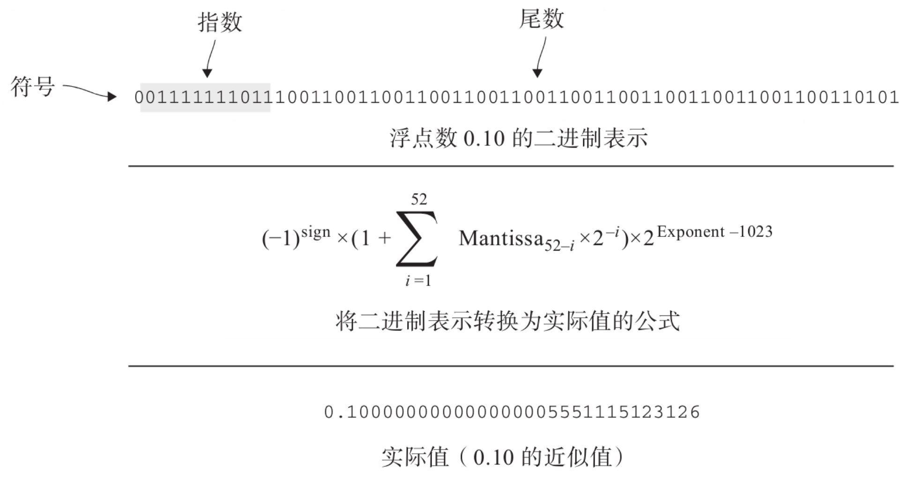
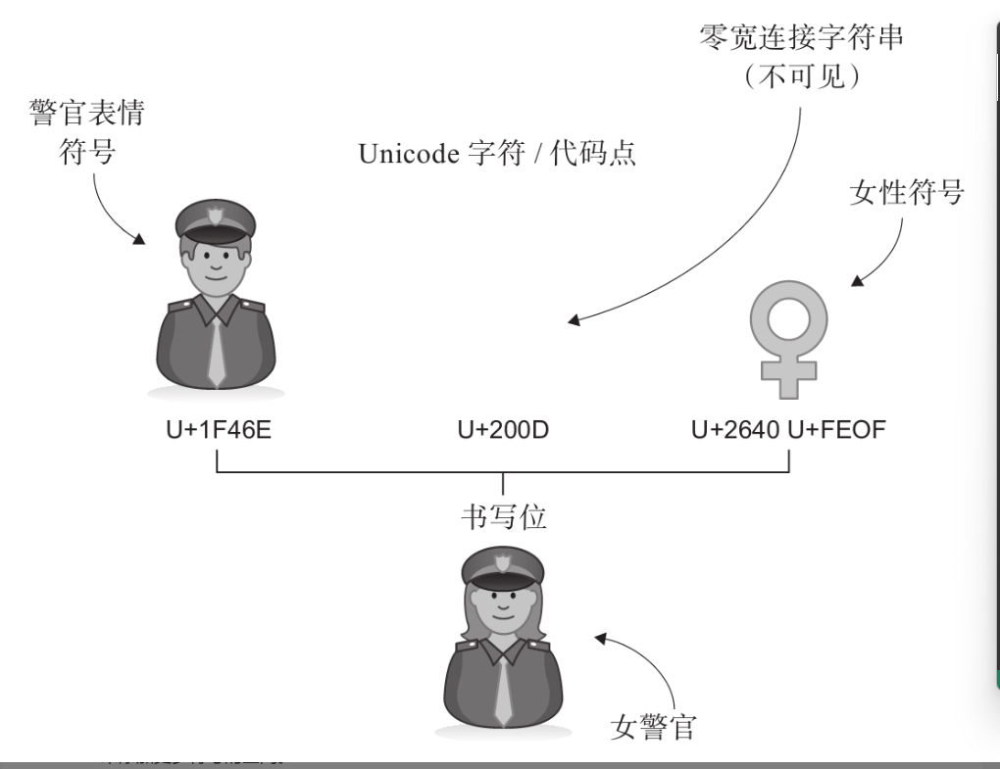

## 基本类型
__空类型：__ 空类型是不能有任何值的类型，其可取值的集合是一个空集合。任何时候都无法实例化这种类型的一个变量。我们使用空类型表示不可能，例如将其用作从不返回的函数(抛出异常或者无限循环的函数)的返回类型。
```ts
const fs = require('fs');
function rasie(message:string):never{
    console.error(`Error "${message} raised at ${new Date()}"`);
    throw new Error(message);
}

function readConfig(configFile:string):string{
    if(!fs.existsSync(configFile)){
        raise(`Configuration file ${configFile} missing`);
    }

    return fs.readFileSync(configFile,"utf-8");
}
```
上面的代码例子`raise()`函数返回类型就是`never`，这告诉了阅读代码的人，`raise()`从不会返回。由于代码声明了返回`never`，而任何值都无法赋值给它，因此，编译器可以保证函数的行为符合设计。

函数从不返回的原因有：1)函数所有代码路径都抛出异常；2)函数可能执行无限循环；3)函数会导致程序崩溃。例如，我们可能实现一个函数，当发生不可恢复的错误的时候，它会记录日志，发送数据然后抛出异常或者导致程序崩溃，抑或是在一个无限循环中处理一直运行的代码，直到关闭程序，这些函数都不会返回。

注意，大多数语言使用`void`表示无意义的值，但是，注意这两者之间的差别，上述函数根本不返回值，而不是不返回有意义的值。
>空类型标识了数学与计算机科学中的一个根本区别：数学中不能顶一个从非空集合到空集合的函数，而计算机程序可以定义一个执行空集合的有意义的函数。

如果你使用的语言没有内置的空类型，可以自己实现一个空类型。定义一个枚举，但不在其中定义任何元素，或者定义一个结构，使得它的构造函数时私有的，这样它也从不来不会被调用。
```ts
declare const EmptyType: unique symbol;//ts用来确保拥有相同形状的其他对象不会被解释为这个类型的一个方式
class Empty{
    [EmptyType] : void ;
    private constructor(){}//私有化构造函数，确保别的代码不能实例化这个类型
}
function raise(message:string):Empty{//这里使用了Empty作为空类型，而不是ts内置的never
    console.error(`Error "${message} raised at ${new Date()}"`);
    throw new Error(message);
}
```
注意：上面`EmptyType`这个符号是必须的，因为对于`ts`来说，如果两个类型结构相似，那么`ts`就认为它们是兼容的，所以需要一个虚拟的`void`属性，确保其他代码不会产生空类型。

编译器通过流程分析，知道代码不需要`return`，因为代码最终都会抛出异常，而且，由于我们不能实例化`Empty`，所以也无法加上return语句。

__单元类型：__ 单元类型是只有一种可能值的类型。对于这种类型的变量，检查其值没有意义，他只可能是那个值。一般函数结果没有意义，我们只想产生副作用的时候(例如执行记录日志，发送消息，修改外部状态等等)，会使用单元类型。
```ts
function greet():void{//只打印一个语句，没有任何有用的返回
    console.log("Hello world!");
}
greet();//通常会忽略它的结果
```
大多数语言中单元类型都是`void`。通常不会创建`void`类型的变量，而是直接从一个`void`函数返回，并不需要提供一个实际的值，因为这个值不重要。

接受任意数量的实参而不返回有意义值的函数也叫做`action`或者`consumer`。

很多语言都对`void`做了特殊处理，无法像使用其他类型那样使用`void`。可以通过定义一个枚举，只包含一个元素，或者定义一个没有状态的单例，创建自己的单元类型。注意，单元类型只有一个可取值，因此值是什么并不重要，所有单元类型都是相等的。将一个单元类型转换为另一个单元类型没有太大意义，因为只有一个选项，从一个类型的单个值映射到另一个类型的单个值。
```ts
declare const UnitType: unique symbol;
class Unit{
    [UnitType]: void;
    static readonly value: Unit = new Unit();
    private constructor(){}
}

function greet():Unit{
    console.log("Hello world!");
    reutrn Unit.value;
}
``` 
__布尔类型：__ 布尔类型只有两个值，它是对真实性进行编码，并可以对其进行逻辑运算，包括`AND`,`OR`和`NOT`。一些类型系统内置了布尔类型，并提供了值`true`和`false`。另一些则依赖数字表示布尔值，`0`表示`false`，其他数字表示`true`。大部分编译器和运行时都会对布尔表达式进行"短路"操作，`A and B`的操作会被翻译为为`if(A) then B else false`。对于`A or B`会翻译为`if(A) then true else B`。这样在计算`A`表达式的时候可能已经可以知道整个表达式的结果，此时就不再需要计算`B`表达式了，这就是短路。所以，在组合条件的时候，通过合理运用短路，可以按照开销从最小到最大的顺序片列条件。

__数值类型：__ 影响数值类型的是了解计算机如何表示它的，其关键特征是宽度和编码。宽度表示一个值的位数，而这与底层芯片有很大的关系。对于编码给定宽度的数字，常见的有三种方案，无符号二级制，二进制补码以及IEEE754。

__整数类型和溢出__
1. 无符号二进制：它的编码规则是每一位都用来表示数值的一部分。一个$N$位无符号整数可以表达$0$(所有位都是0)~$2^N-1$(所有位都是1)之间的值。将$N$个二进制位($b^{N-1}b^{N-2}\cdots b^1 b^0$)转换为一个十进制数字的公式：$b^{N-1}\times 2^{N-1}+b^{N-2}\times 2^{N-2}+\cdots+b^1\times 2^1+b^0\times 2^0$。
2. 二进制补码：上一个策略很简单，但是无法表示负数。如果要表示负数，如果要表示负数，就需要另一种编码方式，通常是补码。在这种编码规则中，我们保留一位作为符号位。正数的表示与前面一样，但是负数编码是从$2^N$减去它的绝对值，其中$N$是位数。这种编码规则中，负数的第一位都是1，正数和0的第一位都是0，表示的值的范围从$-2^{N-1}$ ~ $2^{N-1}-1$。

当计算结果无法根据给定位数表示，就会发生上溢和下溢。处理方式包括环绕，饱和和报错。

硬件通常采用环绕的方式，例如，4位无符号整数最多表示到15，那么，如果`15+1`的结果用二级制表示是`10000`，那么硬件会丢掉最高位，结果就是`0000`，即环绕回0，这是处理溢出最高效但也是最危险的方式。

饱和是另外一种方式，如果运算结果超过了最大值，就保留到最大值。如果是饱和的计算方式，那么算术运算可能就无法具有结合性：例如，最大可表示的数是7，那`7+(2-2)`和`(7+2)-2`就不一样了，前者最终是`7`而后者则是`5`。

第三种是报错。

有时候我们需要检测是否计算会导致上溢和下溢。举个例子，我们需要判断`a`和`b`相加会不会超过`[MIN,MAX]`的范围，我们需要确保不会发生`a+b<MIN`(`a`和`b`都是负数)或者`a+b>MAX`。
考虑如下情况：
1. 如果`b`是正数，那么`a+b`就不可能小于`MIN`，因为加法会让`a`变大，此时，只需要检查是否会上溢，我们将`a+b>MAX`改写为`a>MAX-b`。由于操作是减去一个正数，不会发生上溢(`MAX-b`在范围`[MIN,MAX]`之间)，因此，如果`b>0`且`a>MAX-b`，就会发生上溢。
2. 如果`b`是负数，那么`a+b`就不会大于`MAX`，此时，我们需要检查下溢，可以将`a+b<MIN`改写为`a<MIN-b`，因为`b`是负数，所以`MIN-b`不会发生下溢(`MIN-b`位于范围`[MIN,MAX]`之间)，因此，`b<0`且`a<MIN-b`，就会发生下溢。
```ts
function addError(a:number,b:number,min:number,max:number):boolean{
    if(b>=0){
        return a>max-b;//b是正数，检查是否会上溢
    }else{
        return a<min-b;//b是负数，检查是否会下溢
    }
}
```
减法的逻辑与此类似。

对于乘法，我们可以在两边都除以`b`来检查上溢和下溢。这里，不同于上面的考虑，还需要考虑两个数字的符号，因为两个负数相乘/相除会得到一个正数。而一负一正的乘除法会得到一个负数。因此：
如果：
* `a>0,b>0`且`a>MAX/b`，或者
* `a<0,b<0`且`a<MAX/b` 
发生上溢。
如果：
* `a>0,b<0`且`a>MIN/b`，或者
* `a<0,b>0`且`a<MIN/b`
发生下溢。

对于整数除法，`a/b`的值始终位于`-a`~`a`之间的值，只有当`[-a,a]`不完全位于`[MIN,MAX]`之间，才需要检查上溢和下溢。事实上，对于无符号整数的除法，是不会发生上溢，而对于带符号的整数除法，唯一发生上溢的场景就是`a`是`MIN`而`b`是`-1`。

__浮点类型和圆整__
IEEE754是IEEE组织为浮点数(带小数点的数字)指定的标准。TS和JS使用binary64编码将数字表示为64为浮点数。

浮点数包含三个部分：符号、指数和位数。上图中，0.10的实际值是0.100000000000000005551115123126。但是被向下圆整到了0.10。浮点数只能透过圆整或者近似才能使用相对少量的位数表示很大范围的小数。

对于需要处理数字精度的问题，更好的方式是使用整数计算。例如，表示对价格可以编码为几部分：圆、角、分等等。然后再计算。JS提供了一个`Number.isSafeInteger()`可以判断一个数字是否能再不被圆整的情况下表示出来。
```ts
class Currency{
    private dollars:number;
    private cents:number;

    constructor(dollars:number,cents:number){
        if(!Number.isSafeInteger(dollars)){
            throw new Error("Cannot safely represent dollar amount");
        }
        if(!Number.isSafeInteger(cents)){
            throw new Error("Cannot safely represent cent amount");
        }
        this.dollars = dollars;
        this.cents = cents;    
    }
    
    getDollars():number{
        return this.dollars;
    }

    getCents():number{
        return this.cents;
    }
}

function add(currency1:Currency,currency2:Currency){
    return new Currency(
        currency1.getDollars()+currency2.getDollars(),
        currency1.getCents()+currency2.getCents());
}
```
比较浮点数是否相等，如果直接使用等号比较，肯定不是一个好主意。更好的方式是比较是否近似相等，也就是二者的差值在给定阈值范围内。整个阈值应该是可能出现的最大圆整误差。叫做machine epsilon，根据不同的编码有不同的值。JS提供了`Number.EPSILON`代表这个值。
```ts
//如果两个数字之差小于epsilon值，就可以认为它们是相等的了
function epsilonEqual(a:number, b:number):boolean{
    return Math.abs(a-b)<=Number.EPSILON;
}
```
__任意大数__
我们可以通过固定宽度的数字类型构造任意大的数值作为BigInt。由于任意大数没有对应硬件表示(芯片总是操作固定位数)，很多运行时没有直接提供它们。

__字符串__
字符串由零个或者多个字符串组成，是一个更够有无限个值的基本类型。

`\ud002`是零宽连接字符串，它本身没有图形表示，只用于组合其他字符(unicode允许字符组合)。`\uXXXX`是unicode转义字符，用来表示无法原样打印的字符。所以，如果是简单文本(可见的ascii码)还可以根据字符边界拆分文本，但是如果涉及到了复杂的编码字符，就会出错。

为了理解如果处理文本我们需要理解字符编码。Unicode标准有两个类似但不同的概念：字符(character)和书写位(grapheme)。字符是文本的计算机表示，书写位则是用户看到的符号。比如，警官"👮‍♀️"这个字符，零宽连接字符和女性"♀️"字符，他们都是字符，而女警官"👮‍♀️"这个符号，则是一个书写位，它是由警官字符和女性字符组合而成的，而这两个字符是通过零宽连接字符组合在一起。

字形(graph)是一个字符的特定表现形式，比如__C__(加粗) 和 _C_(斜体) 都是字符"C"的两种不同视觉呈现。书写位不可分割，比如上面所说的女警官。一个书写位可以有用多个字形表示，比如不同的系统对于女警官这个符号的看起来是不一样的，这就是用不同字形呈现相同书写位的结果。



每个Unicode字符被定义为一个代码点，值域是0x0~0x10FFFF，共有1,114,111个代码点，他们一起用来表示全世界所有的字母表，表情符号和许多其他符号。

__UTF-32__
编码这些代码点最直观的方式是UTF-32，它为每个字符使用32位，值域范围是0x0~0xFFFFFFFF。优点是可以容纳所有代码点而且还有剩余空间，缺点是低效，没有使用的位浪费了大量空间。
__UTF-16和UTF-8__
这两个是最常见的编码，前者是JavaScript使用的编码格式。UTF-16的一个单元是16位，能用16位表示的代码点(0x0~0xFFFF)由一个16位整数表示，不能的(0x10000~0x10FFFF)由两个16位值表示。
UTF-8是最流行的编码，一个单元是8位，代码点由1，2，3或者4个单元表示。

应该总是确保使用正确的编码解释字节序列，尽可能依赖成熟的字符串库，在字符和书写位级别操作字符串。

__数组__
一般来说，如果数组从$base$位置开始，元素大小是$M$，则索引位置为$N$的元素存储在$base+M \times N$，由于内存是连续的，可以把数组整体放到内存缓存起来，加速访问速度。而对于链表，就需要沿着next指针前进，直到第$N$个结点。数组的劣势在于大小固定，如果要扩容，需要创建一个更大的数组，将原来的数组值赋给新的数组，而链表只需要增加新的结点。根据对数据的访问模式，选择不同的数据结构表示。

__引用__
引用类型保存对象的指针，引用类型的值，即变量的值，不是这个对象的内容，而是可以找到这个对象在内存中的地址。一个对象的多个引用不会复制该对象的状态，通过其中一个修改对象，所有其他的引用都可以看到这个修改。

__列表__
用链表的方式实现列表，添加和删除节点是O(1)，但是遍历是O(N)
```ts
//列表节点
class NumberListNode{
    value:number;
    next:NumberListNode|undefined;

    constructor(value:number){
        this.value = value;
        this.next = undefined;
    }
}
//列表
class NumberLinkedList{
    private tail:NumberListNode = {value:0,next:undefined};
    private head:NumberListNode = this.tail;

    at(index:number):number{
        let result:NumberListNode|undefined = this.head.next;
        while(index>0&&result != undefined){
            result = result.next;
            index--;
        }
        if(result == undefined) throw new RangeError();
        return result.value;
    }

    append(value:number){
        this.tail.next = {value:value,next:undefined};
        this.tail = this.tail.next;
    }
}
```
基于数组的实现列表，当需要追加新的元素，需要分配新的数组(容量+1)，当前数组的元素复制到新的数组，将追加值写入到新数组最后一个元素，新数组替换当前数组。

基于数组的实现(没有指数扩容)
```ts
class NumberArrayList{
    private numbers:number[] = [];
    private length:number = 0;
    at(index:number):number{
        if(index>=this.length) throw new RangeError();
        return this.numbers[index];
    }
    append(value:number){
        let newNumbers:number[] = new Array(this.length+1);
        for(let i = 0;i<this.length;i++){
            newNumbers[i] = numbers[i];
        }
        newNumbers[this.length] = value;
        this.numbers = newNumbers;
        this.length++;
    }
}
```
基于数组的实现(成倍数扩容)
```ts
class NumberArrayList{
    private numbers:number[] = new Array[1];
    private length:number = 0;
    private capacity:number = 1;
    at(index:number):number{
        if(index>=this.length) throw new RangeError();
        return this.numbers[index];
    }
    append(value:number){
        if(this.length<=capacity){
            this.numbers[length] = value;
            this.length++;
            return;
        }
        this.capacity = this.capacity*2;
        let newNumbers:number[] = new Array(this.capacity);
        for(let i = 0;i<this.length;i++){
            newNumbers[i] = numbers[i];
        }
        newNumbers[this.length] = value;
        this.numbers = newNumbers;
        this.length++;
    }
}
```

__二叉树__
树是一个可以在多个位置追加数据的结构，二叉树是一个例子，他可以向任何没有两个子节点的结点追加结点。可以使用数组表示二叉树。树的根只有一个结点。第二级最多两个，第三级最多的4个，对于一个N级二叉树，最多有$1+2+3+...+2^{N-1}$ 个结点，即$2^N-1$。

我们将每个级别都放到前一个级别的后面，如果树是不完全的(不是每个结点都有子节点)，就将确实的标记为`undefined`，这样可以用数组表示一个二叉树。优点是，如果父节点位于索引`i`的位置，则左侧子节点位于`2*i`，右侧子节点位于`2*i+1`。用数组这个结构表示的话，添加子节点很方便，但是如果增加树的层级，就需要对数组扩容，然后复制整棵树。另一个问题是，如果树本身比较稀疏(很多节点缺失)，那么数组可能会浪费很多空间。
```ts
class Tree{
    nodes:(number|undefined)[] = [];

    left_child_index(index:number):number{
        return index*2;
    }

    right_child_index(index:number):number{
        return index*2+1;
    }

    add_level(){
        let newNodes:(number|undefined)[] = new Array(this.nodes.length*2+1);
        for(let i = 0 ;i<this.nodes.length;i++){
            newNodes[i] = nodes[i];
        }

        this.nodes = newNodes;
    }
}
```
另一种方式是使用引用，节点存储一个值以及子节点的引用，这样可以减少额外的空间开销。虽然引用会占用空间，但是这跟节点数成正比，对于稀疏的树来说，要比数组好很多，后者随着树的层级增加，空间占用会呈指数增长。
```ts
class TreeNode{
    value:number;
    left :TreeNode|undefined;
    right:TreeNode|undefined;

    constructor(value:number){
        this.value = value;
        this.left = undefined;
        this.right = undefined;
    }
}
```

__关联数组__
关联数组也叫做字典或者哈希表，它是键值对的集合。js/ts的数组就是关联数组，key是数组下标，值是下标所在值。Java/C#等语言将关联数组作为标准库的一部分提供，而基本类型和引用则是内置的类型。数组和引用时较低级别的结构，代表了特定的内存布局和访问模型，而关联数组则是较高级别的抽象。关联数组通常实现为一个固定大小的列表数组，哈希函数接受任意类型作为一个key，返回该固定数组的一个索引。在这个数组的给定索引位置的列表中将添加或者检索键值对。使用列表的原因时可以将多个key映射到同一个索引(注：这句话的意思是，关联数组有一个固定大小的数组，数组元素是一个列表，就是链表法解决哈希冲突)。

