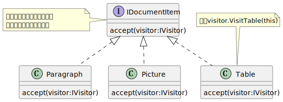
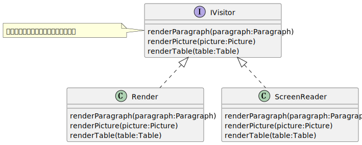

### 复合类型
组合类型最明显的方式是将它们放在一起构成一个新类型。一般来说，以这种方式组合一个或者多个类型得到一个新类型，其值为组成类型的全部可能的组合。注意，这里说的是组合类型的值，而不是类型的操作。本章不关心如何组合操作，只关注值。

__元组类型__
如果我们想要计算两点之间的距离，第一个点包含两个坐标`X`和`Y`，一个简陋的方式是：
```ts
function distance(x1:number, y1:number,x2:number,y2:number):number{
    //注意，js/ts的幂计算
    return Math.sqrt((x1-x2)**2+(y1-y2)**2);
}
```
这个函数可以得到结果，但是很不理想， 他没有类型信息，我们不知道`x1`，`y1`，`x2`，`y2`的含义，我们不知道处理的是一个点，等等。这个时候，我们可以将一个点的两个坐标份组成一个元素。

元组类型：元组类型由一组类型组成，通过它们在元组中的位置可以访问这些组成类型。元组提供了一组特殊的分组数据的方式，允许我们将不同类型的多个值作为一个值访问。

通过使用元组，我们可以将`X`和`Y`组成一个`Point`。这里好处是显然的，我们可以让代码更加简洁，而且我们现在知道了处理的是一个`point`,而不是`x:number`和`y:number`。
```ts
type Point = [number,number];
function distance(point1:Point,point2:Point):number{
    return Math.sqrt((point1[0] - point2[0])**2+(point1[1] - point2[1])**2)
}
```
当从一个函数中返回多个值的时候，元组也很有用(因为ts/js，java不支持golang那种返回多个值)。也可以使用`out`参数，但显然这让代码更难理解了(注：`out`会放在函数的参数列表，虽然他表示的是一个参数会在函数内部修改并影响到它的值，参见C#的out修饰符)。

如果语言没有内置元组，自制一个泛型的元组，下面的例子就是这样，包含了两个组成类型，也叫做"对"。
```ts
class Pair<T1,T2>{
    m0:T1;
    m1:T2;

    constructor(m0:T1,m1:T2){
        this.m0 = m0;
        this.m1 = m1;
    }
}

type Point = Pair<number,number>;

function distance(point1:Point,point2:Point):number {
    return Math.sqrt((point1.m0-point2.m0)**2 + (point1.m1-point2.m1)**2)
}
```
将类型看作可能值得类型时，对于`Point`来说，如果`X`坐标是`number`定义得集合中得任意值，并且`Y`可以是`number`定义得集合中得任意值，那么`Point`元组可以是由`<number,number>`对定义得集合中得任意值。


__记录类型__
我们当然就只把`Point`定义为数值对，但是，我们其实还是少了一些意义：这个数值对既可以代表`X`和`Y`坐标，也可以代表`Y`和`X`。我们虽然在目前的代码中将元组的第一个分量作为`X`，第二个分量作为`Y`，但是这很容易出错。为了确保肯定不会错，可以使用记录类型。

记录类型：记录类型与元组类型类似，可以将其他类型组合在一起。但是，元组中按照分量的位置来访问值，而在记录类型中，我们可以为分量设置名称，并通过名称来访问值。记录类型在不同语言被称为记录或者结构。
```ts
class Point{
    x:number;
    y:number;

    constructor(x:number, y:number){
        this.x = x;
        this.y = y;
    }
    function distance(point1:Point,point2:Point):number {
        return Math.sqrt((point1.x - point2.x) **2 + (point1.y - point2.y) **2);
    }
}
```
一般来说，最好是定义带命名分量的记录，而不是传递元组。元组没有名字，就可能错误的解释。从效率和功能的角度来说，元组没有比记录多提供什么，通常我们可以内联声明元组，而记录通常需要单独的定义，单独的定义在大部分情况下是值得的，这为变量提供了额外的意义。

在一些语言中，记录类型可以有关联的方法，对于这种记录类型，可以定义成员的可见性，可以是`public`（可以在任意位置访问）或者是`private`（只能在记录内访问）等。ts中，成员默认`public`。如果记录类型的成员是独立的，某个成员的变化不会引起另一个成员的变化或者产生问题，就可以把它们标记为公有。

现在考察成员不能独立改变的情况：比如货币类型，它由`dollars`和`cents`构成。如果单独的改变某个值，比如`cents`超过了99，这是错误的，此时应该将`cents`的每100转为1美元。我们对这个货币类型的约束是：
* `dollars`必须是大于等于0的整数，可以安全的用`number`表示
* `cents`必须是大于等于0的整数，可以安全的用`number`表示
* `cents`不能大于99，每`100cents`应该转换为`1dollar`
上面这种规则叫做不变量，因为即使组成的复合类型的值发生了变化，这个规则也不能为违反。如果我们将有这种规则约束的记录类型的成员作为公有的，那么外部代码就可以随意访问修改它们而不比遵守这种约束，这就会导致错误的记录。我们可以让成员私有，然后提供方法按照不变量的规则修改成员，如果我们处理了所有可能导致不变量失效的情况，就可以确保对象始终是有效的状态，因为修改要么会得到一个正确的对象，要么会导致异常。
```ts
class currency{
    private dollars:number = 0;
    private cents:number = 0;

    constructor(dollars:number,cents:number){
        this.assignDollars(dollars);
        this.assignCents(cents);
    }

    getDollars():number{
        return this.dollars;
    }

    getCents():number{
        return this.cents;
    }

    assignDollars(dollars:number){
        if(!Number.isSafeInteger(dollars)||dollars < 0){
            throw new Error();
        }
        this.dollars = dollars;
    }

    assignCents(cents:number){
        if(!Number.isSafeInteger(cents)||cents < 0){
            throw new Error();
        }
        this.assignDollars(this.dollars+Math.floor(cents/100));
        this.cents = cents%100;
    }
}
```
还有一种方法是让成员不可变，我们在初始化的时候保证记录是符合不变量的，然后其他代码就可以访问记录的成员了，因为它们是无法修改成员的。
```ts
class Currency{
    readonly dollars:number = 0;
    readonly cents:number = 0;

    constructor(dollars:number,cents:number){
        if(!Number.isSafeInteger(cents)||cents < 0){
            throw new Error();
        }
        dollars = dollars+Math.floor(cents/100);
        cents = cents%100;
        if(!Number.isSafeInteger(dollars)||dollars < 0){
            throw new Error();
        }

        this.dollars = dollars;
        this.cents = cents;
    }

}
```
如果成员不可变，那么就不需要提供方法维护不变量了，成员只有在构造的时候才会被设置一次，所有验证逻辑都可以放到构造方法里面。不可变另一大优势是不可变对象是并发安全的，因为数据不会改变。可变性会导致数据竞争，即一个线程修改了值，而另一个线程正在使用该值。而缺点是，每次需要新值，就需要创建一个新的实例，根据创建新实例的开销，我们可以选择使用`getter`和`setter`方法更新记录的成员，或者每次更新都创建新对象。

### 表达多选一的类型
上面的组合类型是将多个类型放在一起，得到的结果类型的值有每个成员类型的值组成。另外一种组合类型的基本方式多选一，即结果类型的值是一个或者多个成员类型的值集合中的某一个。

__枚举__
枚举将多个值组成一起，每一个枚举变量可以提供值域中的任何一个，这可以保证当有一小组得可取值时，不会有歧义得使用它们。
```ts
enum DayOfWeek {
    Sunday,
    Monday,
    Tuesday,
    Wednesday,
    Thursday,
    Friday,
    Saturday
}
```

__可选类型__
在ts中，我们可以使用`|`类型操作符来表达可能的类型有哪些：
```ts
function parseDayOfWeek(input:string)DayOfWeek|undefined{
    switch(input.toLowerCase()){
        case "sunday":return DayOfWeek.Sunday;
        case "monday":return DayOfWeek.Monday;
        case "tuesday":return DayOfWeek.Tuesday;
        case "wednesday":return DayOfWeek.Wednesday;
        case "thursday":return DayOfWeek.Thursday;
        case "friday":return DayOfWeek.Friday;
        case "saturday":return DayOfWeek.Saturday;
        default: return undefined;
    }
}

function useInput(input:string){
    let result:DayOfWeek|undefined= parseDayOfWeek(input);
    if(result == undefined){
        console.log(`Failed to parse "${input}"`);
    }else{
        let dayOfWeek:DayOfWeek = result;
        /* 使用dayOfWeek */
    }
}
```
可选类型：可选类型代表代表另一个类型`T`的可选值。可选类型的实例可以保存类型`T`的一个值(任意值)，后者保存一个特殊值来指出不存在类型T的值(任意值)，或者保存一个特殊值来指出不存在类型`T`的值。

一些语言没有为提供像ts这样组合方式的类型提供语法级别的支持，但是在库中提供了常用的结构(比如：Java中的`Optional`)。通常的方式是封装了泛型实参提供另一个类型，提供了两个方法`hasValue()`和`getValue()`，前者用来判断是否有值，后者获取值，如果没有值，调用`getValue()`会报错。
```ts
class Optional<T>{
    private value:T|undefined;
    private assigned:boolean;

    constructor(value?:T){
        if(value){
            this.value = value;
            this.assigned = true;
        }else{
            this.value = undefined;
            this.assigned = false;
        }
    }

    hasValue():boolean{
        return this.assigned;
    }

    getValue():T{
        if(!this.assigned){
            throw Error();
        }
        return <T>this.value;
    }
}
```
当语言不支持`|`操作符定义`T|undefined`类型，可以使用`nullable`类型，它允许该类型的任意值以及`null`，后者代表不存在值。由于大部分语言允许引用类型为`null`，所以不需要`Optional<T>`，也有可以编码"没有可用值"的方式，但是，使用`null`容易出错，我们需要在任何可能的地方加入`null`检查避免NPE。可选类型是为了将`null`和允许值的范围拆分开，当我们遇到一个可选类型，就会知道结果可能不包含值。在检查并指导该类型确实有值后，就可以从可选类型中取出类型`T`的值。此后，我们就知道这个变量不会为`null`，而类型系统可以知道这种区别。因为"可能为`null`"的变量的类型(`DayOfWeek|undefined`或者`Optional<DayOfWork>`)和从中提取出来的值的类型时不同的，我们知道提取出来的值不能为`null`(`DayOfWeek`)。可选类型与其基本类型是不兼容的，这样，我们不会不小心在想要使用基本类型时，没有显式提取值就是用一个可选类型。最好不要让`null`(即没有值)自身成为某个类型的一个有效的值。

__`Either`类型__
如果我们想要在无法确认`DayOfWeek`的值时，返回详细的错误信息而不是简单的`undefined`。我们需要区分字符串为空，以及无法解析字符串这两种情况。一种常见的反模式是，同时返回`DayOfWeek`和一个错误码，如下：
```ts
enum InputError{
    OK, 
    NoInput,
    Invalid
}
Class Result{
    error:InputError;
    value:DayOfWeek;
    constructor(error:InputError,value:DayOfWeek){
        this.error = error;
        this.value = value;
    }
}

function parseDayOfWeek(input:string):Result{
    if(input == ""){
        return new Result(InputError.NoInput,DayOfWeek.Sunday);
    }
    switch(input.toLowerCase()){
        case "sunday":return new Result(InputError.OK,DayOfWeek.Sunday);
        case "monday":return new Result(InputError.OK,DayOfWeek.Monday);
        case "tuesday":return new Result(InputError.OK,DayOfWeek.Tuesday);
        case "wednesday":return new Result(InputError.OK,DayOfWeek.Wednesday);
        case "thursday":return new Result(InputError.OK,DayOfWeek.Thursday);
        case "friday":return new Result(InputError.OK,DayOfWeek.Friday);
        case "saturday":return new Result(InputError.OK,DayOfWeek.Saturday);
        default: return new Result(InputError.Invalid,DayOfWeek.Sunday);
    }
}
```
这个方案很不理想，我们可能会忘记检查错误码，从而错误的使用`DayOfWeek`成员。而这个值可能是默认的`DayOfWeek`，从而在系统中传播了错误的值。

如果我们将类型看作集合，那么这里就会包含所有可能的错误码以及所有可能出现的结果的组合。由三个`InputError`和7个`DayOfWeek`笛卡尔积组成，一共21个。相反，我们应该尝试返回一个错误或者一个有效值，这样值的集合就显著减小，因为在`InputError`为`NoInput`和`Invalid`时，我们就不能使用`Result`的`DayOfWeek`成员。这样，值域就是7个`DayOfWeek`加上`InputError.NoInput`和`InputError.Invalid`。我们不再需要`InputError.OK`，因为`DayOfWeek`就表示`NoInput.OK`。

`Either`类型包含两个类型，`TLeft`和`TRight`。约定`TLeft`存储错误类型，`TRight`类型存储有效值类型。有些语言在库中提供了这种类型，如果没有可以按如下实现：
```ts
class Either<TLeft,TRight>{
    private readonly value: TLeft|TRight;
    private readonly left :boolean;

    private constructor(value:TLeft|TRight,left:boolean){
        this.value = value;
        this.left = left;
    }

    isLeft():boolean{
        return this.left;
    }

    getLeft():TLeft{
        if(!this.isLeft()) throw new Error();
        return <TLeft>this.value;
    }

    isRight():boolean{
        return !this.left;
    }

    getRight():TRight{
        if(!this.isRight()) throw new Error();
        return <TRight>this.value;
    }

    static makeLeft<TLeft,TRight>(value:TLeft){
        return new Either<TLeft,TRight>(value,true);
    }

    static makeRight<TLeft,TRight>(value:TRight){
        return new Either<TLeft,TRight>(value,false);
    }
}
```
如果语言不支持`|`类型操作符，可以用一个公有的类型，比如Java和C#的`Object`，然后`getLeft`和`getRight`方法转换为`TLeft`和`TRight`。这样，我们就可以实现一个健壮的`parseDayOfWeek()`，返回`Either<InputError,DayOfWeek>`，这样，如果函数返回了`InputError`，则不会包含`DayOfWeek`，这样，我们通过`getRight`获取`DayOfWeek`就会报错。我们需要显示提取值，当`isLeft()`或者`isRight()`返回`true`的时候，我们就知道`getLeft()`或者`getRight()`一定会返回有效的值。
```ts
enum InputError{
    NoInput,
    Invalid
}
type Result = Either<InputError,DayOfWeek>;

function parseDayOfWeek(input:string):Result{
    if(input == ""){
        return new Result.makeLeft(InputError.NoInput);
    }
    switch(input.toLowerCase()){
        case "sunday":return Result.MakeRight(DayOfWeek.Sunday);
        case "monday":return Result.MakeRight(DayOfWeek.Monday);
        case "tuesday":return Result.MakeRight(DayOfWeek.Tuesday);
        case "wednesday":return Result.MakeRight(DayOfWeek.Wednesday);
        case "thursday":return Result.MakeRight(DayOfWeek.Thursday);
        case "friday":return Result.MakeRight(DayOfWeek.Friday);
        case "saturday":return Result.MakeRight(DayOfWeek.Saturday);
        default: return Result.MakeLeft(InputError.Invalid);
    }
}
```
这样，就不会出现之前`Result`的一些无效状态，比如`(NoInput,Sunday)`，避免了可能在出现`InputError`时误用`Sunday`。`InputError`也移除了`OK`，因为能解析成功，就不会有错误。

__异常__
如果发生错误时抛出异常，这是返回结果或者错误的一个有效例子：函数要么返回结果，要么抛出异常。如果不能使用异常，优先选择使用`Either`类型，比如，线程间或者进程间传播错误；作为一个设计原则，当错误本身算不上异常时(通常发生在处理用户输入时)；当调用系统API，而这些API使用错误码时，等等。这些情况下，我们不能或者不希望抛出异常，而是希望表达我们成功获取到了值或者失败了，此时最好将这种情形编码成"值或错误"，而不是"值和错误"。当可以抛出异常时，我们可以使用异常确保不会同时得到无效结果和错误。函数在抛出异常时，就不会正常返回，它会一直传播异常，直到找到匹配的`catch`语句。这样，我们就得到一个结果或者一个异常。

__变体__
可选类型包含一个基础类型的一个值或者不包含值，`Either`类型包含一个`TLeft`或者`TRight`值。将这些类型归纳起来，就得到变体类型。

变体类型：变体类型也叫做标签联合类型，包含任意数量的基本类型的值。标签指的是即使基本类型有重合的值，我们仍然可以准确说明该值来自那个类型。
```ts
class Point{
    readonly kind:string = "Point";
    x:number = 0;
    y:number = 0;
}

class Circle{
    readonly kind:string = "Circle";
    x:number = 0;
    y:number = 0;
    radius:number = 0;
}

class Rectangle{
    readonly kind:string = "Rectangle";
    x:number = 0;
    y:number = 0;
    width:number = 0;
    height:number = 0;
}
type Shape = Point|Circle|Rectangle;
let shapes:Shape[] = [new Circle(),new Rectangle()];

for(let shape of shapes){
    switch(shape.kind){
        case "Point":
            let point:Point = <Point>shape;
            console.log(`Point ${JSON.stringify(point)}`);
            break;
        case "Circle":
            let circle:Circle = <Circle>shape;
            console.log(`Circle ${JSON.stringify(circle)}`);
            break;
        case "Rectangle":
            let rectangle:Rectangle = <Rectangle>shape;
            console.log(`Rectangle ${JSON.stringify(rectangle)}`);
            break;
        default:
            throw new Error();
    }
}
```
上面，每个形状都有一组不同的属性和一个标签(`kind`属性)，我们定义了`Shape`类型，作为所有形状的联合，我们通过`kind`判断具体的类型，然后强制转换了类型，进行后续操作。

我们可以实现一个通用的变体，使其跟踪类型，而不需要类型自身存储一个标签。不同的编程语言提供了不同的泛型和类型检查功能。一些语言允许可变数量的泛型实参，这样我们可以有任意数量类型的变体；另一些语言提供了不同的方式，在编译时和运行时判断值是不是特定的类型。下面的例子用到了ts的语言特性，其他语言的实现可能不同。
```ts
class Variant<T1,T2,T3>{
    readonly value: T1|T2|T3;
    readonly index:number;

    private constructor(value:T1|T2|T3,index:number){
        this.value = value;
        this.index = index;
    }

    static make1<T1,T2,T3>(value:T1):Variant<T1,T2,T3>{
        return new Variant<T1,T2,T3>(value,0);
    }
    static make2<T1,T2,T3>(value:T1):Variant<T1,T2,T3>{
        return new Variant<T1,T2,T3>(value,1);
    }
    static make3<T1,T2,T3>(value:T1):Variant<T1,T2,T3>{
        return new Variant<T1,T2,T3>(value,2);
    }
}
```
ts不支持方法重载，其他语言可以使用一个`make()`方法，使其对每种泛型类型重载
```ts
class Point{
    x:number = 0;
    y:number = 0;
}

class Circle{
    x:number = 0;
    y:number = 0;
    radius:number = 0;
}

class Rectangle{
    x:number = 0;
    y:number = 0;
    width:number = 0;
    height:number = 0;
}
type Shape = Variant<T1,T2,T3>;
let shapes:Shape[] = [Variant.make2(new Circle()),Variant.make3(new Rectangle())];

for(let shape of shapes){
    switch(shape.index){
        case 0:
            let point:Point = <Point>shape;
            console.log(`Point ${JSON.stringify(point)}`);
            break;
        case 1:
            let circle:Circle = <Circle>shape;
            console.log(`Circle ${JSON.stringify(circle)}`);
            break;
        case 2:
            let rectangle:Rectangle = <Rectangle>shape;
            console.log(`Rectangle ${JSON.stringify(rectangle)}`);
            break;
        default:
            throw new Error();
    }
}
```
你可能感到疑惑，为什么不为形状使用一个类层次呢？这样一来，就可以让每个类型实现一个基类方法，而不是对标签进行switch分支。为了解释这一点，我们需要了解访问者设计模式，以及实现访问者设计模式的方式
### 访问者模式
假设我们有一个文档，包含三个项目：段落，图片和表格。我们需要渲染它。考虑一种简单的类型设计：
```ts
class Renderer{/*rendering methods*/}
class ScreenReader{/*Screen reading methods*/};

interface IDocumentItem{
    render(renderer:Renderer):void;
    read(screenReader:ScreenReader):void;
}

class Paragraph implements IDocumentItem{
    /*忽略了Paragraph成员*/
    render(renderer:Renderer){
        /*使用renderer在屏幕渲染自己*/
    }
    read(screenReader:ScreenReader){
        /*使用screenReader阅读自身*/
    }
}

class Picture implements IDocumentItem{
    /*忽略了Picture成员*/
    render(renderer:Renderer){
        /*使用renderer在屏幕渲染自己*/
    }
    read(screenReader:ScreenReader){
        /*使用screenReader阅读自身*/
    }
}

class Table implements IDocumentItem{
    /*忽略了Table成员*/
    render(renderer:Renderer){
        /*使用renderer在屏幕渲染自己*/
    }
    read(screenReader:ScreenReader){
        /*使用screenReader阅读自身*/
    }
}

let doc:IDocumentItem[] = [new Paragraph(),new Table()];
let renderer:Renderer = new Renderer();
for(let item of doc){
    item.render(renderer);
}
```
这里，`IDocumentItem`只应该负责描述文档内容(比如文本或者图片)，不应该负责渲染或者阅读。在每个`IDocumentItem`类中加入渲染和阅读的代码，会使代码膨胀，而且如果添加一个新功能，比如`print`，就需要更新接口并修改所有实现类。
__访问者模式__
访问者模式是在一个对象结构的元素上执行的操作。这种模式允许在定义新操作时，不改变其操作的元素的类。我们可以通过访问者模式修改上面的例子。


`IDocumentItem`接口确保每个子类都有一个`accept()`方法，该方法接受一个`IVisitor`。`IVisitor`确保每个访问者都能够处理所有可能存在的文档类型。每个`IDocumentItem`实现类实现`accept()`，将自己发给`IVisitor`，这样我们就将职责(如屏幕渲染和阅读)拆分到单独的组件(访问者)，从`IDocumentItem`中抽象出来。上面的类型使用了双分派机制，让文档接受访问者，然后将自己传递给访问者，实现这种任务，访问者知道如何处理每个文档项，根据不同的文档实例，执行正确的操作。双分派的名字来自这样一个事实：给定`IDocumentItem`，首先调用正确的`accept()`，然后给定`IVisitor`实参，执行正确的操作：
```ts
interface IVisitor{
    visitParagraph(paragraph:Paragraph):void;
    visitPicture(picture:Picture):void;
    visitTable(table:Table):void;
}

class Renderer implements IVisitor{
    visitParagraph(paragraph:Paragraph){
        /*具体实现*/
    }
    visitPicture(picture:Picture){
        /*具体实现*/
    }
    visitTable(table:Table){
        /*具体实现*/
    }
}

class ScreenReader implements IVisitor{
   visitParagraph(paragraph:Paragraph){
        /*具体实现*/
    }
    visitPicture(picture:Picture){
        /*具体实现*/
    }
    visitTable(table:Table){
        /*具体实现*/
    } 
}

interface IDocumentItem{
    accept(visitor:IVisitor):void;
}

class Paragraph implements IDocumentItem{
    /*忽略了Paragraph成员*/
    accept(visitor:IVisitor){
        visitor.visitParagraph(this);
    }
}

class Picture implements IDocumentItem{
    /*忽略了Picture成员*/
    accept(visitor:IVisitor){
        visitor.visitPicture(this);
    }
}

class Table implements IDocumentItem{
    /*忽略了Table成员*/
    accept(visitor:IVisitor){
        visitor.visitTable(this);
    }
}
let doc:IDocumentItem[] = [new Paragraph(),new Table()];
let renderer:IVisitor = new Renderer();
for(let item of doc){
    item.accept(renderer);
}
```
现在`IVisitor`可以遍历`IDocumentItem`对象集合，通过调用每一个文档项的`accept()`方法处理它们。这样处理职责就从`IDocumentItem`移动到了`IVisitor`上，添加新的访问者，并不会影响文档项；新的访问者只需要实现`IVisitor`，之后`IDocumentItem`将能接受它们。

__访问变体__
针对`Variant`类型，我们可以设计如下的`visit()`函数：
```ts
function visit<T1,T2,T3>(
    variant:Variant<T1,T2,T3>,
    func1:(value:T1) => void,
    func2:(value:T2) => void,
    func3:(value:T3) => void):void{
        switch(variant.index){
            case 0:func1(<T1>variant.value); break;
            case 1:func2(<T2>variant.value); break;
            case 2:func3(<T3>variant.value); break;
            default:throw new Error();
        }
    }
```
考虑上面的`IDocumentItem`，我们只需要将其子类型放入到`Variant`中，就可以用这个`visit()`函数选择合适的访问者方法，这样，就不需要`IDocumentItem`的子类实现`accept()`方法，所有将文档项和正确的处理方法匹配起来的工作都移动到这个`visit()`函数中了。而文档项就不再关注任何访问者信息了。
```ts

class Renderer{
    renderParagraph(paragraph:Paragraph){
        /*具体实现*/
    }
    renderPicture(picture:Picture){
        /*具体实现*/
    }
    renderTable(table:Table){
        /*具体实现*/
    }
}

class ScreenReader{
    readParagraph(paragraph:Paragraph){
        /*具体实现*/
    }
    readPicture(picture:Picture){
        /*具体实现*/
    }
    readTable(table:Table){
        /*具体实现*/
    } 
}

class Paragraph {
    /*忽略了Paragraph成员*/
}

class Picture{
    /*忽略了Picture成员*/

}

class Table{
    /*忽略了Table成员*/
}
let doc:Variant<T1,T2,T3>[] = [
    Variant.make1(new Paragraph());
    Variant.make3(new Table());
];
let renderer:Renderer = new Renderer();
for(let item of doc){
    visit(item,
        (paragraph:Paragraph)=>renderer.renderParagraph(paragraph),
        (picture:Picture) => renderer.renderPicture(picture),
        (table:Table) => renderer.renderTable(table)
    );
}
```
这样，我们就将双分派机制和使用的类型解耦，将其移动到了变体/访问者中。而变体和访问者可以是泛型类型，这里的优势是，访问者只负责处理，文档项只负责存储域数据(可以看到，`visit()`并不关心真正要做事情，他只处理了双分派，`renderer`和`ScreenReader`也不需要继承同一个`IVisitor`它们只关心自己如何处理数据，而文档项及其子类只负责数据。这里的缺点可能就是`Variant`和`Visit`的泛型数量是固定的)。类型之间没有了关系，这样代码就更加的灵活。

这里`visit()`函数也是对变体类型使用期望的方式，当我们想要知道一个变体包含哪些类型，使用`switch`总可能会出错。通常当我们有一个变体时，我们的希望是不提取值，而是使用`visit`对其应用函数。这样，就只需要在`visit()`中处理易错的`switch`，将易错的部分封装到一个可重用组件中，这可以降低风险。

### 代数数据类型
代数数据类型(Algebraic Data Type ADT)，是在类型系统中组合类型的方式。有两种组合方式，乘积类型与和类型。
__乘积类型__
乘积类型就是本章所讲的复合类型。元组和记录是乘积类型，因为它们的值是各构成类型的乘积。类型`A={a1,a2}`和类型`B={b1,b2}`组合成元素类型`<A,B>`时，结果为`A×B = {(a1,b1),(a1,b2),(a2,b1),(a2,b2)}`

乘积类型将多个其他类型组合成一个新类型，其中存储了每个构成类型的值。类型`A`、`B`和`C`的乘积类型可以写作`A×B×C`，它包含`A`的一个值、`B`的一个值和`C`的一个值。元组和记录都是乘积类型的一个例子，并且，记录还允许我们为成员分配有意义的名字。元组与记录很相似，只不过我们不能给它们的成员命名并且通常通过指定组成元组的类型以内联的方式定义元组。

__和类型__
多选一的类型就是和类型。它们组合类型的方式是允许有来自任何一个类型的值，但只能是一个值。类型`A={a1,a2}`和类型`B={b1,b2}`组合成和类型`A|B`，结果是`A+B = {a1,a2,b1,b2}`

和类型：和类型将多个其他类型组合成一个新类型，他存储任何一个构成类型的值。类型`A`、`B`和`C`的和类型可以写作`A+B+C`，它包含`A`的一个值，或者`B`的一个值，或者`C`的一个值。可选类型和变体类型就是和类型。