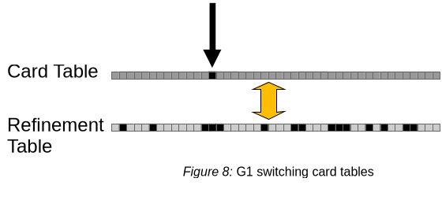

由于 G1 的原则是平衡延迟和吞吐并尝试达到暂停时间目标，导致 G1 的吞吐量相比于 JVM 其他的收集器来说可能在某些场景要少 20% 。这其中一大部分是为了正确性而在垃圾收集器和应用之间必要的同步。[这篇文章](https://tschatzl.github.io/2025/02/21/new-write-barriers.html)。介绍了对于这一部分的同步工作的改造，从而减少吞吐量的影响。

### 背景
G1 是增量的垃圾收集器，在收集期间，一大部分时间花费在尝试在应用堆内存区域中查找活跃对象并排除（ evacuate ）他们。为了限制垃圾收集暂停期间扫描这种引用的区域， G1 ， Serial ， Parallel 收集器使用了 Card 标记（ card marking ）技术。并且为了更好的保持暂停时间目标 G1 还扩展了这个机制：
* 和应用并发， G1 通过应用重新检查了（ re-examines ）（细化（ refines ））被标记的 card ，并分类这些 card 。这种分类在垃圾收集暂停期间帮助可以只扫描对特定垃圾收集重要的 card 。
* 额外被编译进应用的代码（ write barriers ）移除了非必须的 card 标记，减少了将来要扫描的 card 数量。
但这也引入了额外的开销。

#### G1 中的 card 标记
card 标记将堆分成固定大小的块，称之为 card 。每个 card 都在一个固定大小的数组中（叫做 card table ）有一个对应字节。数组每个条目都对应堆中的一个小区域（典型地是 512 字节）。一个 card 要么被标记，要么没有标记，标记表示堆中对应 card 可能存在感兴趣的引用。垃圾收集 __感兴趣的引用（ interesting reference ）__ 是指一个在堆里一个不会被垃圾收集的区域中的引用指向一个会被垃圾手机的区域。

当执行完上图黄色框内的代码后， write barrier 代码（ post write barrier ，在设置完值后添加的代码 ）会标记这个 card 。 Serial GC 和 Parallel GC 会再次止步：他们让应用积累 card 标记直到发生垃圾收集。在那个时候，对应标记了 card 的堆都被扫描， 为了查找指向驱逐区域（ evacuated area ）的引用。对于大多数应用，这样做工作量是可以接受的：在垃圾收集期间需要被扫描的唯一 card 数量非常有限。但是，在其他应用中，扫描对应 card 的堆（ 扫描 card scanning the cards ）会花费大量的垃圾收集时间。 G1 通过几个方面减少垃圾收集暂停时 card 扫描的数量。首先是运行额外的垃圾收集线程，和应用并发执行，清理，重新检查和分类 card 标记，因为：
* 在两次垃圾收集期间，引用总是会被重复的写入。由于引用导致的 card 标记可能在垃圾收集发生的时候已经不包含任何感兴趣的引用了。
* 通过根据 card 标记的来源对其进行分类，有可能在垃圾收集期间只扫描这一次特定垃圾收集相关的被标记的 card 。

这里，除了上面提到的 card 标记， G1 的 write barrier 将存储了 card 地址在（ __入队（ enqueues ）__ ）一个内部 buffer （ __细化 buffer ( refinement buffer )__ ）中，这样重检查垃圾收集器线程稍后可以很容易的再次找到他们。这里会存在一个人为延迟，它基于为了扫描 card 而暂停的可用时间以及在 card 标记和 细化（ refinement ）之间应用生成新的标记了的 card 的速率。这个延迟帮助降低应用重复标记同一个 card 的开销，避免同一个 card 由于 refinement 重复 enqueues （因为他们已经被标记过了）。这个延迟也增加了在 card 自身的引用不再被感兴趣的概率。

如 figure3 所示，细化线程会选择之前入队的 card 做重检查。图中亮蓝色表示了 remembered sets 。对于每个要执行 evacuate 的区域， G1 会为这些区域存放感兴趣的 card 位置的集合。注意，图中的区域都有一个 remembered set ，但是可能某些区域是没有的。区域在堆中也可以是不连续的，细化线程在查看堆的对应内容前也会取消对 card 标记。

figure4 显示了细化线程将已经检查过的 card 放入到了区域的 remembered set 中，因为这些 card 包含了这一时刻感兴趣的引用。由于一个 card 覆盖的对可能包含多个感兴趣的引用，多个 remember set 可能接收到同一个 card 位置。

最终结果就是，相比于 Hotspot VM 中其他吞吐量收集器来说， G1 的垃圾收集暂停需要扫描两个来源的 cards ：
* 应用刚刚标记为脏且还没有细化的 cards 
* 来自即将被收集的区域的 remembered set 的 card （原文是 cards from the remembered sets of areas that are about to be collected from the remembered sets. 我倾向于最后一个 from the remembered set 是笔误，没道理区域也来自于 remembered set 。毕竟，每个将要被 evacuate 的 area 才会有一个 remembered set 。除非理解成，需要被 evacuate 的 area 才有区域，而找到这些 area 是根据 remembered set 来找的）
G1 会合并这两个来源，在扫描 card table 进行 card 标记前，在 card table 上标记来自 remembered set 的 card 。 根据应用的不同，相比于普通的 card 标记，这一步可以显著的减少垃圾收集期间话费在 card 扫描的时间。
#### G1 中的 write barrier
barrier 是用来协调应用和 VM 的一小段代码。 GC 广泛地使用它们拦截内存变化。 Serial ， Parallel 和 G1 在写引用的时候使用 write barrier 。 VM 会执行写入操作附近的代码。
```
X x;
...
<pre-write barrier>
x.a = y;
<post-write barrier>
```
上面的代码显示了，对于将值`y`写入到`x.a`的操作，再世纪的写操作附近，执行了和写入操作无关的代码，用来和垃圾收集器同步； Serial 和 Parallel GC 只用了 post write barrier （位于写操作 __之后__ ）。G1使用了 pre write barrier 和 post write barrier 。不过前者和这里无关。这里所有的 write barrier 或者 barrier 都指的是 G1 使用的 post write barrier 。
G1 的 write barrier 作用有：
* 标记 card 为 dirty
* 如果 card 还没有被标记，就将它的位置存储在 refinement buffer 中

由于应用和细化线程在同一个时间都可能写入都一个 card ，前者标记，后者清理标记，这就可能会导致 remembered set 丢失更新问题，此时如果没有额外的预防措施，细化线程可以观察到 card 标记但是无法观察到值写入。而这需要在 write barrier 中加入开销很大的内存同步操作。对 card 的并发细化也可能很昂贵，特别是如果没有额外可用的处理资源。 G1 的 barrier 包含了额外的过滤代码，避免那些由引用写入操作生成但是对垃圾收集来说没有区别的 card 标记。 G1 的 write barrier 在如下情况不会标记一个 card ：
* 引用赋值写入的引用不是感兴趣的，不跨区域
* 代码赋值了一个`null`值：这不会在对象之间生成连接，因此对应的标记没有必要
* card 已经被标记了，这意味着它已经会由于细化被调度

figure6 对比了 G1 的 write barrier 和 Serial/Parallel GC 的 write barrier 大小对比。相比于后者3个指令，前者将近50个指令。 G1 的 write barrier 大体分成三个部分：蓝色是 filters ，绿色用于内存同步和实际的 card 标记，橙色表示将 card 存入到 refinement buffer 供 细化线程使用。
#### 影响
G1 为了最小化由于正确性而必须执行的内存同步导致的性能影响和并发工作的开销，使用了大量的 write barrier 和机制。但是，如果应用的内存访问模式和它不适配，并且实际执行了很多跨越整个堆的随机引用赋值，这会导致很多 card 位置为了后续细化而 enqueuing 从而浪费了减少内存同步的效果。 
另一个情况是，如果应用在很小的循环内执行 write barrier ，同时几乎很少对感兴趣的引用生成 card mark ，导致不需要或者实际执行并发细化，那么也不怎么适配这种 write barrier 。由于 barrier 的代码印记很大，导致编译器优化受阻，或者由于不必要的 CPU 资源分配导致执行缓慢。
### 新的设计
新的方法使用了两个 card table ，类似 ZGC 的 double-buffered remembered set ，消除内存同步。每个线程集（ set of threads ），应用线程和细化线程，都有自己的 card table ，最初都是未标记的状态。每个线程集（ set of threads ）只在自己的 card table 写值，后续分别叫做 card table 和 refinement table ，取消掉了实际 card 标记期间对于细粒度内存同步的需求。启发式程序会跟踪应用 card table 的 card mark 速率，如果它预测在下一次垃圾收集期间在 card table 上会有太多的 card mark ，G1 会和应用原子的交换 card table 。应用会继续标记自己的 card table （之前是 refinement table ），而垃圾收集细化线程会重新检验所有来自 refinement table 的标记（之前的应用 card table ）。这就取消了 G1 write barrier 对内存的同步。另外， refinement table 被直接用来作为将要被细化的已标记（ to-be-refined ） card 的存储，因此查找一个已标记 card 并不是非常昂贵。这就完全移除了 write barrier 代码中讲 card 位置存储到 refinement buffer 的需要和内存同步。
#### G1 中新的 Card Marking 



figure7 展示了新的数据结构，当 card table 积累了足够的标记， G1 原子的交换二者，如图 figure8 。应用继续在新的 card table （之前的 refinement table ）上执行标记操作，G1 处理交换后的 refinement table （之前应用的 card table ）开始执行重新检查 card 的操作。只有处理完所有已标记的 card ，才会清理 card 的标记。由于应用线程是在自己的 card table 上继续标记 card ，因此，不需要在应用和细化线程之间执行同步。
#### G1 中新的 write barrier
在最小情况下，新的 G1 write barrier 需要 card 标记，类似 Parallel GC 的 write barrier 。但是， Parallel GC 的 write barrier 的 card table 基址是常量，可以在代码流中內联，而 G1 由于上述的交换操作，每次都需要从线程本地存储中重新加载。 G1 当前的 post write barrier 减少了过滤和实际的 card 标记。对于代码`x.a = y`， VM 会在赋值后追加如下伪代码：
```C++
(1)  if (region(x.a) == region(y)) goto done;    // Ignore references within the same region/area
(2)  if (y == nullptr) goto done;                // Ignore null writes
(3)  if (card(x.a) != Clean) goto done;          // Ignore if the card is non-clean
(4)
(5)  *card(x.a) = Dirty;                         // Mark the card
(6) done:
```
1-3 行实现了过滤，基本和原来的一样，但是第 3 行的条件不同，这是因为新的优化。如果没有过滤，相对于原始的有 filter 的 barrier 会有性能回归，同时，这些 filter 也减少了垃圾收集暂停期间还未被扫描的 card 的数量，以及重新检查的 card 数量。最后，第 5 行将 card 标记为`Dirty`。关于 card mark 论文只有两个状态：`Dirty`和`Clean`， G1 扩展为 5 个状态，存储了关于对应堆区域的额外信息：
* __clean__ card 不包含 GC 感兴趣的引用
* __dirty__ card 包含 GC 感兴趣的引用
* __already-scanned__ 在垃圾收集期间用来标识 card 已经扫描过了。这对于潜在的为了更好的保持暂停时间分阶段垃圾收集方式很有必要。
* __to-collection-set__ 这个 card 可能包含一个感兴趣的引用，指向下一次垃圾收集将要被收集的堆区域（ __collection set__ ，因此叫这个名字 ）。这个 collection set 总是包含年轻代，因为每次垃圾收集都会回收它。细化过程可以跳过扫描这些 card ，因为在后面的垃圾收集期间总会扫描它们，因为 G1 总是收集年轻代（注：假设当前 GC 过程设置了 card 为这个状态， 然后细化过程跳过了扫描这些 card ，那么在下一次 GC 的时候，怎么判断这个要处理？毕竟对于下一次 GC 来说，这个状态也算是可以跳过的状态，要么就是， GC 会先处理这个状态，对于本次 GC 不是自己标记的这个状态的 card 都不能跳过。不过将这个放到下一次 GC 算饮鸩止渴么？）。将这些 card 加入到 remembered set 也不是必须的（即使它们包含的引用指向的区域不在 collection set 中），因为它们实际上表示的是重复信息。实际上，这些 to-colleciton-set card 集合也存储了 card table 中下一次 collection set 的全部 remembered set，避免额外的内存。为了保持 write barrier 简单，它仅将 card 标记为`Dirty`，判断一个引用是否指向一个 collection set 对象的额外开销在这里很昂贵。
* __from-remset__ 在垃圾收集期间使用，标识这个 card 最初是一个 remembered set ，并且不是一个最近标识的 card 。这有助于区分来自 remembered sets 中的 cards 和 来自还没有检查的 cards 的 cards ，从而更精确的模型化启发式算法中应用 card 标记速率。

只有最后两个状态是新的， to-colleciton-set 的使用解释了上面 write barriers 中第 3 行使用的条件，避免了应用不必要的覆写这个值，避免了 race 。

#### 交换 card table 和细化
card table 切换的目的是确保系统中所有线程都同意 refinement table 现在是应用 card table 而原来的 card table 现在是 refinement table ，避免出现 figure5 的问题。这一过程由细化控制线程初始化，它根据给定的 card 检查速率，周期地估算当前已经估算的 cards 数量在一个垃圾收集开始的时候将会超过允许的没有重新检查的 card 数量。如果细化工作是必须的，他还需要计算细化工作线程（执行实际工作的线程）的数量，这是需要在垃圾收集前完成的。

这个细化过程由如下阶段组成：
1. __交换指向卡表的引用__。 这包括心新创建的 VM 线程和 VM 运行时调用使用的全局 card table 指针和内部线程对当前应用 card table 引用的内部拷贝。这一步使用了线程本地握手[JEP312](https://openjdk.org/jeps/312)和针对 VM 内部（垃圾收集器相关）线程类似的技术。这一步也确保了正确的内存可见性：这一步结束后， 整个 VM 使用之前的 refinement table 标记新的 card ，在那一个时刻所有应用执行的的 card 标记和应用写都是同步。
2. __执行堆快照__ 收集关于细化工作的内部数据。快照会存储堆的每个区域当前的检查进度，这就允许能够在任意时刻恢复细化并利用并行工作。
3. __重新检查（清理 sweep ）包含了已标记 cards 的 refinement table__ 。细化工作线程线性遍历（从而扫掠） card table ，使用堆快照声明部分 cards 以查找标记过的卡片。
   
   figure9 展示了细化线程重新检查标记过的 cards ，结果可能如下：
   * 包含指向 collection set 的 cards 没有被加入到任何 remembered set 中。细化线程在应用 card table 中标记这些 cards 状态为 to-colleciton-set 并跳过任意进一步的细化。
   * 如果 card 被标记为 to-colleciton-set ，细化线程会重新在这个 card table 上标记 card ，并不再检查对应的堆内容
   * 状态为 Dirty 的 cards ，如果对应的堆现在没有被检查，会被转发到应用的 card table 标记为 Dirty 。
   * 对应了 Dirty card 的堆区域中的感兴趣引用（ interesting reference ）会导致这个 card 被添加到 remembered set 。
   * 在 card 检查期间， refinement table 上的 card 总是被设置为 clean 。在 collection set 中有对应的 refinement table 的那一部分不会被重新检查就标记为 clean ，因为这些 card 没有必要保留。在这些区域的 evacuation 期间，这些区域中的活跃对象引用会被 evacuation 隐式的发现。
  细化线程直接写入应用 card table 是安全的：和应用之间的内存 race 是良性的，最糟糕的结果就是另一个 dirty 的 card 标记没有额外的 to-colleciton-set 颜色信息。
4. __计算统计__ 最近的细化和更新预测器。

所有这些步骤都有可能被安全点（ safepoint ）打断，而这可能是一个在 evacuate 内存的垃圾收集暂停。如果没有，细化工作线程使用他们离开时的堆快照会持续细化工作。

#### 垃圾收集和细化
细化启发式算法尝试避免垃圾收集中断细化。此时，细化表在垃圾收集开始时是完全未标记的，所有还未检查的标记过的 cards 都在应用的 card table 上，这也是后续 card table 扫描阶段期望它们所在的地方。不需要在采取任何行动，除了将要被收集区域的 remembered set 放到应用 card table 上，就能在 card table 上高效地搜索标记过的 cards 。

之前 G1 有所有已标记 card 的位置，这些位置要么记录在 remembered set 上，或者在 refine card 的 refinement buffer 中。根据这些信息， G1 可以创建一个更详细的 map ，记录了已标记的 card 位于哪里，只需要搜索这些位置而不用整个 card table 就可以找到已标记的 card 。然后，搜索已标记 card 是线性扫描一个相对小的内存区域，因此就很快。

针对已标记 card 更精确位置信息的缺失也被不再需要计算整个信息而抵消。垃圾收集的常见场景是只有年轻代堆区域被 evacuate ，在这一步中，不要做什么事情，因为年轻代区域的 remembered set 被 card table 高效地追踪了。如果在细化过程中任意时刻发生了年轻代垃圾收集暂停，垃圾收集需要执行为还没有被扫掠的 refinement table 的部分做一些补偿工作。此时， G1 垃圾收集器会一个新的`Merge Refinement Table`阶段执行细化阶段的子集：

1. （可选的）如上一样的 __对堆执行快照__，如果细化是在这个过程的阶段1被中断
2. __合并 refinement table__ 到 card table 中。这一步将所有 card table 中的 card 标记结合到应用 card table 中。这两个 card table 是逻辑合并的，refinement table 的所有标记都被删除掉。
3. 如上一样的 __计算统计信息__

refinement table 在垃圾收集开始时需要完全未标记的原因是 G1 使用它收集 card 标记，因为在垃圾收集期间，这些 card 标记包含被 evacuated 的对象的 GC 感兴趣的引用，这些引用位于对象被 evacuated 的堆区域。这类似于之前存储这些信息的额外 refinement buffer 。在年轻代垃圾收集的结尾，这两个 card table 被交换，这样新生成的 card 位于应用的 card table ， refinement table 是完全未标记的。一个 full 收集会清理所有 card table ，因为这种类型的垃圾收集不需要这些信息。

### 性能影响
#### 吞吐
如下场景，吞吐会显著提升：
* 那些经常会执行 write barrier 的应用（因为移除了 barrier 中细力度的同步）。另一方面，新的 write barrier 也会显著减少细化开销，因为查找已标记的 card 更快（线性搜索 vs 随机搜索）。由于将年轻代 remembered set 保存在 card table （因为这些 cards 最多被重新检查一次）上减少的细化工作在这里也有节省。
* write barrier 减少的 CPU 资源开销（大小）促进了个更好的性能，包括编译器更好的优化和更容易执行。 G1 中吞吐的提高可以表现为所用堆大小的减少。不同微架构下性能的提升可能不同，但是 Parallel GC 依旧领先， G1 还有很多优化可做。
#### 内存印记
相比于 Java21 及以上，额外的 card table 会多 0.2% 的 Java 堆大小。由于 JDK21 已经减少一个 card table 大小的数据结构，因此在更早的 JDK 中看不出差别。其他额外的内存由于减少了 card 位置的 refinement buffer 而抵消。另外，通过将 collection set 的 remembered set 保存在 card table 上，这就不在占用额外空间，也减少了内存使用。 remembered set 状态颜色的优化使得其他 remembered set 不会出现冗余，也减少了本地内存。在某些应用中，内存的减少被额外的 card table 内存抵消了，不过这种应用很少见。如果应用年轻代没有很大的 remembered set ，展示了上述的额外内存使用，这样的应用几乎都是面向吞吐的应用。只有应用需要执行细化的时候才需要 refinement table 。因此 refinement table 可以是懒分配的。这些应用和上述的十分面向吞吐的应用有很大的重叠。
#### 延迟，暂停时间
除非是更快，延迟也是不受影响的。通常，由于一个更短的“合并 remembered set”阶段（因为在常见情况下，年轻代没有关于 remembered set 的工作要做，他们总是位于 card table 上了），暂停时间通常是减少的。
即使需要将 refinement table 合并到 card table 也是非常快的，并且在作者的测量中，总是比为了年轻代合并 remembered set 快。这个工作是线性扫描某些内存而不是随机访问，从而很适合并行。垃圾收集期间创建的 card 不再需要重新标记为 dirty ，因此就移除了另一个垃圾收集阶段。
#### 代码大小
代码大小大概减少了5%