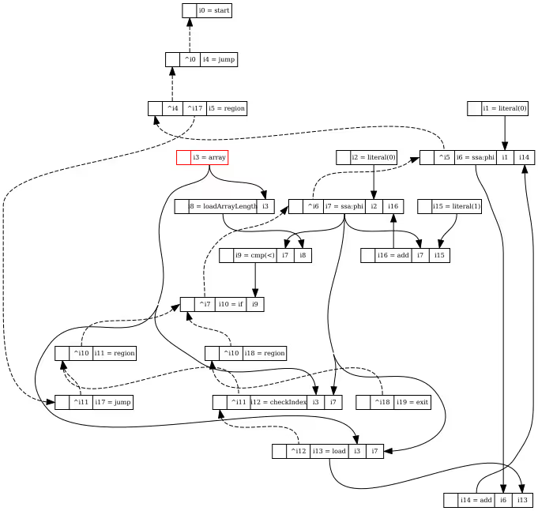
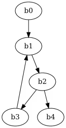
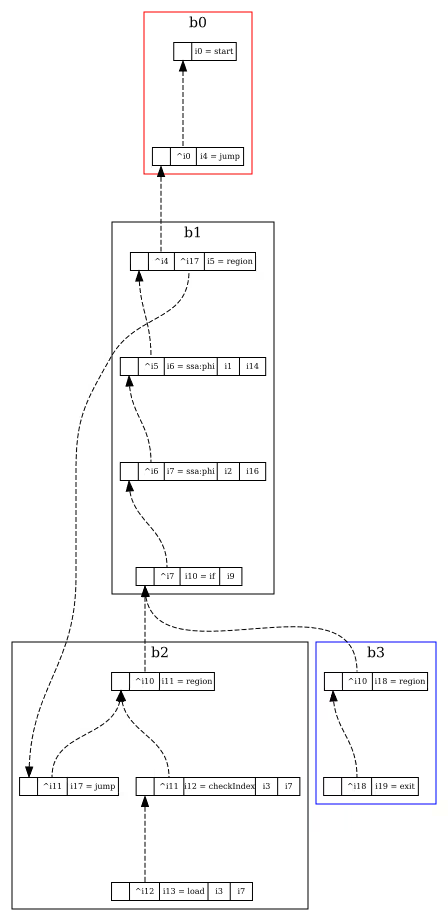

## Sea of nodes
文章[见此](https://darksi.de/d.sea-of-nodes/)
### 优化层
实践中，大多数编译器是多趟编译器，将源码先翻译成 AST ，然后将 AST 转换为机器代码。在这些情况下， AST 作用就像是中间表示（ Intermediate Representation IR ），这些中间表示连在一起作为抽象层，这种抽象层可能很多，越来越接近机器码。从 AST 直接生成机器代码很直接，可以从树根开始访问 AST ，从顶向下随着访问节点将其翻译为机器代码。但是，这生成的代码可能很低效，因为变量的信心变得很稀疏，并且散布到不同的树节点。以下面一段 JavaScript 代码为例：
```javascript
for (var i = 0, acc = 0; i < arr.length; i++)
  acc += arr[i];
```
可能最终的结果如下（并不是实际的指令集）：
```
acc = 0;
i = 0;
loop {
  // Load `.length` field of arr
  tmp = loadArrayLength(arr);
  if (i >= tmp)
    break;

  // Check that `i` is between 0 and `arr.length`
  // (NOTE: This is necessary for fast loads and
  // stores).
  checkIndex(arr, i);

  // Load value
  acc += load(arr, i);

  // Increment index
  i += 1;
}
```
可能不太明显，但是数组的长度在循环中并没有改变，因此，范围检查完全没有必要，理想的结果可能如下：
```
acc = 0;
i = 0;
len = loadArrayLength(arr);
loop {
  if (i >= tmp)
    break;

  acc += load(arr, i);
  i += 1;
}
```
上述 JavaScript 代码的 AST 如下（参见 esprima ）：
```javascript
    {
      "type": "ForStatement",
      "init": {
        "type": "VariableDeclaration",
        "declarations": [
          {
            "type": "VariableDeclarator",
            "id": {
              "type": "Identifier",
              "name": "i"
            },
            "init": {
              "type": "Literal",
              "value": 0,
              "raw": "0"
            }
          },
          {
            "type": "VariableDeclarator",
            "id": {
              "type": "Identifier",
              "name": "acc"
            },
            "init": {
              "type": "Literal",
              "value": 0,
              "raw": "0"
            }
          }
        ],
        "kind": "var"
      },
      "test": {
        "type": "BinaryExpression",
        "operator": "<",
        "left": {
          "type": "Identifier",
          "name": "i"
        },
        "right": {
          "type": "MemberExpression",
          "computed": false,
          "object": {
            "type": "Identifier",
            "name": "arr"
          },
          "property": {
            "type": "Identifier",
            "name": "length"
          }
        }
      },
      "update": {
        "type": "UpdateExpression",
        "operator": "++",
        "argument": {
          "type": "Identifier",
          "name": "i"
        },
        "prefix": false
      },
      "body": {
        "type": "ExpressionStatement",
        "expression": {
          "type": "AssignmentExpression",
          "operator": "+=",
          "left": {
            "type": "Identifier",
            "name": "acc"
          },
          "right": {
            "type": "MemberExpression",
            "computed": true,
            "object": {
              "type": "Identifier",
              "name": "arr"
            },
            "property": {
              "type": "Identifier",
              "name": "i"
            }
          }
        }
      }
    }
```
想要安全的移除循环中的长度查询，需要知道在循环中数组长度不会变化，而仅从 AST 中要做很多事情才能获取到这种信息。所以，我们需要增加一种中间表示，数据流图（ data-flow graph DFG ）。
### 数据流图
上面的代码，我们关心`arr`变量的值，找到所有对它的使用以验证没有越界访问或者其他可能修改数组长度的操作。通过引入不同数据值的 def-use （ definition and uses ）关系，可以完成这个任务。她的意思是值被声明一次（节点），然后在其它地方被使用创建一个新的值（每一次使用一个边）。这些一起组成了数据流图：

从红色框中发出了实线箭头表示了这个值的使用，通过迭代这些变，编译器可以推导出`array`的值用于：`loadArrayLength`，`checkIndex`和`load`。这个图的构造方式如下：如果值以破坏性的方式访问（例如，存储，长度变化），那么就显示的“拷贝”这个数组节点。因此只要我们观察`array`节点的使用，就可以确认他的值没有变化。这个图的属性通过遵守单静态赋值（ Single Static Assignment SSA ）规则是很容易实现的。编译器为将任意程序转换为 [SSA](https://en.wikipedia.org/wiki/Static_single_assignment_form)，对变量的所有赋值和后续使用重新命名，取保每个变量只被赋值一次。
```javascript
// before SSA
let a = 1;
console.log(a);
a = 2;
console.log(a);
//after SSA
let a0 = 1;
console.log(a0);
let a1 = 2;
console.log(a1);
```
这里，只要谈论了`a0`，就肯定是那唯一一个赋值的`a0`。这很接近函数式编程。因此，编译器看到`loadArrayLength`没有控制依赖（没有虚线），它就可以自由的移动这个节点（放置到循环外）。进一步观察，`ssa:phi`节点的值位于`0`和`arr.length`之间，因此`checkIndex`也可以移除出循环内。这种从程序中提取信息的方式这涉及到了[数据流分析](https://en.wikipedia.org/wiki/Data-flow_analysis) ，它允许我们可以看全的假设代码可以如何优化。数据流图的缺点是距离机器代码更远，它相对于 AST 更不适合生成机器代码。由于机器码是一系列指令序列，而数据流图中没有没有任何顺序。这通常通过将节点分组为块解决，这个表示叫做[控制流图](https://en.wikipedia.org/wiki/Control_flow_graph)（ Control Flow Graph CFG ）:
```
b0 {
  i0 = literal 0
  i1 = literal 0

  i3 = array
  i4 = jump ^b0
}
b0 -> b1

b1 {
  i5 = ssa:phi ^b1 i0, i12
  i6 = ssa:phi ^i5, i1, i14

  i7 = loadArrayLength i3
  i8 = cmp "<", i6, i7
  i9 = if ^i6, i8
}
b1 -> b2, b3
b2 {
  i10 = checkIndex ^b2, i3, i6
  i11 = load ^i10, i3, i6
  i12 = add i5, i11
  i13 = literal 1
  i14 = add i6, i13
  i15 = jump ^b2
}
b2 -> b1

b3 {
  i16 = exit ^b3
}
```
其中`bXX`可以表示为节点，而`bXX->bYY`表示边。如图：

其中，`b0`表示循环之前的代码，循环之前的代码在`b1`中，循环头在`b2`中，循环体在`b3`中，退出代码在`b4`中。这个形式翻译成机器代码就很简单，可以用 CPU 寄存器名字直接替换`iXX`标识符（在某些情况下， CPU 寄存器算是一种变量，而 CPU 的寄存器数量有限，需要小心不要超过），并且一行一行地为每个指令生成机器码。可以看到 CFG 保留了数据流的关系同时还排序了。这允许我们可以利用它进行数据流分析和机器代码生成。不过，通过操作块以及块之内的内容优化 CFG 会变得复杂且易错。
### sea-of-nodes
数据流图中的虚线其实就是 sea-of-node 图。不再将节点分组到块中并排序，我们选择在图中用虚线边声明控制依赖。在删除掉所有实线并重新组合下节点得到：

可以看出来，这和控制流图是一样的。这个图和 CFG 最大的不同在于，除了有控制依赖的节点（参与控制流的节点），这个图节点之间没有顺序。
### 消除
sea-of-node 的修改通常是通过图消除实现的。将图中所有节点入队，对队中所有节点调用消除函数。所有这个函数处理过的（修改，替换）都再次入队，稍后会传给这个函数。如果有多个消除函数，可以将这些函数入栈，然后真对队列每个节点一次调用全部，或者，如果每个函数需要依赖其他函数，也可以一次调用一个。