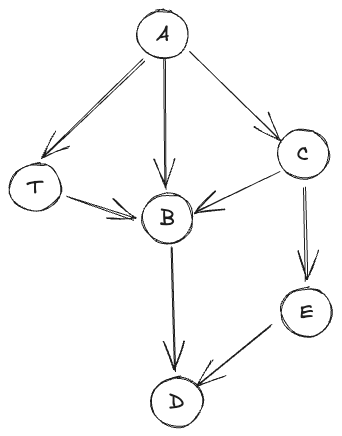
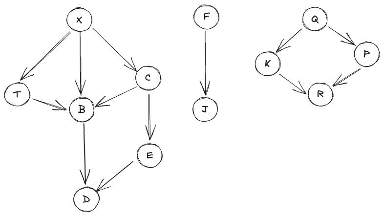
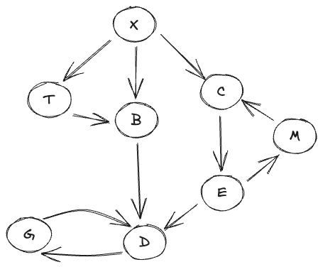
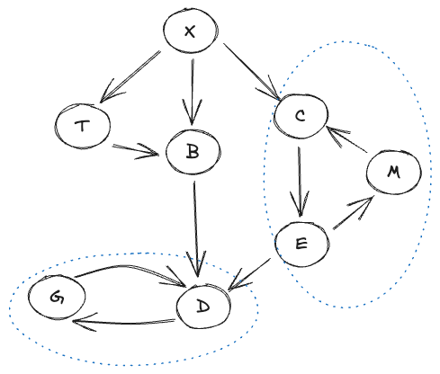
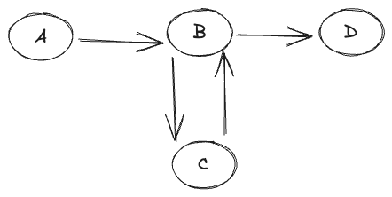
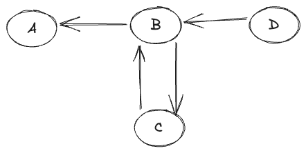

## 图遍历顺序及其应用
[本文](https://eli.thegreenplace.net/2015/directed-graph-traversal-orderings-and-applications-to-data-flow-analysis/)介绍了图遍历的算法和顺序，涉及到的内容有图排序的算法以及顺序以及在数据流分析中这些顺序的应用。
### 深度优先和先序
考虑下面一个图：

可以通过 DFS 算法遍历这个图，但是根据不同的遍历顺序，结果会不同。考虑一个基本的算法（来自于文章，代码是 python ）：
```python
def dfs(graph, root, visitor):
    """DFS over a graph.

    Start with node 'root', calling 'visitor' for every visited node.
    """
    visited = set()
    def dfs_walk(node):
        visited.add(node)
        visitor(node)
        for succ in graph.successors(node):
            if not succ in visited:
                dfs_walk(succ)
    dfs_walk(root)
```
这个算法实现了先序（ pre-order ）遍历。不过，这里跟树的先序遍历不同的是，在树上先序遍历，总是可以假设会先访问一个节点，然后访问节点的后序节点。但是，在图上，是不能保证的。上述 DFS 算法在上面的图遍历结果可能是： A，C，B，D，E，T （取决于获取图后继节点的逻辑，但是是可能出现这种情况的）。可以看到 B 先于 T 被访问到。但是 T 是 B 的前序节点。
### 后序和逆后序
下面的代码展示了后序 DFS 遍历：
```python
def postorder(graph, root):
    """Return a post-order ordering of nodes in the graph."""
    visited = set()
    order = []
    def dfs_walk(node):
        visited.add(node)
        for succ in graph.successors(node):
            if not succ in visited:
                dfs_walk(succ)
        order.append(node)
    dfs_walk(root)
    return order
```
注意到方法增加了`order`列表，取消了`visitor`函数。算法在节点被完全访问（也就是所有出边都被访问）后将其加入到`order`列表。后序遍历保证了，在不存在环的情况下，如果图中存在从 W 到 V 的路径，那么在结果中 V 在 W 前出现。逆后序（ reverse post order RPO ）就是将上述结果翻转。在逆后序中，如果图中存在从 V 到 W 的路径，那么在结果中 V 在 W 前出现。这里这个特点非常有用，他保证了在 DAG 图中，我们会先访问一个节点，然后再访问从它出发的节点。下面是几种排序的一种可能（依赖于获取后继节点的顺序）：
先序： A ， C ， B ， D ， E ， T
后序： D ， B ， E ， C ， T ， A 
逆后序： A ， T ， C ， E ， B ， D
注意， RPO 和先序是不同的，先序只是 DFS 访问图的顺序，而 RPO 保证了我们会先看到节点，然后是这个节点的后继节点（注意这是没有环的情况）。因此，对于树结构，如果需要这个保证，可以直接使用先序遍历，但是对于 DAG ，就需要使用 RPO 。
### 拓扑排序
DAG 的 RPO 其实就是拓扑排序。按照先列出 DAG 节点，再列出来节点的后继节点就是拓扑排序的含义。 如果在图中的节点表示操作，边表示操作之间的依赖（从 V 到 W 意味着 V 先于 W 发生），那么拓扑排序给出的顺序就可以让我们在依赖都满足后运行操作（不会有操作先于依赖运行）。
### 多个根的 DAG
真实的图不一定是跟上面例子中那样只有一个很好发现的根节点。在编译中，单根图是最常见的情况，因为所有程序都有单一入口函数（针对调用图），一个函数只有单个入口指令或者基本块（针对函数的控制流和数据流分析）。如果不在考虑上面的例子是单个根，那么从哪个节点开始就很模糊了，我们可以从 A 开始，也可以从 B 开始。如果从 B 开始，就只能再看到 D ，那么就需要重新开始发现其他节点。考虑如下图：

对于这个图，我们就任意选择一个没有被访问的节点作为根然后开始遍历。当完成这一次遍历，如果还有没被访问的节点就在选择一个然后重新开始。一直这样下去直到所有节点都访问了：
```python
def postorder_unrooted(graph):
    """Unrooted post-order traversal of a graph.

    Restarts traversal as long as there are undiscovered nodes. Returns a list
    of lists, each of which is a post-order ordering of nodes discovered while
    restarting the traversal.
    """
    allnodes = set(graph.nodes())
    visited = set()
    orders = []
    def dfs_walk(node):
        visited.add(node)
        for succ in graph.successors(node):
            if not succ in visited:
                dfs_walk(succ)
        orders[-1].append(node)
    while len(allnodes) > len(visited):
        # While there are still unvisited nodes in the graph, pick one at random
        # and restart the traversal from it.
        remaining = allnodes - visited
        root = remaining.pop()
        orders.append([])
        dfs_walk(root)
    return orders
```
上面的代码返回了嵌套列表，每个列表都是一次迭代中访问的节点集合的后序遍历顺序。可能的结果如下：
```python
[
 ['d', 'b', 'e', 'c'],
 ['j', 'f'],
 ['r', 'k'],
 ['p', 'q'],
 ['t', 'x']
]
```
虽然没有联通的子图之间相对顺序是未定义的，但是联通的子图内，顺序是有定义的。但是从结果中可以看到， T 和 X 和 D ， B ， E ， C 是分开的，而它们之间是有自然的顺序的。可以用一个复杂的算法，尝试在合理的情况下合并这些顺序以修正这一点，或者，我们可以先查看图中所有的顶点，找到所有没有入边的节点作为遍历操作的根集合。
### 有环的有向图
当考虑图中有环的时候，上面介绍的遍历定义就都有问题了。再有环的图中，依定义，节点之间是不存在一个比一个前的。在后序中，节点可能会先于他所有出边的节点被访问前访问到。拓扑排序再有环的图中没有定义。后序遍历依旧可以工作，但是顺序没有清晰的定义。下面的图的`postorder`是`['m', 'g', 'd', 'e', 'c', 'b', 't', 'x']`：

虽然这是一个合法的后序顺序，但是，注意到 M 出现在 G 和 D 前，而其实不存在一个从 G 和 D 到 M 的路径。我们希望找到一个有环的图的算法能够“近似”后序遍历，并在顺序上某些高层级标记上保持一致性（在实际的环外面）。
### 强连通分量
强连通分量（ Strongly Connected Components SCCs ）可以解决这个问题。有环图会分成多个强连通分量，每个强连通分量内部是强连通的，也就是说，在这个强连通分量内部，存在从任意一个节点到其他节点的路径。也就是说，每个强连通分量下面是上面有环图的 SCCs ：

在一个图中，每个强连通分量是一个循环，然后我们可以创建一个分量的 DAG （这对于相对规整的图来说有用，如果一个图整体都是强连通的， SCC 作用就不大了。不过这也不会出现例子的问题）。所有没有分入到循环中的节点被看作是自身的单节点分量。通过这样分解图，就可以后序遍历甚至是拓扑排序了。
### 3色 DFS 和边分类
前面描述的后序遍历算法并没有以一个合理的顺序访问节点，也无法检测环的存在。因此，需要使用三色 DFS 在遍历过程中，记录更多信息，这些信息可以有更深入地分析有环图。它包含白灰黑三种颜色，根据在跟定时间从某一个节点已经访问了多少次对节点着色。下面的代码使用了`color`字典跟踪节点的不同状态：
1. 节点不在字典中：没有被发现（白色）
2. 节点被发现了但是还没有访问完（灰色）
3. 节点访问完--所有出边都访问了（黑色）
```python
def postorder_3color(graph, root):
    """Return a post-order ordering of nodes in the graph.

    Prints CYCLE notifications when graph cycles ("back edges") are discovered.
    """
    color = dict()
    order = []
    def dfs_walk(node):
        color[node] = 'grey'
        for succ in graph.successors(node):
            if color.get(succ) == 'grey':
                print 'CYCLE: {0}-->{1}'.format(node, succ)
            if succ not in color:
                dfs_walk(succ)
        order.append(node)
        color[node] = 'black'
    dfs_walk(root)
    return order
```
上述代码会给有环图中输出如下内容
```
CYCLE: m-->c
CYCLE: g-->d
```
在 M 和 C 以及 G 和 D 之间的边叫做回边。这涉及到边的分类，图的边分类还包括树边（ tree edge ），交叉边（ cross edge ）和 前向边（ forward edge ）。这些在 DFS 访问过程中都可以发现。回边对于标识环很重要。
### 数据流分析
在编译过程中，数据流分析对于优化很重要。编译器分析程序的控制流图（ control-flow graph CFG ），推断出在程序的基本块中，值的潜在变化（由于数据流分析是静态的，通常情况下编译器无法知道某个值在运行时是真是假，因此只能使用在静态时可用的信息）。有两类数据流分析问题，_前向_（ forward ）和 _后向_（ backward ）。对于 _前向_ 问题，使用从基本块习得的信息分析它们的后继。在 _后向_ 问题中，使用从基本块习得的信息分析它们的前驱。因此， RPO 能非常高效的分析前向数据流。在没有环的情况下， RPO （拓扑排序）保证了我们在访问一个节点前肯定会访问完它所有的前驱节点。这意味着我们可以对整个图在单趟访问中执行分析。如果图中有环，尽管这一前提不在出现，但是 RPO 可以保证最快的收敛速度，在有环图中，直到出现固定点之前，数据流分析都是迭代的（由于数据流集形成了偏序并且算法满足一些额外的数学保证，即使随机访问节点，也会收敛，但是选择正确的顺序可以更显著的收敛这对于编译时间很重要）。同样，后序遍历是最高效的后向数据流分析方法。
有些资料建议使用翻转 CFG （ CFG 中的边都反过来）的 RPO 代替原始图的后序执行后向数据流分析。注意，这两个结果是不同的，再有环的情况下，这两个顺序是不同的。考虑下面的图：

这个图的后序会返回： D ， C ， B ， A 。翻转所有边：

这个时候 D 是入口节点。它的的 RPO 是： D ， B ， C ， A 。这两个顺序在环上是不同的。至于为什么倾向于翻转图的 RPO 而不是原图的后序，就上面的例子来说，前者能够先访问更多的后继节点。如果是先 B 后 C ，那么 B 的后继 D （针对于原图）是已经访问了，这有助于快速收敛。而如果是先 C 后 B ，那么对于我们对 B 的后继就知道的很少，因为 B 还没有被访问。
### 记
最开始了解到逆后序的是在[《算法（第四版）》](https://book.douban.com/subject/19952400/)这本书中，当时书中并没有过多的介绍这个顺序的作用。后面发现，在编译优化中，逆后序对于静态分析很有用。这涉及到了数据流分析和控制流分析。对于这两种分析，一般需要将程序转换为数据流图和控制流图，而这涉及到需要将程序转换为单静态赋值形式（ Single Static Assignment [ SSA ](https://en.wikipedia.org/wiki/Static_single_assignment_form) ）。而在 Java ，包括 JavaScript 中，编译或者 JIT 过程中，会使用一个叫做 sea-of-node 的形式。